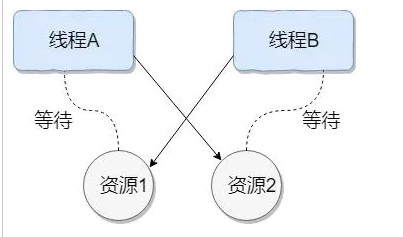
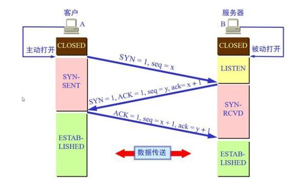
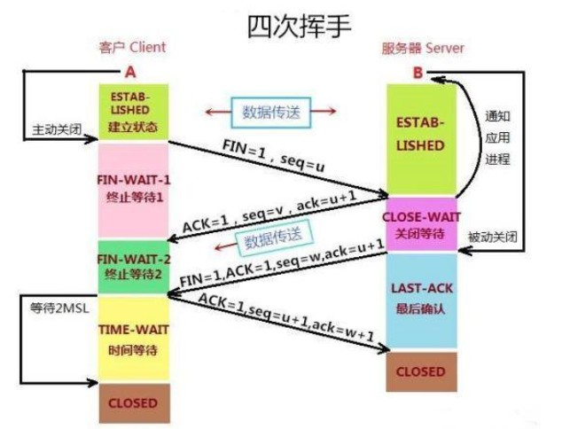
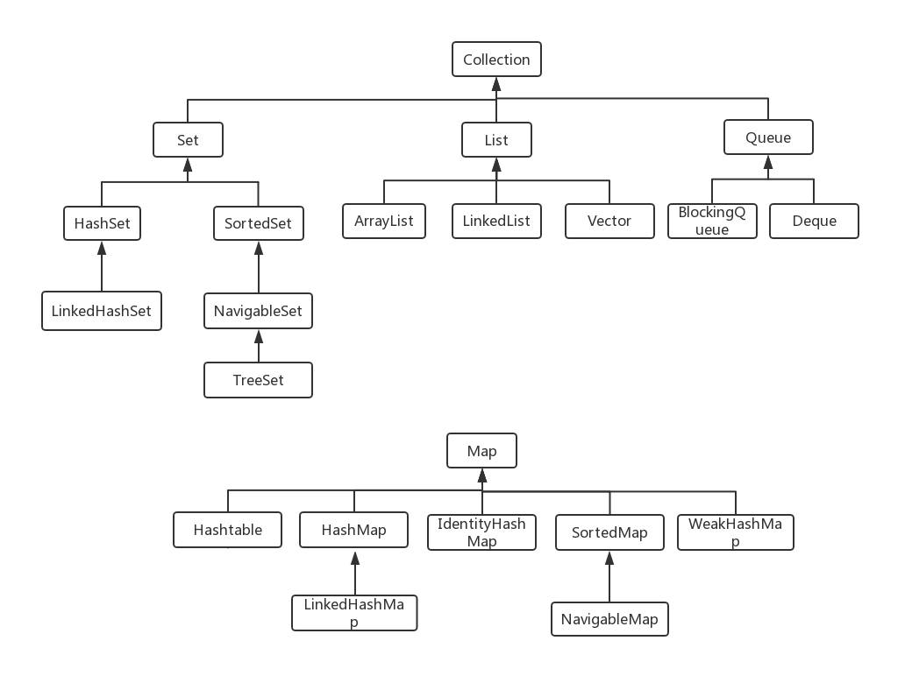

#### 1.	Object类有哪些方法

​	Object是所有类的父类，任何类都默认继承Object，Object实现了哪些方法：

```
	1. clone方法
```

实现对象的浅复制。只有实现了Cloneable接口才能调用该方法，否则抛出CloneNotSupportException异常。

```
	2. getClass
```

final 方法，获得运行时类型

```
	3. toString方法
```

一般子类都有覆盖，字符串打印。

```
	4. finalize方法
```

用于释放资源，因为无法确定该方法什么时候被调用，很少使用。

```
	5. equals方法
```

该方法是非常重要的一个方法。一般equals和==是不一样的，但是Object中两者是一样的。子类一般都要重写这个方法。

```
	6. hashCode方法
```

该方法用于哈希查找，重写了equals方法一般都要重写hashCode方法。这个方法在一些具有哈希功能的Collection中用到。

```
	7. wait方法
```

wait方法就是使当前线程等待该对象的锁，当前线程必须是该对象的拥有者，也就是具有该对象的锁。wait()方法一直等待，直到获得锁或者被中断。wait(long timeout)设定一个超时时间，如果在规定时间内没有获得锁就返回。

调用该方法后当前线程进入休眠状态，直到以下事件发生：

​    (1)其他线层调用了该对象的notify方法

​    (2)  其他线程调用了该对象的notifyAll方法

​    (3)  其他线程调用了interrupt中断该线程

​    (4)  事件间隔到了

此时该线程就可以被调度了，如果是被中断的话就会抛出一个InterruptedException异常。

```
	8. notify方法
```

该方法唤醒在该对象上等待的某个线程。

```
	9. notifyAll方法
```

该方法唤醒在该对象上等待的所有线程。

#### 2.	修饰符

​	访问修饰符 public，private，protected，以及默认的default。

​	Java语言程序设计中，定义类时除了要使用class关键字说明所定义的数据类型是类，还可以在class之前增加若干类的修饰符来限定所定义类的操作特性，说明类的属性。

​	类的修饰符分为：可访问控制符和非访问控制符两种

​		可访问控制符：公共类修饰符public

​		非访问控制符：抽象类修饰符abstract

​		最终类修饰符：final

1. class不加修饰符的时候，即直接声明 class A{ }

   在这种情况下，class前面没有加任何的访问修饰符，通常称为“默认访问模式”，在该模式下，这个类只能被同一个包中的类访问或引用，这一访问特性又称包访问。

2. 类修饰符：

   1. public（访问控制符），讲一个类声明为公共类，他可以被任何对象访问，一个程序的主类必须是公共类。

   2. abstract，将一个类声明为抽象类，没有实现的方法，需要子类提供方法实现。

   3. final，讲一个类声明为最终类，非继承类，表示他不能被其他类继承。

      匿名内部类访问成员变量时，成员变量需要被final修饰。

   注意：修饰符abstract和修饰符final不能同时修饰同一个类，因为abstract类是没有具体对象的类，它必须有子类，所以需要可以被继承。而final类是不可能由子类，所以abstract和final修饰同一个类是无意义的。


3. 成员变量修饰符

   	1. public ：公共访问控制符，指定该变量为公共的，他可以被任何对象的方法访问。
    2. private：私有访问控制符，指定该变量只允许自己的类的方法访问，其他任何类（包括子类）中的方法均不能访问。
    3. protected：保护访问控制符，指定该变量可以被同一个包下的类和所有子类课件。不能修饰类（外部类）。
    4. final：最终修饰符，指定此变量的值不能变。
    5. static：静态修饰符，指定变量可以被该类的所有对象共享，所有实例都可以使用该变量。
    6. volatile：易失修饰符，指定该变量可以同时被几个线程控制和修改。
    
4. 方法修饰符


   1. private ： 指定此方法只能有自己类来访问，其他类（包括子类）不能访问。
   2. public：公共控制符
   3. protected：指定该方法可以被它的类和子类进行访问。
   4. final：指定该方法不能被重载
   5. static：指定不需要实例化就可以激活的一个方法，直接类使用。
   6. synchronize：同步修饰符，在多个线程中，该修饰符用于在运行前，对他所属的方法加锁，以防止其他线程的访问，运行结束后解锁。

#### 3. 类加载机制

   ​    一个Java文件从编码完成到最终执行，一般主要包括两个过程

		* 编译
		* 运行

​		编译，即把我们写好的java文件，通过javac命令编译成字节码，也就是.class文件。

​		运行，则是把编译生成的.class文件交给Java虚拟机JVM执行。

​		而我们所说的类加载过程即是指JVM虚拟机把.class文件中的类信息加载进内存，并进行解析生成对应的class对象的过程。

​		举个例子来说，JVM在执行某段代码时，遇到了classA，然而此时内存中并没有classA的相关信息，于是JVM就回到相应的class文件中去寻找classA的类信息，并加载进内存中，这就是类加载过程。

​		由此可见，JVM不是一开始就把所有的类都加在进内存中，而是只有第一次遇到某个需要运行的类时才会加载，且只加载一次。

​	类加载的过程主要分为三个部分：

​		加载，链接，初始化

​	而链接又可以细分为三个小部分：

​		验证，准备，解析


1. 简单来说，加载指的是把class字节码文件从各个来源通过类加载装载入内存中。

   这里有两点：

   	* 字节码来源：一般的加载来源包括从本地路径下编译生成的.class文件，jar包中的.class文件。
   	* 类加载器：一般包括启动类加载器，扩展类加载器，应用类加载器，以及用户的自定义类加载器。

 2. 验证

    主要是为了保证加载进来的字节流符合虚拟机规范，不会造成安全错误。

    比如：对于元数据的验证，该类是否继承了被final修饰的类，类中的字段，方法是否与父类冲突，是否出现了不合理的重载。对于符号引用的验证，比如校验符号引用中通过全限定类名能否找到对应的类，校验符号引用中的访问行（private，public等）是否可被当前类访问。

	3. 准备

    主要是为类变量（注意，不是实例变量）分配内存，并且赋予初值。

    注意，初值不是代码中具体写的初始化的值，而是JVM根据不同变量类型的默认初始值。比如8中基本类行的初值，默认是0；引用类型的初值为null；常量的初值即为代码中设置的值，final static temp = 456，那么该阶段tem的初值就是456.

	4. 解析

    将常量池内的符号引用替换为直接引用的过程。

    两个重点：

    	* 符号引用。即一个字符串，但是这个字符串给出了一些能够唯一性识别一个方法，一个变量，一个类的相关信息。
    	* 直接引用。可以理解为一个内存地址，或者一个偏移量。比如类方法，类变量的直接饮用是指向方法区的指针；而实例方法，实例变量的直接引用则是从实例的头指针开始算起到这个实例变量位置的偏移量。

    举个例子：现在调用方法hello()，这个方法的地址是1234567，那么hello就是符号引用，1234567就是直接引用。

    在解析阶段，虚拟机会把所有的类名，方法名，字段名这些符号引用替换为具体的内存地址或偏移量，也就是直接引用。

	5. 初始化

    这个阶段主要是对类变量初始化，是执行类构造器的过程。

    换句话说，只对static修饰的变量或者语句进行初始化。

    如果初始化一个类的时候，其父类尚未初始化，则优先初始化其父类。

    如果同时保函多个静态变量和静态代码块，则按照自上而下的顺序依次执行。

	6. 总结：

    类加载过程只是一个类生命周期的一部分。在其前有编译的过程，只有对源代码编译后，才能获得可以被虚拟机加载的字节码文件；在其后还有具体的类使用过程，当使用完成后，还会在方法区垃圾回收的过程中进行卸载。


####  4. 多态的含义

​		Java实现多态有三个必要的条件：继承，重写，向上转型。

​		继承：在多态中必须存在有继承关系的子类和父类。

​		重写：子类对父类中某些方法进行重新定义，在调用这些方法时就会调用子类的方法。

​		向上转型：在多态中需要定义一个指向子类对象的父类引用，只有这样该引用才能够具备调用父类的方法和子类的方法。

​		只有满足了上述三个条件，我们才能够在同一个继承结构中使用统一的逻辑实现代码处理不同的对象，从而达到执行不同的行为。

深入理解：

​		所谓多态就是指程序中定义的引用变量所指向的具体类型，和通过该引用变量发出的方法调用在编程时并不确定，而是在程序运行期间才确定。即一个引用变量到底会指向哪个类的实例对象，该引用变量发出的方法调用到底是哪个类中实现的方法，必须在由程序运行期间才能决定。

​		因为在程序运行时才确定具体的类。这样，不用修改源程序代码，就可以让引用变量绑定到各种不同的类实现上，从而导致该引用变量调用的具体方法随之改变。即不修改程序代码就可以改变程序运行时绑定的具体代码，让程序可以选择多个运行状态，这就是多态。

向上转型：

​		酒 a = 剑南春

​		酒 b = 五粮液

​		酒 c = 茅台

​		比如桌子上三杯酒，你只知道这是三杯白酒，但是不知道酒杯里的白酒品牌。只有当你尝了之后才知道具体的品牌。

​		这里所表现的就是多态。我们只是通过酒这一个父类就能够引用不同的子类，这就是多态---我们只有在运行的时候才会知道引用变量所指向的具体实例对象。

​		所体现的向上转型：Wine a = new 剑南春(); 由于剑南春是继承于Wine，所以剑南春可以自动向上转型为Wine，所以Wine的引用是可以指向剑南春的实例对象的。

​		这样做的好处：

​		在继承中我们知道子类是父类的扩展类，它可以提供比父类更加强大的功能，如果我们定义了一个指向子类的父类的引用类型。那么它除了能够引用父类的共性外，还可以使用子类强大的功能（方法）。

​		多态得到的父类引用，只能访问父类中拥有的方法和属性，而对于子类中存在而父类中不存在的方法，该引用是不能使用。比如重载方法，它是子类特有的方法。若子类重写了父类中的某些方法，在调用改写方法的时候一定走的是子类的方法。

​		由子类对象（被引用）类型而不是父类引用来决定调用的谁的成员方法。但是这个被调用的方法必须是在父类中定义过的。也就是会执行子类中重写的父类中的方法。


#### 5.	Override和Overload区别是什么？

  1. Override重写：

     重写Override表示子类中的方法可以与父类中的某个方法的名称和参数完全相同。指向子类创建的实例对象的父类引用调用这个方法时，将调用子类中定义的方法，这相当于把父类中定义的那个完全相同的方法给覆盖掉了，这也是多态的一种表现。

     子类覆盖父类的方法是只能抛出父类的异常或者异常的子类或者父类异常的子集（多个子异常）因为子类不能比父类有更多的问题，可以解决一些问题。

     还有子类重写的方法的访问权限只能只能比父类更大，不能更小。如果父类的方法是private类型，子类根本不存在覆盖，即子类中和父类的private的同名方法没有覆盖关系，是两个不相关的方法，因为private访问权限只限于同一个类中，相当于在子类中增加了一个全新的方法。

     JDK1.5以后，重写的方法和父类的方法的返回值可以不同，但返回的对象必须是父类方法返回值的子类。

  2. Overload重载：

     存在于父类和子类，同类中。允许存在一个以上的同名函数，只要他们的参数个数或者参数类型不同即可。

     重载的特点：和返回值类型无关，只看参数列表，重载的方法可以改变返回值的类型。所以如果两个方法的参数列表完全一致时，是不能通过让他们的返回值类型不同来实现重载的。

     比如我们调用map.remove(key)方法时，虽然remove方法有返回值，但是我们通常都不会定义接收返回结果的变量，这时候如果类中有两个remove()方法，只是返回值类型不同，那么我们不定义接收变量时，java就无法确定我们到底想调用哪个方法。


#### 6.     线程有几个状态？死锁产生的条件？

  1. 线程死锁：

     指两个或两个以上的线程在执行过程中，由于竞争资源或者由于彼此通信而造成的一种阻塞的现象，若无外力作用，他们将都无法推进下去。此时称系统处于死锁状态或系统产生了死锁。这些永远处于互相等待的进程（线程）称为死锁进程（线程）

     多个线程同时被阻塞，它们中的一个或者全部都在等待某个资源被释放。由于线程被无限期地阻塞，因此程序不可能正常终止。

     如下图所示：

     

     线程A持有资源2，线程B持有资源1且都在使用，它们同时还要申请对方的资源，那么它们就会互相等待对方将相应资源使用完之后，让渡出来，所以这两个线程就会互相等待而进入死锁状态。

     	2. 线程死锁的四个必要条件：
     	
     		1. 互斥条件：线程对于所分配到的资源具有排他性，即一个资源同时只能被一个线程占用，知道该线程释放让渡出来。
     		2. 请求与保持条件：一个线程因请求被占用资源而发生阻塞时，对已经获得的资源保持不放。
     		3. 不剥夺条件：线程以获得的资源在未使用完之前不能被其他线程强行剥夺，只有自己使用完毕后才释放资源。
     		4. 循环等待条件：当发生死锁时，所等待的线程必定形成一个环路，造成永久阻塞。
     	
     	3. 如何避免死锁

     我们只要破坏产生死锁的四个条件中的其中一个就可以了。

     1. 破坏互斥条件。

        这个条件我们没有办法破坏，临界资源本身就需要互斥访问。

     2. 破坏请求与保持条件：

        因为这个条件时线程在执行过程中，又申请了其他资源。我们可以考虑一次性申请所有的资源。

     3. 破坏不剥夺条件

        占用部分资源的线程进一步申请其他资源时，如果申请不到，可以主动释放它占有的资源

     4. 破坏循环等待条件

        靠按序申请资源来预防，按某一顺序申请资源，释放资源则反序释放。破坏循环等待条件。

#### 7. volatile关键字有什么作用？能否保证原子性？如果不能有其他方法代替吗？

​	保证了可见性。

​	Java语言是支持多线程的，为了解决线程并发问题，在语言内部引入了同步块(synchronized)和volatile关键字机制。

​	1.先了解一下JVM在运行时候的内存分配过程：

​		JVM在运行时刻内存的分配，其中有一个内存区域是jvm虚拟机栈，每一个线程运行时都有一个自己的线程栈，线程栈中保存了线程运行时候变量值信息。当线程访问某一个对象值的时候，首先通过对象的引用找到对应在堆内存的变量的值，然后把堆内存变量的具体值加载到该线程的本地内存中，建立一个变量副本，之后线程就不再和对象在堆内存变量值有任何关系，而是直接访问修改副本变量的值。在修改完的某一时刻（线程退出之前），自动把线程变量副本的值会写到对象在堆中变量，这样在堆中的对象的值就产生变化了。

​	

​	2.看这样一段代码：

```java
public class VolatileTest extends Thread {

    boolean flag = false;
    int i = 0;

    public void run() {
        while (!flag) {
            i++;
        }
    }

    public static void main(String[] args) throws Exception {
        VolatileTest vt = new VolatileTest();
        vt.start();
        Thread.sleep(2000);
        vt.flag = true;
        System.out.println("stope" + vt.i);
    }
}
```

首先，看一下vt线程：

​	vt线程在运行的时候会把变量flag与i从“主内存”拷贝到线程栈内存（线程的工作空间）。

​	然后vt线程运行，开始执行while循环。

​	while(!flag)进行判断的flag是在线程工作内存中获取，而不是从“主内存”种获取。

​	i++；将vt线程内存中的i++；加完之后将结果写回至“主内存”，如此重复。

再看一下主线程：

​	Thread.sleep(2000);主线程暂停2秒

​	vt.flag = true;主线程同样从主内存中将vt.flag的值拷贝到自己的线程工作内存，然后修改flag=true，再将值回写到主内存中。

结果：

​	由于vt线程在进行flag判断的时候拿到的仍然是false。那就是因为vt线程每次判断flag标记的时候是从它自己的“工作内存中”取值，不是从“主内存中”取值。所以while判断一致为true，程序就会一直执行，即使我们在主线程中设置了vt.flag = true;

解决：

​	让vt线程每次判断flag的时候都强制它去主内存中取值---volatile关键字。

```java
volatile boolean flag = false;
```

​	在flag前面加上volatile关键字，强制线程每次读取该值的时候，都去“主内存”中取值，如何保持内存可见性。此时程序就可以正常退出了。

​	3.volatile无法保证原子性

​		Java中只有对基本类型变量的赋值和读取是原子操作，如i=1的赋值操作。但是像j=i或者i++这样的操作都不是原子操作，因为它们进行了多次原子操作。比如i=j，先读取i的值，在将i的值赋值给j，两个原子操作加起来就不是原子操作了。

​	所以，如果一个变量被volatile修饰了，那么肯定可以保证每次读取这个变量值的时候得到的值是从主内存中获取的，是最新的，但是一旦需要对这个变量进行自增这样的费原子操作时，就不会保证这个变量的原子性了。

​	4.例子：一个变量i被volatile修饰，两个线程想对这个变量修改，都对其进行自增操作也就是i++。i++的过程可以分为三步，首先获取i的值，其次对i的值进行加1，最后将得到的新值写回到主内存中。

线程A首先得到了i的初始值100，但是还没来得及修改，就阻塞了。这时线程B开始了，它也得到了i的值，由于i的值未被修改，即使是被volatile修饰，主存的变量还没变化，那么此时线程B得到的值也是100，之后对其进行加1操作，得到101后，将新值回写到主内存中。根据可见性员额，这个主存中的值是可以被其他线程可见的。

问题来了，线程A已经读取到了i的值为100，也就是说读取的这个原子操作已经结束了，所以这个可见性来的有点晚，线程A阻塞结束后，继续将100这个值加1，得到101，再将值写到缓存，最后回写到主存。所以结果是i在主存中的值还是101，即使是被volatile修饰的具有可见性，也不能保证它修饰的变量具有原子性。

#### 8. 远程数据库连接不上如何排查问题？

​	1.排除网络或防火墙问题

​		先看是否能ping通远程服务器，ping 192.168.xxx.xxx。如果不可以就是网络问题；

​		检查端口是否被防火墙挡住了：telnet 192.168.xxx.xxx 3306，如果ping不通，配置防火墙，放开端口。

​		配置防火墙，开启3306端口：

```		
vi /etc/sysconfig/iptables
-A INPUT -m state –state NEW -m tcp -p tcp –dport 3306 -j ACCEPT（允许3306端口通过防火墙）
/etc/init.d/iptables restart（重启防火墙使配置生效）
```


​	2.检查MySQL配置

​		如果开启了防火墙，telnet还是失败，通过netstat查看3306端口状态：

```
netstat -apn|grep 3306
tcp6  0  0 127.0.0.1:3306  :::*  LISTEN    13524/mysqld
```

​		注意：这里说明3306被绑定到本地。检查my.cnf的配置，这里可以配置绑定ip地址。

​		bind-address=addr

​	

​	3.检查用户访问权限

​		MySQL建用户的时候会指定一个host，默认是127.0.0.1/localhost，那么这个用户就只能本机访问，其他机器用这个账号访问会提示没有权限，host改为%。

​	


#### 9. TCP和UDP的区别

​	TCP的优点可靠，稳定。TCP的可靠体现在TCP在传递数据之前，会有三次握手来建立连接，而且在数据传递时，有确认，窗口，重传。拥塞控制机制，在数据传完后，还会断开连接用来节约系统资源。

​	TCP的缺点：慢，效率低，占用系统资源高，易被攻击。TCP在传递数据之前，要先建立连接，这回消耗时间，而且在数据传递时，确认机制，重传机制，拥塞控制机机制等都会消耗大量的时间，而且要在每台设备上维护所有的传输连接。事实上，每个连接都会占用系统的CPU，内存等硬件资源。而且，因为TCP有确认机制，三次握手机制，这些也导致TCP容易被人利用，实现DOS,DDOS,CC等攻击。

​	UDP的优点：快，比TCP稍安全。UDP没有TCP的握手，确认，串钩，重传，拥塞控制等机制。UDP是一个无状态的传输协议，所以它在传递数据时非常快。没有TCP这些机制，UDP较TCP被攻击者利用的漏洞就要少一些。但UDP也是无法避免被攻击的，比如UDP Flood攻击......

​	UDP的缺点：不可靠，不稳定。因为UDP没有TCP那些可靠的机制，在数据传递时，如果网络质量不好，就会很容易丢包。

​	TCP应用场景：对网络通讯质量有要求的时候。比如：整个数据要准确无误的传递给对方，这往往用于一些要求可靠的应用，比如HTTP,HTTPS,FTP等传输文件协议，POP,STMP等邮件传输协议。常见的TCP协议的应用如下：浏览器，QQ文件创术。

​	UDP使用场景：当对网络通讯质量要求不高的时候，要求网络通讯速度能尽量的快，允许丢失一些数据。这时就可以使用UDP。比如QQ语音，在线视频。对可靠性要求不高，要求速率。

​	TCP和UDP区别总结：

  1. TCP面向连接（如打电话要先拨号建立连接）；UDP是无连接的，即发送数据之前不需要建立连接

  2. TCP提供可靠的服务。也就是说，通过TCP连接传送数据无差错，不丢失，不重复，且按需到达；UDP尽最大努力交付，不保证可靠交付。

  3. TCP面向字节流，实际上是TCP把数据看成一连串无结构的字节流；UDP是面向报文的。

     UDP没有拥塞控制，因此网络出现拥塞不会使源主机的发送速率降低（对时是应用很有用，如IP电话，实时视频会议等）

  4. 每一条TCP连接只能是点到点的；但是UDP支持一对一，一对多和多对多的交互通信

  5. TCP首部开销20字节；UDP的首部开销少，只有8字节

  6. TCP的逻辑通信信道是全双工的可靠信道，UDP则是不可靠信道。

#### 10. tcp连接需要几次握手？各发送了什么？挥手需要几次？为什么？

​		TCP简述：

​		TCP是面向连接的协议，TCP把连接作为最基本的抽象。每一条TCP连接唯一地被通信两端的两个端点所确定。TCP的端点又叫套接字（socket），根据TCP协议的规定，端口号拼接到IP地址即构成了套接字，即：

```
套接字 socket = (IP地址:端口号)
```

​		这样一来，TCP连接可以用下式表示：

```
TCP连接 = {socket1, socket2} = {(IP1:port1), (IP2:port2)}
```

​		在面向连接通信中，连接的建立和释放是必不可少的过程。TCP连接的建立采用客户服务器方式，主动发起连接建立的应用进程叫做客户，而被动等待连接的应用进程叫做服务器。

​		

​		TCP是如何管理连接的建立和连接的释放？

  1. TCP的三次握手

     所谓的三次握手即TCP连接的建立。这个连接必须是一方主动打开，另一方被动打开的。一下为客户端主动发起连接的图解。

     

     ​	握手之前主动打开连接的客户端结束CLOSED阶段，被动打开的服务器端也结束CLOSED阶段，并进入LISTEN阶段。随后开始“三次握手”：

     ​	(1) 首先客户端向服务器端发送一段TCP报文，其中：

     		* 标记位为SYN，表示请求建立新连接；
     		* 序号为Seq=X（X一般为1）
     		* 随后客户端进入SYN-SENT阶段

     ​	(2) 服务器端接收来自客户端的TCP报文之后，结束LISTEN阶段。并返回一段TCP报文，其中：

     ```
         * 标志位为SYN和ACK，表示“确认客户端的报文Seq序号有效，服务器能正常接收客户端发送的数据，并同意创建新连接”（即告诉客户端，服务器接收到了你的数据）；
         * 序号为Seq=y；
         * 确认号为Ack=x+1，表示收到客户端的序号Seq并将其值加1作为自己确认号Ack的值；随后服务器端进入SYN-RCVD阶段。
     ```

     ​	(3) 客户端接收到来自服务器端的确认收到数据的TCP报文之后，明确了从客户端到服务器的数据传输是正常的，结束SYN-SENT阶段。并返回最后一段TCP报文。其中：

     ```
     	* 标志位ACK，表示“确认收到服务器端同意连接的信号”（即告诉服务器，我知道你收到我发的数据了）；
     	* 序号为Seq=x+1，表示收到服务服务器端的确认好Ack，并将其作为自己的序号值；
     	* 确认好为Ack=y+1，表示收到服务器端序号Seq，并将其值加1作为自己的确认号Ack的值；
     	* 随后客户端进入established阶段。
     ```

     ​	(4) 服务器接收到来自客户端的“确认服务器数据”的TCP报文之后，明确了从服务器到客户端的数据传输是正常的。结束SYN-SENT阶段，进入established阶段。

     ​		

     ​	在客户端与服务器端传输的TCP报文中，双方的确认号Ack和序号Seq的值，都是在彼此Ack和Seq值的基础上进行计算的，这样做保证了TCP报文传输的连贯性。一旦出现某一方发出的TCP报文丢失，便无法继续“握手”，以此确保了“三次握手”的顺利完成。

     ​	此后客户端和服务器端进行正常的数据传输。这就是“三次握手”的过程。	

  2. TCP的四次挥手

     所谓的四次挥手即TCP连接的释放（解除）。连接的释放必须是一方主动释放，另一方被动释放。以下为客户端主动发起释放连接的图解：

     

     ​    “挥手之前主动释放连接的客户端结束established阶段。随后开始四次挥手：”
     ​     ​

     ​	(1) 首先客户端想要释放连接，向服务器端发送一段TCP报文，其中：

     ```
     	* 标记位为FIN，表示“请求释放连接”；
     	* 序号为Seq=U；
     	* 随后客户端进入FIN-WAIT-1阶段，即半关闭阶段。并且停止在客户端到服务器端方向发送数据，但是客户端仍然能接收从服务器端传输过来的数据。
     ```

     ​		注意：这里不发送的是正常连接时传输的数据（非确认报文），而不是一切数据，所以客户端仍然能发送ACK确认报文。

     ​	(2) 服务器端接收到从客户端发出的TCP报文之后，确认了客户端想要释放连接，随后服务器端结束established阶段，进入CLOSE-WAIT阶段（半关闭状态）并返回一段TCP报文，其中：

     ```
     	* 标记位为ACK，表示“接收到客户端发送的释放连接的请求”；
     	* 序号为Seq=V；
     	* 确认号Ack=U+1，表示是在收到客户端报文的基础上，将其序号Seq值加1作为本段报文确认号Ack的值；
     	* 随后服务器端开始准备释放服务器端到客户端方向上的连接。
     ```

     ​	

     客户端收到从服务器端发出的TCO报文之后，确认了服务器收到了客户端发出的释放连接请求，随后客户端结束FIN-WAIT-1阶段，进入FIN-WAIT-2阶段。

     ```
     前两次回收即让服务器端知道了客户端想要释放连接，也让客户端知道了服务器端了解了自己想要释放连接的请求。于是，可以确认关闭客户端到服务器端方向上的连接了。
     ```

     ​	(3) 服务器端自从发出ACK确认报文之后，经过CLOSED-WAIT阶段，做好了释放服务器端到客户端方向上的连接准备，再次向客户端发出一段TCP报文，其中：

     ```
     	* 标记位为FIN,ACK,表示“已经准备好释放连接了”。注意：这里的ACK并不是确认收到服务器端报文的确认报文。
     	* 序号为Seq=W；
     	* 确认号为Ack=U+1；表示实在收到客户端报文的基础上，将其序号Seq值加1作为本段报文确认号Ack的值。
     ```

     ​	随后服务端结束CLOSE-WAIT阶段，进入LAST-ACK阶段。并且停止在服务器端到客户端的方向上发送数据，但是服务器端仍然能够接收从客户端传输过来的数据。

     ​     (4) 客户端收到从服务器端发出的TCP报文，确认了服务器端已做好释放连接的准备，结束FIN-WAIT-2阶段，进入TIME-WAIT阶段，并向服务器端发送一段报文，其中：

     ```
     	* 标记位为ACK，表示“接收到服务器准备好释放连接的信号”。
     	* 序号Seq=U+1；表示是在收到了服务器端报文的基础上，将其确认号Ack值作为本段报文序号的值。
     	* 确认号位Ack=W+1;表示是在收到了服务器端报文的基础上，将其序号Seq值作为本段报文确认号的值
     ```

     ​	随后客户端开始在TIME-WAIT阶段等待2MSL


​			为什么客户端要等待2MSL呢？

​				服务器端收到从客户端发出的TCP报文之后结束LAST-ACK阶段，进入CLOSED阶段。由此正式确认关闭			服务器端到客户端方向上的连接。

​				客户端等待完2MSL之后，结束TIME-WAIT阶段，进入CLOSED阶段，由此完成“四次挥手”

```
		后两次挥手既让客户端知道了服务器端准备好释放连接了，也让服务器端知道了客户端了解了自己准备好释放连接		了。于是，可以确认关闭服务器端到客户端方向上的连接了，由此完成“四次挥手”。
```

​				于“三次挥手”一样，在客户端与服务器端传输的TCP报文中，双方的确认号Ack和序号Seq的值，都是在彼			此Ack和Seq值的基础上进行计算的，这样做保证了TCP报文传输的连贯性，一旦出现某一方发出的TCP报			文丢失，便无法继续“挥手”，一次确保了“四次挥手”的顺利完成。

#### 11.  hashcode有什么作用？

​		前言：Object提供给我们一个Native的方法：public native int hashCode();

​		所以是一个本地方法，所谓本地方法就是非java代码，这个代码通常用c或c++写成，在java中可以去调用它。

​		在Object类中的默认实现是“将该对象的内部地址转换成一个整数返回”。 

​		1.	Hash：

​			先用一张图看下什么是Hash：

​		

​			要想知道这个hashcode，首先得知道hash，通过百度百科看一下。

​			Hash，一般翻译做“散列”，也有直接音译为“哈希”的，就是把**任意长度的输入（又叫做预映射，pre-image），通过散列算法，交换成固定长度的输出，该输出就是散列值。**这种转换是一种压缩映射，也就是，散列值的空间通常远小于输入的空间，不同的输入可能会散列成相同的输出，所以不可能从散列值来唯一确定输入值。简单地说就是一种将任意长度的消息压缩到某一固定长度的消息摘要的函数。

​			常用的HASH函数：**直接取余法**，乘法取整法，平方取中法。			

​	2.hash表

​		hash是一个函数，该函数的实现是一种算法，通过一系列的算法来的到一个hash值。这个时候，我们就需要知道另一个东西，hash表。通过hash算法得到的hash值就放在这张hash表中。也就是说，hash表就是所有的hash值组成的。

​	3.HashCode：

​		hashcode就是通过hash函数得来的，通俗的说，就是通过某一种算法得到的hashcode，每个hashcode和hash表中的一个位置对应起来。

​		每个对象都有hashcode，对象的hashcode怎么得来的呢？

​		首先一个对象肯定有物理地址，对象的物理地址和这个hashcode地址不一样。hashcode代表对象的地址说的是对象在hash表中的位置，物理地址说的是对象存放在内存中的地址。

​		那么对象如何得到hashcode呢？通过对象的内部地址（物理地址）转换成一个整数，然后该整数通过hash函数的算法就得到了hashcode。

​		**所以hashcode是什么呢？就是对象在hash表中对应的位置。**

​	4.举个例子

​		hash表中有hashcode为1，hashcode为2，……8这样八个位置。有一个对象A，A的物理地址转换为一个整数17，通过直接取余算法，17%8=1，那么A的hashcode就是1，且A就在hash表中1的位置。

​	5.HashCode有什么用：举例说明

​		为什么hashcode不直接写物理地址，还要另外用一张hash表来代表对象的地址呢？而且也无法满足一一对应。

​		**HashCode的存在主要是为了查找的快捷性，HashCode（对象在hash表中的位置）是用来在散列存储结构中代表对象的存储地址的。**

​		先来试想一个场景，如果你想查找一个集合中是否包含某个对象，那么程序应该怎么写呢？第一反应是逐一取出每个元素与要查找的对象一一比较，当发现两者的equals比较结果相等时，则停止查找并返回true，否则返回false。但是这个做法的一个缺点是当集合中的元素很多时，譬如有1W个元素，那么逐一比较的效率就会很差。于是有人发明了一种哈希算法来提高从该集合中查找元素的效率，这种方式将集合分成若干个存储区域（可以看成一个个桶），每个对象可以计算出一个哈希吗，可以根据哈希码分组，每组分别对应某个存储区域，这样一个对象根据它的哈希吗就可以分到不同的存储区域（不同的桶中）。如下图所示：

​			

​		比如有一个能存放1000个数这样大的内存，其中要存放1000个不一样的数字，用最笨的方法，就是存一个数字，遍历一遍，看看有没有相同的数字。如果存了900个数字，开始存901个数字的时候，为了确定是不一样的数字就需要跟前面900个数字进行对比，这样就很麻烦，很耗费时间。如果用hashcode来记录对象的位置，假设hash表中有1，2，3，4，5，6，7，8这些位置，存第一个数，hashcode为1，该数就放在hash表中1的位置，存到100个数字时，hash表中8个位置会有很多数字了。5这个位置可能有20个数字，这20个数字的hashcode都是5。此时当存入第101个数字时，他先查hashcode值对应的位置，101%8=5。那么确定第101个数是和前面的100个数都是不一样的只要确定101和hashcode为5这个位置上的20个数字equals不同即可，不用比较100。如果hash表足够大，那么equals比较的次数会更少。

​	6.HashCode和equals的区别和联系

​		通过前面的例子，大概可以知道，先通过hashcode来比较，如果hashcode相等，那么就用equals方法来比较两个对象是否相等。

​		(1)若重写了equals(Object obj)方法，则有必要重写hashCode()方法。

​		(2)若两个对象equals相等，那么这两个对象的HashCode一定也相同

​		(3)如果两个对象的HashCode相同，不代表两个对象就相同，只能说明这两个对象在散列存储结构中，存放在同一个

​	7.什么时候需要重写equals和hashCode？

​		为了保证equals相同的对象，其hashcode值也一样。

​		如果没有重写hashCode()方法，可能导致equals相同的对象，但是hashcode不一样。

​		举个例子，比如：有A类重写了equals方法，但是没有重写hashCode方法。如果输出结果，对象a1和对象a2的equals方法比较是true，按照我们的逻辑，他们的hashcode也一定要相等。但是由于A类没有重写hashcode方法，导致他们两个hashcode并不一样，所以我们在重写了equals方法，要尽量也重写hashcode方法，是他们在equals相等时，也会有相同的hashcode值。

​		下面这个图示：没有重写hashCode()方法，导致equals为true但是hashCode不同。

​		

​		实际上这只是一条规范，如果不这样做程序也可以执行，只不过会隐藏bug。一**般一个类的对象如果会存储在HashTable，HashSet，HashMap等散列存储结构中，那么重写equals后最好也重写hashCode，否则会导致存储数据的不唯一性（存储两个equals相等的数据）。**而如果确定不会存储在这些散列结构中，则可以不重写hashCode。但是无法保证以后不会存储在这些散列存储结构中，所以还是建议重写。

一个对象放入散列集合的流程：

​		先进行hashCode值的比较，如果hashCode只相等再进行equals的比较，还想等的话就会舍去。

​		要想保证元素的唯一性，必须同时覆盖hashCode和equals才行。

#### 12.	抽象类和接口的区别

​	1.抽象类

​			含有abstract修饰符的class即为抽象类，abstract类不能创建实例对象。含有abstract方法的类必须定义为abstract class，abstract class类中也可以有非抽象方法。

​			抽象类可以含有抽象方法，也可以不含有抽象方法，但是含有抽象方法abstract关键字修饰的方法的类（注意是类，接口不是类）就一定是抽象类。

​			abstract class类中定义的抽象方法必须在具体的子类中实现，所以不能有抽象构造方法或抽象静态方法。如果子类没有实现抽象父类中的所有抽象方法，那么子类也必须定义为abstract类型。

​	2.接口

​			接口(interface)可以说成是抽象类的一种特列，接口中的所有方法都必须是抽象的。接口中的方法定义默认为public abstract类型，接口中的成员变量类型默认为public static final类型。

​	3.语法区别：

  1. 抽象类可以有构造方法，接口中不能由构造方法

     抽象类不能直接创建抽象类的实例，所以构造函数只能通过构造函数链调用，即从其他构造函数调用这个构造函数super。

     那么会问：不能对抽象类实例化，那么构造函数的作用是什么呢？

     ​	它可以用来初始化抽象类内部声明的通用变量。即使没有提供任何构造函数，编译器将为抽象类添加默认的无参构造函数，没有的话的子类将无法编译，因为在子类中构造方法的第一条语句隐式的调用了super()，父类的构造函数。

		2. 抽象类中可以有普通成员变量，接口中没有普通成员变量。
		
		3. 抽象类中可以包含非抽象的普通方法，接口中的所有方法必须都是抽象的，不能有非抽象的普通方法。
		
		4. 抽象类中的抽象方法的访问类型可以是public，protected，但接口中的抽象方法只能是public类型，并且默认是public abstract类型
		
		5. 抽象类中可以包含静态方法，JDK8以后接口也可以有静态方法。
		
		6. 抽象类和接口都可以包含静态成员变量，抽象类中的静态成员变量的访问类型可以任意，但接口中定义的变量只能是public static final类型，并且默认是public static final类型。
		
		7. 一个类可以实现多个接口，但只能继承一个抽象类。

     

     4.两者在应用上的区别：

     抽象类在代码实现方面发挥作用，可以实现代码的重用。例如，模版方法设计模式是抽象类的一个典型应用，假设某个项目的所有Servlet类都要用相同的方式进行权限判断，记录访问日志和处理异常，那么就可以定义一个抽象的基类，让所有的Servlet都继承这个抽象基类，在抽象基类的service()方法中完成完成权限判断，记录访问日志和处理异常的代码。在各个子类中只是完成各自的业务逻辑代码。

     接口更多的是在系统架构设计方法发挥作用，主要用于定义模块之间的通信契约。


#### 13.接口的一些理解

厂商会在提供给我们服务时一般会给我们做好默认的配置，但是厂商考虑到默认配置无法满足用户的需求，用户可能需要做一些自定义的配置 ，所以还会留下来一些接口给用户做扩展或者做自定义的配置。

做一些抽取公共方法，属性的作用：策略模式，接口，抽象类，策略类

#### 13. equals和==

  1. 初步了解在JVM中的内存分配知识：

     ​	在JVM中，内存分为堆内存和栈内存。它们两者的区别是：当我们new一个对象时，就会调用对象的构造方法来开辟空间，将对象数据存储到堆内存中，与此同时在栈内存中生成对应的引用。当我们在后续代码中调用的时候用的都是栈内存中的引用。

     ​	还需要注意的一点：基本数据局类型是存储在栈内存中的。

		2. equals与==的区别详解

     ​	== 比较的是变量（栈）内存中的存放的对引用，存放的是所指向的对象的堆内存地址，判断是否指向同一个对象。

     ​	equals方法，一般我们会在类中重写这个方法，让它用来比较的是两个对象的内容是否相等。如果没有重写的话，就会调用父类的equals方法，作用和==相同，比较两个引用变量所指向的堆地址值。

     ​	为什么会有重写equals这个需求：常见的一个场景

     ​		"".equals(str1) ：如果str1是的确是空字符串，那么""和str1很大情况下不是同一个对象。如果不重写equals方法，比较的就是两个对象的地址值，结果是false。但这不是我们想要的，我们此时想比较的是内容，而不是对象的地址值。


#### 14.  hashmap底层实现原理。

1.HashMap的节点：HashMap是一个集合，键值对的集合。源码中的每个节点用Node<K,V>表示

```java
static class Node<K,V> implements Map.Entry<K,V> {
   final int hash;
   final K key;
   V value;
   Node<K,V> next;
```

Node是一个内部类，这里的key为键，value为值，next指向下一个元素，可以看出HashMap中的元素不是一个单纯的键值对，还包含下一个元素的引用。

2.HashMap的数据结构：HashMap的数据结构为数组+链表/红黑树，如图：


为什么采用这种结构来存储元素呢？

数组的特点：查询效率高，插入，删除效率低。

链表的特点：查询效率低，插入删除效率高。

在HashMap底层使用数组加链表/红黑树的结构完美的解决了数组和链表的问题，使得查询和删除的效率在一定程度上都能兼顾。

3.HashMap存储元素的过程

有这样一段代码：

```java
HashMap<String, String> map = new HashMap<String, String>();
map.put("刘德华","张惠妹");
map.put("张学友","大S");
```

现在将键值对"刘德华","张惠妹"存入map；具体的过程：

​	(1)计算出"刘德华"key的hashcode，该值用来定位要将这个元素存放到数组中的什么位置。

​	(2)通过hashcode和数组长度取模运算我们可以得到元素存储的下标，比如：

​		"刘德华"的hashcode是20977295数组长度为16，则要存储在数组索引的20977295%16=1的地方。

​	(3)之后分两种情况：

​		1.数组索引为1的地方是空的，这种情况很简单，直接将元素放进去就行。

​		2.已经有元素占据了索引为1的位置，这种情况下我们还需要用equals来判断该元素是否和当前元素相同。

​			如果equals方法没有重写，那么比较的就是两个对象地址，也就是两个对象必须是同一个对象才相等。比			较常见的是重写equals来比较属性值判断是否相等。

​			如果equals比较还是相等，那么直接覆盖，如果不等就在原元素下面使用链表的结构存储该元素：


​		3.每个元素节点都有一个next属性指向下一个节点（此处的“曹雪芹-->刘德华”），这里由数组结构变成了数组			+链表结构，红黑树又是怎么回事呢？

​			因为链表中元素太多的时候会影响查找效率，所以当链表的元素个数达到8的时候，链表存储就转变成了使			用红黑树存储，原因就是红黑树是平衡二叉树，在查找性能方面比链表要高。

​		4.HashMap中有两个重要的参数：初始容量大小和加载因子。

​			初始容量大小是创建的时候给分配的数组的容量大小，默认值是16。用数组容量大小乘以加载因子得到一			个值，一旦数组中存储的元素个数超过该值就会调用rehash()方法将数组容量增加到原来的两倍，专业术语

​			叫做扩容。

​			在做扩容的时候会生成一个新的数组，原来的所有数据需要重新计算哈希码值重新分配到新的数组，所以			扩容的操作非常消耗性能。

​			

​			创建HashMap时我们可以通过合理的设置初始容量大小来达到尽量少扩容的目的，但是一般不建议设置加			载因子。

#### 15. 为什么说HashMap是线程不安全的？

​		在JDK1.7和JDK1.8HashMap的线程不安全体现不同，我只了解JDK1.8的HashMap线程不安全的体现。

​		1.JDK1.8中的HashMap在进行put操作时，会**进行一个hash碰撞的判断**。

```java
 if ((p = tab[i = (n - 1) & hash]) == null)
```

​			假设两个线程A，B都在进行put操作，并且hash函数计算出的插入下标是相同的。如果此时A执行完这个判		断代码后由于时间片耗尽导致被挂起，而线程B得到时间片后在该下标处进行判断后插入了元素，完成了正常		的插入。然后线程A获得时间片，由于之前已经进行了hash碰撞的判断，所以此时A线程不会再进行判断，而		是直接进行插入，这就会导致线程B插入的数据被线程A覆盖了，从而导致线程不安全。

​		2.除此之外还有一个 **++size** 操作，**它不是一步完成的**，这也会导致线程不安全。

​			假设线程A和B，这两个线程同时进行put操作是，假设当前HashMap的size是10，当线程A执行到++size这			一步代码时，从主存中获得size的值为10，然后准备进行+1操作，但是由于时间片耗尽只好让出CPU，线			程B就拿到CPU还是从主存中拿到size的值为10进行+1操作，完成put操作并将size=11写会主内存。然后			CPU让渡给A线程，线程A继续执行++size为。线程A已经从主存中拿过size了并且存在它的工作空间中，而			且是size=10，然后size+1，得到size=11再写回内存。

​			结果就是，A，B线程都执行了一次put操作，但是size的值只增加了1，所以说还是由于数据覆盖导致了线			程不安全。

​		3.我的尝试解决：原子性，加锁，让导致线程不安全的代码能一次性执行完。

#### *16.	Java中有几种锁？区别是什么？

#### 17.	synchronized的用法

​			1.线程安全概念：

​				当多个线程访问某一个类对象或方法时，这个对象始终都能表现出正确的行为，那么这个类对象或方法			就是线程安全的，

​			2.synchronized：可以在任意对象及方法上加锁，而加锁的这段代码称为“临界区”或“互斥区”。

​			3.访问临界区资源

​				当多个线程想要执行synchronized修饰的代码时，会以排队的方式进行处理。这里所指的排队是指CPU			为线程分配的先后顺序。

​				(1).线程尝试获得锁

​				(2).如果拿到锁，就执行synchronized代码体的内容；拿不到锁，这个吸纳成就会不断的尝试获得这把					 锁，直到拿到为止。

​					 而且是多个线程同时去竞争这把锁，也就是会有锁竞争的问题。

​			4.互斥锁

​				线程安全是并发编程中的重要关注点，造成线程安全问题的主要诱因有两点：

​					1.存在共享数据（临界资源）

​					2.存在多条线程共同操作临界资源

​				为了解决这个问题，我们可能需要这样的一个方案，当存在多个线程操作共享数据时，需要保证同一时			刻有且只有一个线程在操作共享数据，其他线层必须等到该线程处理完数据后再进行，这种方式有个专业			的名称叫做互斥锁，技能达到互斥访问目的的锁。也就是说当一个共享数据被当前正在访问的线程加上互			斥锁后，在同一时刻，其他线程只能处于等待的状态，知道当前线程处理完毕释放该锁。

​				在Java中，关键字synchronized可以保证同一时刻，只有一个线程可以执行某个方法，或者代码块			（主要是对方法或代码块中存在的共享数据的操作）。同时我们还应该注意到synchronized另外一个重要			的作用，synchronized可以保证一个线程的变化，主要是共享数据的变化能被其他线程所看到，保证可见			性，完全可以替代Volatile功能，这点事很重要的。

​			5.synchronized的三种应用方式

​				synchronized关键字最主要有以下3种应用方式，下面分别介绍

​				(1).修饰实例方法：作用于实例方法，锁的是当前实例对象

​				(2).修饰静态方法：锁的是当前类

​				(3).作用于代码块：锁的是synchronized里配置的对象

​			6.synchronized作用于实例方法：

​				所谓的实例对象锁就是用synchronized修饰实例对象中的实例方法

```java
package sychronized;

import static net.mindview.util.Print.*;

import java.util.concurrent.*;

public class AccountingSync2 implements Runnable {
    //共享资源(临界资源)
    static int i = 0;

    /**
     * synchronized 修饰实例方法
     */
    synchronized void getI() {
        if (i % 1000000 == 0) {
            print(i);
        }
    }

    public synchronized void increase() {
        i++;
        getI();
    }

    @Override
    public void run() {
        for (int j = 0; j < 1000000; j++) {
            increase();
        }
        print(i);
    }

    public static void main(String[] args) throws InterruptedException {
        ExecutorService exec = Executors.newCachedThreadPool();
        AccountingSync2 accountingSync2 = new AccountingSync2();
        exec.execute(accountingSync2);
        exec.execute(accountingSync2);
        exec.shutdown();
    }
}

最后的结果为：
1000000
1519541
2000000
2000000
```

​		代码分析：

 * i++操作不具有原子性，先读取值，再写回一个新值，在i原来的基础上加1，分两步完成。

   如果第二个线程可能会在第一个线程读取旧值和写回新值期间读取i的值域，实际上执行了两次i++，但是结果i只增加了一次。所以increase方法，有必要使用synchronized修饰，以保证线程安全。

	* 注意：此时synchronized修饰的是实例方法increase，在这样的情况下，当前线程的锁便是实例对象accountingSync2 。

   * 只有一个实例对象AccountingSync2 accountingSync2 = new AccountingSync2();

   * 开启了该实例对象accountingSync2 的两个线程

     ```
     exec.execute(accountingSync2);
     exec.execute(accountingSync2);
     ```

* 由于当前线程的锁是实例对象accountingSync2 ，所以当一个线程访问对象中的synchronized实例方法时，就会获取到该实例对象的锁，那么其他该实例对象的线程无法获取该对象的锁了。所以也就无法访问该对象的所有synchronized方法。但是一个synchronized方法可以调用另一个需要获得同样锁的synchronized方法，因为已经获得锁了。

* 如果一个线程A需要访问实例对象obj1的synchronized方法f1（当前锁对象是obj1）

  另一个线程B需要访问实例对象obj2的synchronized方法f2（当前锁对象obj2），这样是允许的。因为两个锁对象不同。

  此时两个线程操作的数据如果不是共享的，线程安全还是有保障的。但是如果此种情况，两个线程操作的是共享数据，那么线程安全就可能无法保证了。


​		7.synchronized作用于实例方法：锁对象是两个不同的实例对象

```java
package sychronized;

import static net.mindview.util.Print.*;
import java.util.concurrent.*;

public class AccountingSync2 implements Runnable {
    //共享资源(临界资源)
    static int i = 0;

    /**
     * synchronized 修饰实例方法
     */
    synchronized void getI() {
        if (i % 1000000 == 0) {
            print(i);
        }
    }

    public synchronized void increase() {
        i++;
        getI();
    }

    @Override
    public void run() {
        for (int j = 0; j < 1000000; j++) {
            increase();
        }
        print(i);
    }

    public static void main(String[] args) throws InterruptedException {
        ExecutorService exec = Executors.newCachedThreadPool();
        AccountingSync2 accountingSync2 = new AccountingSync2();
        exec.execute(accountingSync2);
        exec.execute(new AccountingSync2());
        exec.shutdown();
    }
}

#输出结果：
1000000
1249050
1329218
```

​	代码分析：

 * 上述代码与前面不同的是我们同时创建了两个新实例accountingSync2和new AccountingSync2()，然后启动了两个不同的线程对共享变量i进行操作，但很遗憾的是这里产生的线程不安全的情况。

   ```java
   AccountingSync2 accountingSync2 = new AccountingSync2();
   exec.execute(accountingSync2);
   exec.execute(new AccountingSync2());
   ```

 * 虽然我们使用了synchronized修饰了increase方法，但是new了两个不同的实例对象，这也就意味着存在两个不同的实例对象锁，因此两个进程都会进入各自持有对象的对象锁，也就是说两个线程使用的是不同的锁，因此线程安全是无法保证的。

 * 解决这种困境的方式是将synchronized作用与静态的increase方法，这样的话，对象锁就是当前的类，由于无论创建多少个实例对象，但对于类对象的拥有只有一个，所有在这样的情况下对象锁就是唯一的。


​			8.synchronized作用于静态方法

​			当synchronized作用于静态方法时，其锁就是当前类的class对象锁。由于静态成员变量不专属于任何一个		实例对象，是类成员，因此通过类class对象锁就可以控制静态成员的并发操作。

​			注意：如果线程A调用一个实例对象的非static synchronized方法，而线程B需要调用这个实例对象所属类		的静态synchronized方法，是允许的，不会发生互斥现象，因为访问静态synchronized方法占用的锁是当前		类的class对象，而访问非静态synchronized方法占用的锁是当前实例对象锁。

```java
package sychronized;

import static net.mindview.util.Print.*;
import java.util.concurrent.*;

class OtherTask implements Runnable{
    AccountingSyncClass accounting = new AccountingSyncClass();
    @Override
    public void run(){
        for (int j = 0; j < 1000000; j++) {
            accounting.increaseForObject();
        }
        print(accounting.getI());
    }
}

public class AccountingSyncClass implements Runnable {
    //共享资源(临界资源)
    private static int i = 0;

    /**
     * synchronized 修饰实例方法
     */
    public synchronized void increaseForObject() {
        i++;
    }

    public synchronized static void increase() {
        i++;
    }

    @Override
    public void run() {
        for (int j = 0; j < 1000000; j++) {
            increase();
        }
        print(i);
    }
    
    public int getI(){
        return i;
    }

    public static void main(String[] args) throws InterruptedException {
        ExecutorService exec = Executors.newCachedThreadPool();
        exec.execute(new AccountingSyncClass());
        exec.execute(new AccountingSyncClass());
        exec.execute(new OtherTask()); // 1
        exec.shutdown();
    }
}

输出结果为：
1459696
2692181
2754098

注释掉代码中的 1 那一行代码的输出结果为：
1468495
2000000
```

​	代码分析：

* 由于synchronized关键字修饰的是静态increase方法，与修饰实例方法不同的是，其锁对象是当前类的class对象。
* 注意代码中的increaseForObj方法是实例方法，其锁对象是当前实例对象。在当前代码中，由于有两个实例，所以当另一个锁实例对象的线程调用该方法，就不会发成互斥现象，毕竟锁对象不同。在这种情况下可能会发生线成安全问题（操作了共享静态变量i）。
* 因此在设计同步代码的时候一定要仔细思考到底该用多大的同步粒度和该对什么对象使用同步操作。


​			9.synchronized同步代码块

​			除了使用关键字修饰实例方法和静态方法外，还可以使用同步代码块。在某些情况下，编写的方法体可能		比较大，同时存在一些比较耗时的操作，而需要同步的代码又只有一小部分，如果直接对整个方法进行同步		操作，可能得不偿失，此时我们可以使用同步代码块的方式对需要同步的代码进行包裹。这样就无需对整个		方法进行同步操作了。

```java		
public class AccountingSync implements Runnable{
    static AccountingSync instance=new AccountingSync();
    static int i=0;
    @Override
    public void run() {
        //省略其他耗时操作....
        //使用同步代码块对变量i进行同步操作,锁对象为instance
        synchronized(instance){
            for(int j=0;j<1000000;j++){
                    i++;
              }
        }
    }
    public static void main(String[] args) throws InterruptedException {
        Thread t1=new Thread(instance);
        Thread t2=new Thread(instance);
        t1.start();t2.start();
        t1.join();t2.join();
        System.out.println(i);
    }
}
```

* 从代码中可以看出，将synchronized作用于一个给定的实例对象Instance，即当前实例对象就是锁对象。

  每当线程进入synchronized包裹的代码块时就会要求当前线程持有instance实例对象锁。

  ```java
  static AccountingSync instance=new AccountingSync();
  synchronized(instance){
      for(int j=0;j<1000000;j++){
          i++;
      }
  }
  ```

* 除了指定锁对象是实例对象instance时，我们还可以使用this对象或者当前类的class对象作为锁对象。

  ```java
  //this,当前实例对象锁
  synchronized(this){
      for(int j=0;j<1000000;j++){
          i++;
      }
  }
  
  //class对象锁
  synchronized(AccountingSync.class){
      for(int j=0;j<1000000;j++){
          i++;
      }
  }
  ```


#### *18.	数据库双机热备方案是如何做的？如何保证数据一致性？

#### 19.	构造方法，静态变量，静态代码块的加载顺序

​		A：如果有父类：Parent obj1 = new Child ();

​			1.先执行父类的静态变量/静态代码块，再执行子类红的静态变量/静态代码亏

​			    静态变量和静态代码块两者的顺序看代码编写时的顺序。

​			2.执行父类的实例变量初始化，再执行父类的构造方法

​			（因为子类的构造方法会默认调用父类的构造方法，但是执行构造方法之前会先初始化父类中的非静态成			   员变量）

​			3.执行子类的实例变量初始化，再执行子类的构造方法

​			（执行子类的构造方法前会先初始化子类的非静态成员变量）

​		B：不考虑父类时的一般顺序

​			1.静态变量/静态代码块，两者的顺序按照代码编写时的顺序

​			2.成员变量

​			3.构造方法

​			4.静态方法（被调用时才加载）

​			静态代码块/静态变量，只在类的第一次加载初始化的时候执行。

​			类变量不依赖类的实例，只在初始化的时候在栈内存中分配一次空间，以后无论类的时候被创建几次，都不在为类分配空间。

​			构造方法：创建一个实例就加载一次

​			静态方法只在需要调用的时候才会执行。

​			

#### 20.	i++；++i；

   1. i++：**先自增，然后返回自增之前的值**

      ```java
      int a = 0;
      for (int i = 0; i < 99; i++) {
          a = a++;
      }
      System.out.println(a);
      ```

      a先自增，然后返回自增之前的值。a自增后，a=1，但是接着返回自增之前的值0，此时a=0。

      在0返回给a之前，a的值因为自增了，所以是1。但是当把0返回后，a的值又变成了0.

      所以即使循环99次，a的值仍然是0.

      最后结果：a=0；

   2. ++i：**先自增，然后返回自增之后的值**

      ```java
      int b = 0;
      for (int i = 0; i < 99; i++) {
          b = ++ b;
      }
      System.out.println(b);
      ```

      最后结果：b=99；

   3. 例题：

      ```java
      int a = 0;
      int b = 0;
      a = a++;
      b = a++;
      System.out.println("a = " + a + ", b = " + b); // a = 1, b = 0
      ```

      结果：a=1，b=0；

      首先：a = a++；最后结果是a=0

      然后：b = a++; b接收a++自增之前的值0，a只进行了自增操作，没有进行赋值，所以是1.


#### 21. HashMap的遍历方式

一.HashMap概述

​	a.HashMap是一个散列表，它存储的是键值对（key-value）映射；

​	b.HashMap继承AbstractMap，实现了Map，Cloneable，Serializable接口；

​	c.HashMap的实现不是同步的，线程不安全，但是效率高。

​	d.HashMap允许null键和null值，是基于哈希表的Map接口实现。但是只能有一个null键，可以有任意个null		值；

​	e.**哈希表的作用是用来保证键的唯一性。**

​	f.HashMap的实例有两个参数影响其性能：初始容量和加载因此。当哈希表中的条目数超出加载因子与当前容		量的乘积时，要对哈希表进行rehash操作（即重建内部数据结构），容量扩大约为之前的两倍，加载因子默		认值为0.75。

​	g.Map的每个Entry都持有两个对象，一个键一个值。

二.HashMap的三种遍历方式：

​	1.遍历HashMap的entrySet键值对集合

​		通过HashMap.entrySet()得到键值对集合；

​		通过迭代器Iterator遍历键值对集合得到key值和value值；

```java
package com.xyfer;

import java.util.HashMap;
import java.util.Iterator;
import java.util.Map;

public class HashMapTest {

    public static void main(String[] args) {
        // 创建一个key和value均为String的Map集合
        Map<String, String> map = new HashMap<String, String>();
        map.put("1", "11");
        map.put("2", "22");
        map.put("3", "33");
        // 键和值
        String key = null;
        String value = null;
        // 获取键值对的迭代器
        Set set = map.entrySet();
        Iterator it = set.iterator();
        while (it.hasNext()) {
            Map.Entry entry = (Map.Entry) it.next();
            key = (String) entry.getKey();
            value = (String) entry.getValue();
            System.out.println("key:" + key + "---" + "value:" + value);
        }

    }

}
```

​	2.遍历HashMap键的Set集合，再获取值

​		通过HashMap.keySet()获取键的Set集合；

​		遍历键的Set集合获取值；

```java
package com.xyfer;

import java.util.HashMap;
import java.util.Iterator;
import java.util.Map;

public class HashMapTest {

    public static void main(String[] args) {
        // 创建一个key和value均为String的Map集合
        Map<String, String> map = new HashMap<String, String>();
        map.put("1", "11");
        map.put("2", "22");
        map.put("3", "33");
        // 键和值
        String key = null;
        String value = null;
        // 获取键集合的迭代器
        Iterator it = map.keySet().iterator();
        while (it.hasNext()) {
            key = (String) it.next();
            value = (String) map.get(key);
            System.out.println("key:" + key + "---" + "value:" + value);
        }
    }
}
```

​	3.遍历集合HashMap值的集合：

​		通过HashMap.values()得到值的集合

​		遍历“值”的集合

```java
package com.xyfer;

import java.util.HashMap;
import java.util.Iterator;
import java.util.Map;

public class HashMapTest {

    public static void main(String[] args) {
        // 创建一个key和value均为String的Map集合
        Map<String, String> map = new HashMap<String, String>();
        map.put("1", "11");
        map.put("2", "22");
        map.put("3", "33");
        // 值
        String value = null;
        // 获取值集合的迭代器
        Iterator it = map.values().iterator();
        while (it.hasNext()) {
            value = (String) it.next();
            System.out.println("value:" + value);
        }
    }
}
```


#### 22. 从一个字符串中取出第二个相同的字符

      ```java
String str = "232ljsfsf.sdfl23.ljsdfsdfsdfss.23423.sdfsdfsfd";
//获取第一个.的位置
int index = str.indexOf(".");
//根据第一个点的位置，获得第二个点的位置
index = str.indexOf(".", index+1);
//根据第二个点的位置，截取字符串。得到结果result
String result = str.substring(index);
​      ```

相关API：

```java
//返回指定子字符串在该字符串中第一次出现的索引，从0开始
public int indexOf(String str);
    
//从指定的索引开始，返回此子字符串第一次出现的索引位置
public int indexOf(String str, int fromIndex);
```


#### 23. List，Set，Map三者的区别

​	Java容器分为Collection和Map两大类，Collection集合的子接口有Set，List，Queue三种子接口。Map接口不是Collection的子接口。

​	


​      Collection集合主要有List和Set两大接口：

		 * List：一个有序（元素存入集合的顺序和取出的顺序一致）容器，元素可以重复，可以插入多个null元素，元素都有索引。常用的实现类有ArrayList，LinkedList和Vector。
		 * Set：一个无序（存入和取出顺序有可能不一致）容器，不可以存储重复元素，只允许存入一个null元素，必须保证元素的为一项。Set接口常用的实现类是HashSet，LinkedHashSet以及TreeSet。

​		Map是一个键值对集合，存储键、值和之间的映射。Key无序，唯一；Value不要求有序，允许重复。Map没有继承Collection接口，从Map集合中检索元素时，只要给出键对象，就会返回对应的值对象。

​		Map的常用实现类：HashMap，TreeMa，HashTable，LinkedHashMap，ConcurrentHashMap。

   

#### 24.	线程安全的集合类

​	1. Vector：就比arraylist多了个同步化机制（线程安全），但是效率低，使用很少。

​	2.statck：堆栈类，先进后出。

​	3.hashtable：就比hashmap多了个线程安全。

​	4.enumeration：枚举，相当于迭代器。


#### 25. JDK1.8新特性有哪些？

 1. default关键字

    在java里面，我们通常都认为接口里面都只是抽象方法，不能有任何方法的实现，那么在jdk1.8里面打破了这个规定，引入新的关键字default，通过default修饰方法，可以让我们在接口里面定义具体的方实现，如下：

    ```java
    public interface NewCharacter {
        
        public void test1();
        
        public default void test2(){
            System.out.println("我是新特性1");
        }
    
    }
    ```

    作用：

    ​	这个default修饰的方法，可以直接被接口的实现类调用，不用重写实现。

    ```java
    public class NewCharacterImpl implements NewCharacter{
    
        @Override
        public void test1() {
            
        }
        
        //default修饰的方法，可以直接被调用
        public static void main(String[] args) {
            NewCharacter nca = new NewCharacterImpl();
            nca.test2();
        }
    }	
    ```

	2. Lambda表达式

    Lambda表达式是jdk1.8里面的一个重要更新，这意味着java也开始承认了函数式编程，并且尝试引入其中。

    首先，什么是函数式编程：

    ​	函数式编程就是一种抽象程度很高的编程范式，纯粹的函数式编程语言编写的函数没有变量。因此任意一个函数，只要输入是确定的，输出就是确定的，这种纯函数我们称之为没有副作用。而允许使用变量的程序设计语言，由于函数内部的变量状态不确定，同样的输入，可能得到不同的输出，因此函数是有副作用。函数式编程的一个特点就是，允许把函数本身作为参数传入另一个参数，还允许返回一个函数。

    ​	简单的来说，函数式编程语言里面，函数也可以跟变量，对象一样使用了，也就是说函数即可以作为参数，也可以做我返回值了。

    ​	引入lambda表达式的一个最直观的作用就是大大的简化了代码的开发，当然不是所有的接口都可以通过这种方法来调用，只有函数式接口才行。

	3. 函数式接口

    定义：“函数式接口”是指仅仅只包含一个抽象方法的接口，每一个该类型的lambda表达式都会被匹配到这个抽象方法。jdk1.8提供了一个@FunctionalInterface注解来定义函数式接口。

	4. Date API的更新

    1.8之前JDK自带的日期处理类非常不方便，我们处理的时候经常是使用的第三方工具包，比如commons-lang包等。不过1.8出现之后这个改观了很多。比如日期时间的创建，比较，调整，格式化，时间间隔等。这些类都在java.time1包下。

	5. 流，Stream 


#### 26. sleep()，wait()、yield()和join()方法

​	这3个在Java中能够用来暂停线程的方法中，sleep()和yield方法是定义在Thread类中的，而wait()方法是定义在Object类中的，这也是面试中常问的一个问题。

​	wait()和sleep()的关键区别在于，wait()是用于线程间通信的，而sleep()是用于短时间暂停当前线程的。

​	1.wait()方法：

​		wait()、notify()、notifyAll()都是Object类的final方法，被所有的类继承且不允许重写的方法。特别需要注意的是，不可以在非同步方法中使用上述三个方法（即要用synchronized修饰的方法才能用）。必须先获得锁才能释放锁。

​		wait()方法可以中断线程的运行，使线程等待，暂时让出CPU的使用权，并且释放它持有的锁，允许其他线程使用这个同步方法。这个其他线程在使用完这个方法的同时，应该用notifyAll()方法通知其他由于使用了这个同步方法而处于等待的线程结束等待。曾经中断的线程就会从刚才中断处继续执行这个同步方法（并不是立马执行，而是结束等待），并遵循“先中断先继续”的原则。

​	wait()是指在一个已经进入了同步锁的线程内，让自己暂时让出同步锁，以便其他正在等待此锁的线程可以得到同步锁并运行。直到其他线程调用此对象的notify()方法或者notifyAll()方法，当前线程被唤醒，进入就绪状态。

​	使用场合：

​	当一个线程中使用的同步方法中用到某个变量，而此变量又需要其他线程修改后才能符合本线程的需要，那么可以在同步方法中使用wait()方法。

​	2.sleep()方法

​	sleep()方法是Thread类的方法，线程通过调用该方法，进入休眠状态主动让出CPU，从而CPU可以执行其他的线程。进过sleep指定的时间后，CPU回到这个线程上继续往下执行。

​	如果当前线程进入了同步锁，**sleep()方法并不会释放它持有的锁**。所以虽然让渡出了CPU，但其他线程访问同步代码时，仍然会被挡住。

​	使用场景：

​	线程的调用有的是按照优先级高低顺序进行的，所以有时候高优先级的线程需要低优先级线程帮助做一些辅助工作，那么高优先级线程就会调用sleep()方法，让渡出CPU。让低优先级有机会抢占CPU。

​	注意：

​	如果线程在休眠时被打断（调用interrupt方法时），JVM就会抛出InterruptedException异常。因此，必须在try-catch语句块中调用sleep方法。

​	3.yield方法：

​	sleep()方法给其他线程运行机会时，其他线程不是按照优先级高低抢占的，因此低优先级的线程也有机会抢占到CPU等资源。yield()方法只会给相同优先级或者更高优先级的线程以运行机会，抢占是按照优先级高低抢占的。

​	线程执行sleep()方法后会转入阻塞状态，所以，执行sleep()方法的线程在指定的时间内肯定不会被执行。而yield()方法只是让当前线程从执行态进入就绪态，**所以该线程也可以抢占CPU等资源，也可能在进入就绪态后马上又被执行。**

​	sleep()方法声明抛出InterruptedException，而yield()方法没有声明任何异常。

​	4.join()方法

​	4.1 join方法的主要作用就是同步，它可以使线程之间的并行执行变为串行执行。例如在A线程中调用了B线程的join()方法时，表示只有当B线程执行完毕时，A线程才能继续执行。

​	t.join()：等待t线程执行完毕，线程对象销毁。

​	4.2 join方法可以传参：如果A线程中调用了B线程的join(10)，则表示A线程会等待B线程执行10毫秒，10毫秒之后，A,B线程并行执行。join(0)等价于join()，表示A线程等待B线程无限时间，直到B线程执行完毕。因为join()源码调用的就是join(0)。

​	4.3 join方法必须在线程调用start方法之后调用才有意义，调用了start方法之后，该线程才能同步执行。

```java	
t1.start();
t1.join();   
```

​	4.4 代码示例：

```java
package cn.qlq.thread.nine;


/**
 * 线程类join()使用方法
 * 
 * @author Administrator
 *
 */
public class Demo1 extends Thread {
    /**
     * 更改线程名字
     * 
     * @param threadName
     */
    public Demo1(String threadName) {
        this.setName(threadName);
    }

    @Override
    public void run() {
        for (int i = 0; i < 2; i++) {
            try {
                Thread.sleep(1 * 500);
            } catch (InterruptedException e) {
                e.printStackTrace();
            }
            System.out.println(Thread.currentThread().getName() + "-----" + i);
        }
    }

    public static void main(String[] args) {
        Demo1 t1 = new Demo1("t1");
        Demo1 t2 = new Demo1("t2");
        Demo1 t3 = new Demo1("t3");
        //t1先执行start()方法，才能执行join()方法
        t1.start();
        /**
         * join的意思是使得当前线程的放弃执行，并返回对应的线程，例如下面代码的意思就是：
         * 程序在main线程中调用t1线程的join方法，则main线程放弃cpu控制权，并返回t1线程继续执行直到线程t1执行完毕
         * 所以结果是t1线程执行完后，才到主线程执行，相当于在main线程中同步t1线程，t1执行完了，main线程才有执行的机会
         */
        try {
            t1.join();
        } catch (InterruptedException e) {
            e.printStackTrace();
        }
        if (t2.isAlive()) {
            System.out.println("t2 is alive");
        } else {
            System.out.println("t2 is not alive");
        }
        t2.start();
        t3.start();
    }
}
//====================结果====================
/**
    t1-----0
    t1-----1
    t2 is not alive
    t3-----0
    t2-----0
    t2-----1
    t3-----1
*/
```

​	4.5 join()的使用场景和通过wait()释放锁对象

​		首先我们知道wait()是用在同步方法中的，即被synchronized修饰的方法中，调用wait()方法后会释放这个线程持有的锁。join()方法底层是通过wait()来执行的，比如主线程调用了t1.join()，那么由于底层走的是wait()，就会释放t1这个线程对象的锁。让t1线程顺利的执行完毕。

​		具体源码过程：

```java
public final synchronized void join(long millis) throws InterruptedException {
    long base = System.currentTimeMillis();
    long now = 0;

    if (millis < 0) {
        throw new IllegalArgumentException("timeout value is negative");
    }
	
    //语句1
    if (millis == 0) {
        while (isAlive()) {
            wait(0);
        }
    } else {
        while (isAlive()) {
            long delay = millis - now;
            if (delay <= 0) {
                break;
            }
            wait(delay);
            now = System.currentTimeMillis() - base;
        }
    }
}
```


​		在while的判断中执行t1.isAlive()，判断t1线程是否存活，如果存活，就用锁对象t1调用wait()方法，即t1.wait()，该锁对象被释放。**同时如果其他线程拥有t1锁对象，就会进入等待状态。**线程t1拿到对象锁，执行自己同步方法块中的代码。等到t1执行结束，系统会自动调用t1.notifyAll()唤醒正在等待的主线程，然后主线程才可以继续执行后面的代码。

​		场景：很多情况下，主线程创建并启动了子线程。如果子线程中要进行大量的耗时运算，主线程会早于子线程结束。这时，如果主线程相等子线程执行完成才结束，比如子线程处理一个数据，主线程想要获得这个数据中的值，就要用到join()方法。让主线程等带子线程执行完毕再执行。

​	


#### 27. 启动一个线程是用run()还是start()？

​	启动一个线程是调用start()方法，使该线程处于就绪状态，以后可以被jvm调度为运行状态并执行。但这并不意味它可以立即执行。run()方法是线程启动后要进行回调的方法。方法run()称为线程体，它包含了要执行的这个线程的内容， Run方法运行结束， 此线程终止。然后CPU再调度其它线程。

​	不要调用Thread类或者Runnable对象的run方法，直接调用run方法，只会执行同一个线程中的任务，而不会启动新线程。只是调用关联的Runnable的run方法，只是在当前线程中调用run()方法.

​	一般实现并启动线程有两种方法：

​	1.写一个类继承自Thread类，重写run方法，用start方法启动线程。

​	2.写一个类实现Runnable接口，实现run方法，用new Thread(Runnable target).start()方法来启动

```java
// 测试启动一个线程Thread是用run()还是start()? 注意观察执行顺序
public class ThreadTest {
	
	public static void main(String[] args) {
		Runner1 runner1 = new Runner1();
		Runner2 runner2 = new Runner2();
		// 分配新的 Thread 对象。
		Thread thread1 = new Thread(runner1);
		Thread thread2 = new Thread(runner2);
		
		// 注意观察执行顺序
		System.out.println("start time:" + System.currentTimeMillis());
		thread1.start(); // 执行start，thread1与thread2交叉执行
		thread2.start();
		System.out.println("end time:" + System.currentTimeMillis());

	}
}

// 实现了Runnable接口，jdk就知道这个类是一个线程
class Runner1 implements Runnable {
	public void run() {
		for (int i = 0; i < 50; i++) {
			System.out.println("进入Runner1运行状态:" + i);
		}
	}
}

//实现了Runnable接口，jdk就知道这个类是一个线程
class Runner2 implements Runnable { 
	public void run() {
		for (int i = 0; i < 50; i++) {
			System.out.println("进入Runner2运行状态:" + i);
		}
	}
}
```

#### 28.	throw和throws的区别？

​	1.throw：

​		表示方法内抛出某种异常对象

​		如果异常对象是非RuntimeException则需要在方法声明时加上异常的抛出，即需要加上throws语句或者在方法体内try-catch处理异常，否则编译报错。

​		执行到throw语句则后面的语句块不再执行

​	2.throws：

​		方法的定义上使用throws表示这个方法可能抛出某种异常

​		需要由方法的调用者进行异常处理。

#### 29.	JDBC中Statement和PreparedStatement的区别

​		关系：PreparedStatement继承自Statement，两者都是借口。

​		区别：PreparedStatement是预编译的，比Statement效率高，可以使用占位符，可防止SQL注入。

​		1.PreparedStatement是什么？

​			PreparedStatement是java.sql包下面的一个接口，用来执行SQL语句查询。PreparedStatement是预编译的，数据库系统会对sql语句进行预编译处理（如果JDBC驱动支持的话），预处理语句将被预先编译好，这条预编译的sql查询语句能在将来的查询中重用，这样一来，它比Statement对象生成的查询速度更快。

​		2.PreparedStatement可以写动态参数化的查询：占位符。

​			用PreparedStatement可以写带参数的sql查询语句，通过使用相同的sql语句和不同的参数值来左查询比每次都创建一个不同的查询语句要方便呃多。比如下面是一个参数化的查询：

```sql
SELECT interest_rate FROM loan WHERE loan_type=?
```

​		这里的?就是占位符。

​		3.PreparedStatement比Statement更快

​			使用PreparedStatement最重要的一个好处是它拥有更佳的性能优势，SQL语句会预编译在数据库系统中。执行计划同样会被缓存起来，它允许数据库做参数化查询。使用预处理语句比普通的查询更快，因为数据库对SQL语句的分析，编译，优化已经在第一次查询前就完成，所以后面在执行该查询SQL语句时做的工作很少。

​			注意：为了获得性能上的优势，PreparedStatement应该使用参数化SQL查询而不是字符串追加的方式。

​			A：字符串追加形式的PreparedStatement

```java
String loanType = getLoanType(); PreparedStatement prestmt = conn.prepareStatement("select banks from loan where loan_type=" + loanType);
```

​			B:	使用参数化查询的PreparedStatement

```java
PreparedStatement prestmt = conn.prepareStatement("select banks from loan where loan_type=?"); 
prestmt.setString(1,loanType);
```

​			第二个查询就是正确使用PreparedStatement的查询，它比SQL1能获得更好的性能。

#### 30. 线程和进程的区别，线程安全的概念。

一.线程和进程的区别

​	1.进程是系统进行资源分配的基本单位，有独立的内存地址空间。

​		线程是CPU独立运行和独立调度的基本单位，没有单独的地址空间，有独立的栈，局部变量，寄存器，程序奇数器等。

​	2.创建进程的开销大，包括创建虚拟地址空间等需要大量系统资源。

​		创建线程开销小，基本上只有一个内核对象和一个堆栈。

​	3.一个进程内可以有多个线程，并且这多个线程可以共享进程的资源。

​		一个进程无法直接访问另一个进程的资源。

​	4.进程切换开销大，线程切换开销小。

​		进程间通信开销大，线程间通信开销小。

​	5.线程属于进程，不能独立执行。每个进程至少要有一个线程，成为主线程。

二.线程安全的概念。

​	1.线程安全

​		线程安全：就是多个线程访问执行某类时，这个类始终能表现出正确的行为，那么这个类就是线程安全的。比如当一个线程访问该类的某个数据时，通过加锁机制为这个数据进行保护，其他线程此时就不能访问这个诗句，直到该线程读取完，其他线程才可使用。不会出现数据不一致或者数据污染的情况。

​		比如Vector是用同步方法来实现线程安全的。

​	2.线程不安全：

​		线程不安全就是不提供数据访问保护，有可能出现多个线程先后更改数据造成所得到的数据是脏数据。

​	3.原因

​		线程安全问都是由全局变量及静态变量引起的（共享变量）。

​		若每个线程中对全局变量，静态变量只有读操作，而无写操作，一般来说，这个全局变量是线程安全的；若有多个线程同时执行写操作，一般都需要考虑线程同步，否则的话就可能影响线程安全。

#### 31. 线程的5种状态

​		1.Java中线程的生命周期大体可分为5种状态

​			a.初始态（NEW）：新创建了一个线程对象。

​			b.就绪态（RUNNABLE）：线程对象创建后，其他线程（比如main）线程调用了该线程对象的**start()方法。该状态的线程位于可运行线程池**中，等待被线程调度选中获取CPU的使用权。

​			c.运行态（RUNNING）：可运行状态的线程获得了cpu时间片，执行程序代码。

​			d.阻塞态（BLOCKED）：阻塞状态是指线程因为某种原因放弃了CPU使用权，也即让出了CPU时间片，暂时停止运行。直到线程进入就绪态，才有机会再次获得CPU时间片转到运行态。阻塞的情况分三种：

```			
等待阻塞：运行态的线程执行wait()方法，JVM会把该线程放入等待队列（waitting queue）中
同步阻塞：运行态的线程在获取对象的同步锁时，若该同步锁被别的线程占用，则JVM会把该线程放入锁池（lock pool）中
其他阻塞：运行态的线程执行Thread.sleep(long ms)或t.join()方法，或者发出了I/O请求时，JVM会把该线程设置为阻塞状态。当sleep()状态超时，join()等待线程终止或者超时，或者I/O处理完毕，线程重新转入就绪态。
```

​			e.死亡：线程run()，main()方法执行结束，或者因异常退出了run()方法，则该线程结束生命周期。死亡的线程不可再复生。

​		线程状态图：


​	一.初始状态

​		1.实现了Runnable接口和继承Thread可以得到一个线程类，new一个线程实例对象，线程就进入了初始态。

​			new Thread()/new Thread(Runnable target)

​	二.可运行状态/就绪状态

​		可运行状态只是说你有资格运行，如果调度程序没有挑选到你，你就还是处于就绪态

​		1.调用线程的start()方法，此线程进入可运行状态

​		2.其他阻塞结束：当前线程sleep()方法结束，其他线程调用了join()方法而且join()方法结束，I/O处理完毕，这些线程也将进入可运行状态。

​		3.同步阻塞结束：锁池里的线程拿到对象锁，将进入可运行状态

​		4.当前线程时间片用完后或者调用当前线程的yield()方法，当前线程进入可运行状态。

​	三.运行状态

​		1.线程调度程序从就绪队列中选择一个线程作为当前线程，此时该线程所处的状态就是运行态。这也是线程进入运行状态的唯一一种方式。

​	四.死亡状态

​		1.当线程的run()方法完成时，或者主线程的main()方法完成时，我们就认为它死去。线程一旦死亡，就不能复生。

​		2.在一个死去的线程上调用start()方法，会抛出IllegalThreadStateException异常。

​	五.阻塞状态

​		1.当前线程T调用Thread.sleep()方法，当前线程进入阻塞状态。

​		2.运行在当前线程里的其他线程t2调用join()方法，当前线程进入组赛状态。

​		3.等待用户输入的时候，当前线程进入阻塞状态。

​	六.等待队列

​		当线程调A用了Object的wait()方法时，就会释放持有的锁对象，进入等待队列。

​		锁池里的对象争夺刚刚释放的锁，并且抢到锁的线程会调用notifyAll，唤醒所有要想争夺该锁对象的线程包括线程A进入锁池。

​	七.锁池状态

​		1.当前线程想调用对象A的同步方法时，发现对象A的锁被别的线程占用，此时当前线程进入锁池状态。

​			即锁池里面放的都是想要争夺该对象锁的线程。

​		2.当一个线程1被另一个线程2唤醒时，1线程进入锁池状态，去争夺对象锁。

​		3.**锁池是在同步的环境下才有的概念，一个对象对应一个锁池。**

#### 32. 创建线程的方法

	1. 继承Thread类，实现run()方法，无返回值

```java
public class MyThread extends Thread {
    public MyThread(){}
    
    public void run() {
        for(int i=0; i<10; i++){
            System.out.println(Thread.currentThread()+":"+i)
        }
    }
    
    publi static void main(String[] args) {
        MyThread mThread1 = new MyThread();
        MyThread mThread2 = new MyThread();
        MyThread mThread3 = new MyThread();
        mThread1.start();
        mThread2.start();
        mThread3.start();
    }
}
```

2.实现Runnable接口，实现run()方法，无返回值

```java
public class MyThread implements Runnable{
    public static int count = 20;
    
    public void run() {
        while(count > 0){
            Thread.sleep(200);
        }catch(InterruptedException e) {
            e.printStackTrace();
        }
        System.out.println(Thread.currentThread().getName()+"-当前剩余票数-"+count--);
    }
    
    public static void main(String[] args) {
        MyThread thread1 = new MyThread();
        Thread mThread1 = new Thread(Thread1, "线程1");
        Thread mThread2 = new Thread(Thread1, "线程2");
        Thread mThread3 = new Thread(Thread1, "线层3");
        mThread1.start();
        mThread2.start();
        mThread3.start();
    }
}
```

继承Thread和实现Runnable接口的区别：

​	a.实现Runnable接口避免多继承局限

​	b.实现Runnable可以更好的体现共享的概念。

3.实现Callable<T>接口，接口中要覆盖的方法是public <T> call()方法。

​	实现Callable接口，通过FutureTask包装器来创建Thread线程

​	注意：此方法可以抛异常，而前两种不能，而且此方法可以有返回值。

```java
public class MyThread  implements Callable<String>{
    @Override
    public String call() throws Exception{
        return "";
    }
}

public static void main(String[] args){
    Callable<String> callable = new MyThread();
    FutureTask<String> futureTask = new FutureTask<>(callable);
    Thread mThread1 = new Thread(futureTask);
    mthread.start();
}
```


```java
import java.util.concurrent.Callable;
import java.util.concurrent.ExecutionException;
import java.util.concurrent.FutureTask;
 
public class MyThread implements Callable<String> {
	private int count = 20;
 
	@Override
	public String call() throws Exception {
		for (int i = count; i > 0; i--) {
			System.out.println(Thread.currentThread().getName()+"当前票数：" + i);
		}
		return "sale out";
	} 
 
	public static void main(String[] args) throws InterruptedException, ExecutionException {
		Callable<String> callable  =new MyThread();
		FutureTask <String>futureTask=new FutureTask<>(callable);
		Thread mThread=new Thread(futureTask);
		Thread mThread2=new Thread(futureTask);
		Thread mThread3=new Thread(futureTask);
//		mThread.setName("hhh");
		mThread.start();
		mThread2.start();
		mThread3.start();
		System.out.println(futureTask.get());
		
	}
}
```

4.通过线程池启动多线程

​	通过Executor的工具类可以创建三种类型的普通线程池。


#### 33.为什么要用多线程？平常工作中用的多吗？

​	1.使用多线程最主要的原因是提高系统的资源利用率。现在CPU基本都是多核的，如果只用单线程的话，那就只会用到一个核心，其他的核心就相当于空闲在那里了。

​	2.在平常工作中多线程是随处可见的。比如Web服务器用的是Tomcat，Tomcat处理每一个请求都会从线程连接池里面拿一个线程去处理。或者连接数据库时会用连接池，比如Druid/C3P0这些都用了多线程。

#### 34. 解决线程安全的思路

​	1.能不能保证操作的原子性，考虑atomic包下的类够不够我们使用。

​	2.能不能保证操作的可见性，考虑volatile关键字够不够我们使用

​	3.如果是集合，考虑java.util.concurrent包下的集合类

​	4.如果synchronized无法满足，考虑lock包下的类

​	......

​	总的来说，就是先判断有没有现成安全问题，如果存在则根据具体的情况去判断使用了什么方式去处理现成安全问题。虽然synchronized很厉害，但是无脑使用会影响我们程序的性能。

#### 35. 如何在两个线程之间共享数据

​	通过在线程之间共享对象就可以了。然后通过wait/notify/notifyAll进行换起和等待。阻塞队列BlocingQueue就是为线程之间共享数据而设计的。

​	此处共享的对象是Ticket t = new Ticket();

```java
package 多线程共享数据;
public class Ticket implements Runnable{
    private int ticket = 10;
    public void run() {
        while(ticket>0){
            ticket--;
            System.out.println("当前票数为："+ticket);
        }
    }
}

package 多线程共享数据;
public class SellTicket {
    public static void main(String[] args) {
        Ticket t = new Ticket();
        new Thread(t).start();
        new Thread(t).start();
    }
}
```

#### 36. arraylist是线程安全的吗？线程安全的List。

在多线程并发的向一个ArrayList添加元素时，就会发生线程不安全的情况。

来分析一下ArrayList的源码：

```java
//增加元素
public boolean add(E e) {
    ensureCapacityInternal(size + 1);  // Increments modCount!!
    elementData[size++] = e;
    return true;
}
```

在多线程并发的向arraylist添加元素的过程中，容易出现线程安全问的部分在于：

​	1.增加元素：elementData[size++] = e;这不是一个原子操作，等价于：

​		elementData[size] = e;	size++;

​	2.扩充数组长度。

1.增加元素：用两个线程来模拟插入元素的过程，线程1和线程2


​	运行过程如下所示：

​		a.线程1赋值elementData[1]=1；随后因为时间片用完而中断。所以导致size++没有执行，size还是1

​		b.线程2赋值elementData[1]=2；随后因为时间片用完而中断。

​		c.线程1得到时间片：自增size++；(size=2)

​		d.线程2得到时间片：自增size++；(size=3)

​	想要的结果：list[1]=1，list[2]=2，size=3；

​	实际的结果：list[1]=2，list[2]=null，size=3；

​	导致了某个线程要添加的值被其他线程要添加的值覆盖，还有出现null值元素。

2.扩充数组长度：导致数组越界


​	前天条件：当前size=2，数组长度为2  elementData[size++] = e;

​		a.线程1判断数组是否越界，因为size=2，长度为2，没有越界。将进行赋值操作，但是因为时间片问题导致了中断。

​		b.线程2判断数组是否越界，因为size=2，长度为2，没有越界，将进行赋值操作，但是因为时间片问题导致了中断。

​		c.线程1重新获取到主动权，因为上文判断了长度刚刚好够用，size=2，进行赋值操作elementData[size]=1，并且size++

​		d.线程2重新被调度，因为上文判断了数组没有越界，所以进行赋值操作。但是此时size=3，再进行elementData[size]=2，就导致了数组越界。

​	因为在临界情况时，数组在添加一个元素就到达了最大长度。两个线程都仅仅只进行了是否越界判断，判断结果插入数据时不会越界。然后时间片结束后在被调度时，由于线程上文已经判断过不会越界，那么后一个插入数据时elementData[size] = e，一定会导致ArrayIndexOutOfBoundsException异常。因为线程1插入数据后，导致size增加了。本来线程2也是想在以前的size位置上插入数据，而且以前的size是一个临界值。但是现在size+1，超过了数组长度，并且由于之前判断过不会越界，所以数组也没有扩容。那么再插入时，就会导致越界异常。

3.代替方案：

​	a.使用Vector类进行替换：

​		因为Vector的add方法使用了synchronized关键字进行了加锁处理

​	b.使用Collections类中的synchronizedList(List)方法来替换

```java
public static List arrayList = Collections.synchronizedList(new ArrayList());
```


#### 37. hashmap的key value能否为null

​	HashMap可以存储一个key为null，多个value为null的元素。

​	但是HashTable的key value都不能为null

​	1.HashMap计算key的hash值是，调用单独的方法判断key的值是否为null，为null时会返回0；所以如果有多个key为null的键值对，那么这些元素的hash值就会都相同的。

```java
static final int hash(Object key) {
    int h;
    return (key == null) ? 0 : (h = key.hashCode()) ^ (h >>> 16);
}
```

​	2.hashtable在获取key的hash值时，直接调用key的hashCode()方法，所以如果key为null时，会报空指针。

​		而且hashtable是先判断value是否为null，是null的话也会报空指针异常。

​	所以hashtable只能有一个key为null，但是可以有多个value为null；而hashtable的key和value都不能为null。


#### 38. 怎么强制启动一个线程

​		在线程操作中，可以使用join()方法让一个线程强制运行，线程强制运行期间，只有该线程拥有CPU的执行权，其他线程无法运行，必须等待此线程完成后才可以继续执行。


#### 39. 谈一下面向对象

面向对象：是模型化的，将一个东西，一个功能抽线成一个类，这是一个封闭的盒子。在这个类里面，拥有数据也拥有解决问题的方法。需要什么功能，可以直接使用，不必一步步的实现。而且重点也不是在具体怎么实现的。面向对象的底层还是面向过程。

有点：易维护，易复用，易扩展，由于面向对象的三大特性封装，继承，多态，可以设计出低耦合的系统，是系统更加灵活，更易于维护。

缺点：性能比面向过程低。

封装：隐藏对象的属性和实现细节，仅对外提供公共访问方式，将变量隔离，便于使用，提高复用性和安全性。

继承：继承是使用已存在的类的定义作为基础建立新类的技术，新类的定义可以增加新的数据或新的功能，也可以用父类的功能，但不能选择性地继承父类。通过使用继承可以提高代码复用性。继承是多态的前提。

#### *40. jvm的内存结构，大概运行过程

#### 41.IO流，NIO

 流：代表任何有能力产出数据的数据源对象或者又能里接收数据的接收端对象。

流的本质：数据传输，类似一个管道，根据数据传输特性将流抽象为各种类，方便更直观的进行数据操作。

字节流和字符流的区别：

1.读写单位不同：字节流以字节为单位8bit，字符流以字符为单位，一次可能读多个字节

2.处理对象不同：字节流能处理所有类型的数据（如：图片，视频等），而字符流只能处理字符类型数据。


NIO是什么？适用于何种场景？

a.NIO是为了弥补IO操作的不足而诞生的，NIO的一些新特性有：非阻塞I/O，选择器，缓冲以及管道。

b.如果需要管理同时打开的成千上万个连接，这些连接每次只是发送少量的数据，例如聊天服务器，这时候用NIO处理数据可能是个很好的选择。（适用于小数据多连接）

c.而如果只有少量的连接，而这些连接每次要发送大量的数据，这时候传统的IO更合适。使用哪种处理数据，需要在数据的响应等待时间和检查缓冲区数据的时间上做比较来选择衡量。

d.NIO

​	i.概念：NIO（new IO），是一种非阻塞式I/O；java NIO采用了双向通道进行数据传输，在通道上我们可以注册我们感兴趣的事件：连接事件，读写时间；NIO有三大核心部分：Channel(通道)，Buffer（缓冲区），Selector（选择器）。传统的IO基于字节流和字符流进行操作，而NIO基于Channel和Buffer（缓冲区）进行操作，数据总是从通道读取到缓冲区中，或者从缓冲区写入通道中。Selector（选择器）用于监听多个通道的事件（比如：连接打开，数据到达）。

​	因此，单个线程可以监听多个数据通道。

ii.原理：

​	1.由一个专门的线程来处理所有的IO事件，负责并发。

​	2.事件驱动机制：事件到的时候触发，而不是同步的去监视事件。

​	3.线程通讯：线程之间通过wait，notify等方式通讯。保证每次上下文切换都是有意义的。减少无谓的线程切换。


#### 42. 怎么实现一个线程安全的HashMap

​	如果一个线程试图将元素添加到散列表中，同时另一个线程正在对散列表进行再散列，其结果将是灾难性的。

​	类库的设计者使用视图机制来确保常规集合的线程安全，而不是实现线程安全的集合类。例如，Collections类的静态synchronizedMap方法可以将任何一个映射表转换成具有同步访问方法的Map.

```java
Map<String, Employee> map = ()Collections.syschronizedMap(new HashMap<String, Employee>());
```

​	现在，就可以由多线程访问map对象了。像get和put这类方法此时都是同步操作的，即在另一个线程调用get/put这类方法时，刚才的方法调用必须彻底完成。


#### 43.注解

在Java中注解是一种元数据，他们可以用来为类，方法，字段，接口，注解提供附加信息。

元注解：是指用于标注其他注解的特殊注解，元注解是用来定义其他注解的，常用在自定义注解上。可以理解为Java将注解的一些公共属性抽取出来，定义成了若干元注解，用来标注其他自定义注解。这些公共属性像作用范围，生命周期，是否生成文档信息等等。

Java提供了一些预定义的元注解，这些注解用于定义和控制注解的行为：

- @Target({ElementType.TYPE, ElementType.METHOD})：指明该注解的使用范围。
  - ElementType.TYPE（类，接口，枚举，注解：说明可以加在自定义注解中）
  - ElementType.METHOD（方法）
- @Retention(RetentionPolicy.RUNTIME)：用来指定被注解的元素在编译后是否被保留在Java字节码中（是否能够在运行时通过反射机制获取），用以控制其他自定义注解的生命周期（或者说保留策略）
  - RetentionPolicy.RUNTIME：代表该注解不仅仅被保存到class文件中，并且jvm加载class文件后，仍然存在。即运行时一直有效，所以可以在运行时通过反射机制访问和解析注解信息。
  - RetentionPolicy.CLASS：注解被编译器保留在字节码中，但是在jvm加载class文件后不存在。即运行时不存在，所以无法在运行时通过反射访问。这是默认的保留策略，如果在定义注解时没有显示指定@Retention这个元注解的话，则默认为是CLASS保留策略
  - RetentionPolicy.SOURCE：注解仅仅保留在源代码中，编译后生成的class文件不包含该注解，所以运行时也无法得到该注解信息。非常典型的一个例子就是@Override注解，还有@SuppressWarnings	
- @Documented：一般用来指定其他自定义注解，加了该注解的自定义注解，会在生成Java文档时，包含该自定义注解的信息。


