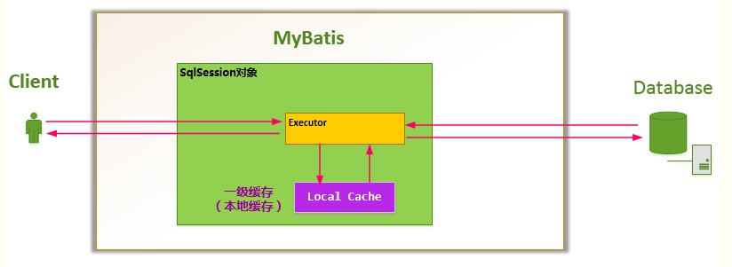
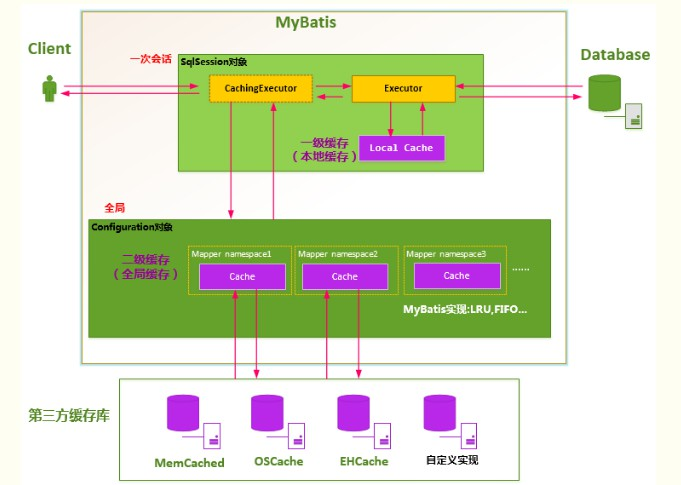

### 1.	 MyBatis的延迟加载和立即加载

1.	概念：

    	如果一个用户它有多个账户：
    	
    	我们在进行查询用户的时候，对于用户下的账户信息，应该是我们使用的时候才查询出来。
    	我们在查询账户时，对于账户所属的用户信息，应该随着账户的查询立马查询出来。
    	
    	延迟加载：在真正使用数据的时候才发起查询，不用的时候就不查询关联的数据，又称懒加载，按需加载。
    	立即加载：无论用不用，只要一调用相关的方法，马上发起查询。

2.	MyBatis中如何实现查询方法的延迟加载	

		在MyBatis的配置文件中通过设置settings的：
			1.	lazyLoadingEnabled属性为true进行开启全局的延迟加载
				延迟加载的全局开关。当开启时所以关联对象都会延迟加载。
			2.	aggressiveLazyLoading属性为true开启立即加载
				立即加载，任何方法的调用都会立即加载该对象的所有属性。	

3.	代码演示：

	    1.	用户类和账户类

```java
public class User implements Serializable{
    private Integer id;
    private String username;
    private Date birthday;
    private String sex;
    private String address;
    private List<Account> accountList;

    get和set方法省略.....      
}


public class Account implements Serializable{
    private Integer id;
    private Integer uid;
    private Double money;

    get和set方法省略.....      
}
```

		2.	UserDao/AccountDao接口
```java
 	/**
     * 查询所有的用户
     *
     * @return
     */
    List<User> findAll(); 
    
    /**
     * 根据用户ID查询账户信息
     * @return
     */
    List<Account> findAllByUid(Integer uid);
```

		3.	dao接口映射文件
	
	    	UserDao.xml
```xml
<resultMap id="userAccountMap" type="com.example.domain.User">
        <id property="id" column="id"/>
        <result property="username" column="username"/>
        <result property="birthday" column="birthday"/>
        <result property="sex" column="sex"/>
        <result property="address" column="address"/>
        <collection property="accountList" ofType="com.example.domain.Account" column="id"
                    select="com.example.dao.AccountDao.findAllByUid"/>
</resultMap>

<select id="findAll" resultMap="userAccountMap">
    SELECT * FROM USER;
</select>       
```

			AccountDao.xml   

```xml
<select id="findAllByUid" resultType="com.example.domain.Account">
	SELECT * FROM account WHERE uid = #{uid};
</select>           
```

			主要的功能实现位于：
```xml
        <collection property="accountList" ofType="com.example.domain.Account" column="id"
                    select="com.example.dao.AccountDao.findAllByUid"/>
```
			指明User中的accountList属性通过表字段id映射，Account表中有uid字段。
		查询的方法/SQL语句在select="com.example.dao.AccountDao.findAllByUid"中：	
		
			即select指定为AccountDao.xml文件的namespace全类名加相关映射文件下的
		findAllByUid方法：
			SELECT * FROM account WHERE uid = #{uid};
			
			通过这个唯一表示指定集合中元素的查找方式：
			根据用户ID和账户的UID匹配，进行查找。
		
	    4.	在Mybatis的配置文件mybatis-config.xml中通过设置settings开启全局延迟加载

```xml
configuration>
    <settings>
        <!--开启全局的懒加载-->
        <setting name="lazyLoadingEnabled" value="true"/>
        <!--关闭立即加载，其实不用配置，默认为false-->
        <setting name="aggressiveLazyLoading" value="false"/>
        <!--开启Mybatis的sql执行相关信息打印-->
        <setting name="logImpl" value="STDOUT_LOGGING" />
    </settings>
    <typeAliases>
        <typeAlias type="com.example.domain.Account" alias="account"/>
        <typeAlias type="com.example.domain.User" alias="user"/>
        <package name="com.example.domain"/>
    </typeAliases>
    <environments default="test">
        <environment id="test">
            <!--配置事务-->
            <transactionManager type="jdbc"></transactionManager>
            <!--配置连接池-->
            <dataSource type="POOLED">
                <property name="driver" value="com.mysql.jdbc.Driver"/>
                <property name="url" value="jdbc:mysql://localhost:3306/test1"/>
                <property name="username" value="root"/>
                <property name="password" value="123456"/>
            </dataSource>
        </environment>
    </environments>
    <!--配置映射文件的路径-->
    <mappers>
        <mapper resource="com/example/dao/UserDao.xml"/>
        <mapper resource="com/example/dao/AccountDao.xml"/>
    </mappers>
</configuration>
```

4.	测试方法：

```java
private InputStream in;
    private SqlSession session;

    private UserDao userDao;
    private AccountDao accountDao;
    private SqlSessionFactory factory;
    @Before
    public void init()throws Exception{
        //获取配置文件
        in = Resources.getResourceAsStream("SqlMapConfig.xml");
        //获取工厂
        factory = new SqlSessionFactoryBuilder().build(in);

        session = factory.openSession();

        userDao = session.getMapper(UserDao.class);
        accountDao = session.getMapper(AccountDao.class);
    }
    @After
    public void destory()throws Exception{
        session.commit();
        session.close();
        in.close();
    }
    @Test
    public void findAllTest(){
        List<User> userList = userDao.findAll();
//        for (User user: userList){
//            System.out.println("每个用户的信息");
//            System.out.println(user);
//            System.out.println(user.getAccountList());
//        }
    }
```
5. 测试说明

			当注释掉for循环打印时，意味着不需要用户的账户信息，按照延迟加载的特性程		序只会查询用户的信息，而不会查询账户的信息。
	​		当放开for循环打印时，意味着使用了用户的账户信息，程序会同时将用户和对应		账户信息打印出来。


### 2.	Mybatis的一级缓存和二级缓存

1. 缓存

	使用缓存是为了减少和数据库的交互次数，提高执行效率。
	
	适用于缓存的数据：
	​	经常查询并且不经常改变的，而且数据的正确与否对最终结果影响不大。

2. Mybatis的一级缓存

		Mybatis在开启一个数据库会话时，会创建一个新的SqlSession对象，SqlSession对象中会有一个新的Executor对象。Executor对象中持有一个新的PerpetualCache对象；当会话结束时，SqlSession对象及其内部的Executor对象还有PerpetualCache对象也一并释放掉。



		Mybatis的一级缓存是相对于同一个SqlSession对象的缓存。当我们执行查询时，查询的结果会同时存入到SqlSession为我们提供的一块区域中，该区域的结构是一个Map。
		所以在参数和SQL完全一样的情况下，我们使用同一个SqlSession对象调用同一个Mapper中的方法，Mybatis会先去SqlSession查询是有缓存，有的换就直接去出来。没有的话会查询数据库，并将结果存入SqlSession对象的本地一级缓存。
		当SqlSession对象销毁时，该对象的一级缓存也就销毁了。同时当调用SqlSession的修改，添加，删除，commit()，close()等方法时，也会清空一级缓存。
		
		Mybatis的一级缓存是默认开启的。

3. Mybatis的二级缓存。

		Mybatis的二级缓存指的是SqlSessionFactory对象的缓存，由同一SqlSessionFactory对象创建的SqlSession对象共享其缓存。
	​	二级缓存的作用域是mapper的同一个namespace
	​	但是缓存在其中的是数据而不是对象，所以从二级缓存中查询得出的结果要结果反序列化成一个新的对象。即从二级缓存中查询出得到的对象和第一次存储的对象不是同一个对象。
	​	
		SqlSessionFactory层面上的二级缓存是默认不开启的，二级缓存的开启需要进行配置，并且Mybatis要求返回的POJO必须是可序列化的要实现Serializable接口。
		配置的方法很简单：只需要在映射XML文件配置<cache/>即可，配置了二级缓存就意味着：
		1.	映射文件的所有select语句都将被缓存。
		2.	映射语句文件的所有insert，update和delete语句会刷新华黁，
		3.	缓存会使用默认的最近最少使用算法（LRU）回收。
		
		Mybatis的整体缓存设计以及二级缓存的工作模式：


4. 二级缓存如何使用

		1.	让Mybatis框架支持二级缓存：在Mybatis主配置文件中配置

```xml
<setting name="cacheEnabled" value="true"/>
```

		2.	让当前的映射文件支持二级缓存：Dao.xml映射文件中进行配置。

```xml
<?xml version="1.0" encoding="UTF-8" ?>
<!DOCTYPE mapper PUBLIC "-//mybatis.org//DTD Mapper 3.0//EN"
        "http://mybatis.org/dtd/mybatis-3-mapper.dtd">
<mapper namespace="com.yihaomen.mybatis.dao.StudentMapper">
    <!--开启本mapper的namespace下的二级缓存-->
    <!--
        eviction:代表的是缓存回收策略，目前MyBatis提供以下策略。
        (1) LRU,最近最少使用的，一处最长时间不用的对象
        (2) FIFO,先进先出，按对象进入缓存的顺序来移除他们
        (3) SOFT,软引用，移除基于垃圾回收器状态和软引用规则的对象
        (4) WEAK,弱引用，更积极的移除基于垃圾收集器状态和弱引用规则的对象。这里采用的是LRU，
                移除最长时间不用的对形象

        flushInterval:刷新间隔时间，单位为毫秒，这里配置的是100秒刷新，如果你不配置它，那么当
        SQL被执行的时候才会去刷新缓存。

        size:引用数目，一个正整数，代表缓存最多可以存储多少个对象，不宜设置过大。设置过大会导致内存溢出。
        这里配置的是1024个对象

        readOnly:只读，意味着缓存数据只能读取而不能修改，这样设置的好处是我们可以快速读取缓存，缺点是我们没有
        办法修改缓存，他的默认值是false，不允许我们修改
    -->
     <cache eviction="LRU" flushInterval="100000" readOnly="true" size="1024"/>
     
    <!--可以通过设置useCache来规定这个sql是否开启缓存，ture是开启，false是关闭-->
    <select id="selectAllStudents" resultMap="studentMap" useCache="true">
        SELECT id, name, age FROM student
    </select>
  
    <!--刷新二级缓存
    <select id="selectAllStudents" resultMap="studentMap" flushCache="true">
        SELECT id, name, age FROM student
    </select>
    -->
</mapper>
```
5. Mybatis二级缓存的缺点：

		MyBatis二级缓存使用的在某些场景下会出问题
	
		假设我有一条select语句：开启了二级缓存
```sql
select a.col1, a.col2, a.col3, b.col1, b.col2, b.col3 from tableA a, tableB b where a.id = b.id
```
		对于tableA和tableB的操作定义在两个Mapper中，分别是MapperA和MapperB，他们属于两个不同名称空间，如果此时启用二级缓存：
	
		1.	MapperA中执行上述sql语句查询这6个字段
		2.	MapperB更新了tableB的两个字段col1,col2
		3.	MapperA再次执行上述sql：结果会从二级缓存中中取数据，结果不是更新后的值。
		对于MapperA来说，其中的任何一个条件都没有变化，自然回去从二级缓存中取数据。
		
		这是Mybatis的二级缓存的一个bug，因此使用Mybatis的二级缓存有一个前提：
			必须保证所有的增删改查都在同一个名称空间下运行。

6. 小结

		Mybatis的一级缓存是SqlSession级别的缓存，一级缓存缓存的是对象，SqlSession的提交，更新等操作一级缓存就会清空。
	​	二级缓存是SqlSessionFactory级别的缓存，同一个SqlSessionFactory产生的SqlSession都共享一个二级缓存，而计划缓存中存储的是数据，当名中二级缓存时，通过存储的数据来反序列化构造一个对象返回。
	​	开启二级缓存查询数据的时候：二级缓存-->一级缓存-->数据库。
	​	
		需要注意的是：
			当Mybatis整合Spring后，是通过Spring来注入Mapper对象。如果不是在同一个事务中，每个Mapper的每次查询操作都对应一个新的SqlSession实例，这个时候就不会有一级缓存的命中，但是在同一个事务中共用的是一个SqlSession。


### 3.	谈谈你对Mybatis的理解

​			两点吧：1. 封装JDBC； 2. 映射

​			Mybatis是一个对象关系映射（Object Relational Mapping，简称ORM）框架，是为了解决**面向对象与关系数据库存在的互不匹配的现象。**也就是说Mybatis的关注点在于对象与数据库之间的映射，Mybatis会把数据库中得到的松散数据进行封装，使开发者直接拿到一个对象。

​			相较于使用纯JDBC来对数据库进行操作，SQL语句和JAVA代码是写在一起的，这是两种不同的语言。重复的创建连接，效率不高，查询结果集的映射也不方便。

​			Mybatis对JDBC操作数据库的过程进行了封装，SQL语句全部独立的保存在xml中，使开发者只需关注SQL本身，而不需要花费精力去处理例如注册驱动，创建connection，创建statement，手动设置参数，结果集检索等JDBC繁杂的过程代码。还有查询结果集的映射自动化，动态SQL标签等，都使查询更强大。

​			Mybatis需要手写Sql语句，对JDBC的封装程度不如Hibernate，但也因此灵活的多。

​			在使用Mybatis时，只需关注三个部分（1.sql语句 2.输入参数 3.输出参数）

​			1.	输出参数的映射：通过parameterType来指定传入的参数类型：基本类型，POJO

​					1.1 当输入参数是基本数据类型时，如果有多个要用@Param指定。

​					1.2 当输入参数是POJO时，可以通过#{}取出其中的属性。

​						  也可以先用@Param指定参数名x，再用#{x.name}

```sql
@Update("UPDATE account_info SET name=#{name}, bank_no=#{bankNo}")
Integer updateOne(Account one);

@Update("UPDATE account_info SET name=#{o.name}, bank_no=#{o.bankNo}")
Integer updateOne(@Param("o")Account one);
```

​			

​			2.	输出映射：

​			resultType：查询到的列名和resultType指定的POJO对象的属性名一致时，才能映射成功。

​			使用了反射机制，属性名和列名不一致时就无法通过反射找到setter方法。

​					

​			resultMap：如果查询到的列名和映射的POJO的属性名不一致时，通过resultMap设置列名和属性名

​			之间的对应关系（映射关系）。可以完成映射。

​					

​			association ：映射封装结果集中的对象属性。一对一关系

​					

​			collection：映射封装结果集中的List属性，一对多的关系。


### 4.	#和$的区别

​			${}是Properties文件中的变量占位符，它可以用于标签属性值和sql内部，属于静态文本替换。

​			比如${driver}会被静态替换为com.mysql.jdbc.Driver。

​			#{}是sql的参数占位符，Mybatis会将sql中的#{}替换为?号，在sql执行前会使用PreparedStatement的参数设置方法，按序给sql的?号占位符设置参数值，比如ps.setInt(0, parameterValue)，#{item.name}的取值方式为使用反射从参数对象中获取item对象的name属性值，相当于param.getItem().getName()。


## 1、#{}和${}的区别是什么？

答：${}是Properties文件中的变量占位符，它可以用于标签属性值和sql内部，属于静态文本替换，

比如${driver}会被静态替换为com.mysql.jdbc.Driver。#{}是sql的参数占位符，Mybatis会将sql中的#{}替换为?号，在sql执行前会使用PreparedStatement的参数设置方法，按序给sql的?号占位符设置参数值，比如ps.setInt(0, parameterValue)，#{item.name}的取值方式为使用反射从参数对象中获取item对象的name属性值，相当于param.getItem().getName()。


### 2、Xml映射文件中，除了常见的select|insert|updae|delete标签之外，还有哪些标签？

答：还有很多其他的标签，<resultMap>、<parameterMap>、<sql>、<include>、<selectKey>，加上动态sql的9个标签，trim|where|set|foreach|if|choose|when|otherwise|bind等，其中<sql>为sql片段标签，通过<include>标签引入sql片段，<selectKey>为不支持自增的主键生成策略标签。


### 3、最佳实践中，通常一个Xml映射文件，都会写一个Dao接口与之对应，请问，这个Dao接口的工作原理是什么？Dao接口里的方法，参数不同时，方法能重载吗？

答：Dao接口，就是人们常说的Mapper接口，接口的全限名，就是映射文件中的namespace的值，接口的方法名，就是映射文件中MappedStatement的id值，接口方法内的参数，就是传递给sql的参数。Mapper接口是没有实现类的，当调用接口方法时，接口全限名+方法名拼接字符串作为key值，可唯一定位一个MappedStatement，举例：com.mybatis3.mappers.StudentDao.findStudentById，可以唯一找到namespace为com.mybatis3.mappers.StudentDao下面id = findStudentById的MappedStatement。在Mybatis中，每一个<select>、<insert>、<update>、<delete>标签，都会被解析为一个MappedStatement对象。

Dao接口里的方法，是不能重载的，因为是全限名+方法名的保存和寻找策略。

Dao接口的工作原理是JDK动态代理，Mybatis运行时会使用JDK动态代理为Dao接口生成代理proxy对象，代理对象proxy会拦截接口方法，转而执行MappedStatement所代表的sql，然后将sql执行结果返回。


### 4、Mybatis是如何进行分页的？分页插件的原理是什么？

答：Mybatis使用RowBounds对象进行分页，它是针对ResultSet结果集执行的内存分页，而非物理分页，可以在sql内直接书写带有物理分页的参数来完成物理分页功能，也可以使用分页插件来完成物理分页。

分页插件的基本原理是使用Mybatis提供的插件接口，实现自定义插件，在插件的拦截方法内拦截待执行的sql，然后重写sql，根据dialect方言，添加对应的物理分页语句和物理分页参数。

举例：select * from student，拦截sql后重写为：select t.* from （select * from student）t limit 0，10


### 5、简述Mybatis的插件运行原理，以及如何编写一个插件。

答：Mybatis仅可以编写针对ParameterHandler、ResultSetHandler、StatementHandler、Executor这4种接口的插件，Mybatis使用JDK的动态代理，为需要拦截的接口生成代理对象以实现接口方法拦截功能，每当执行这4种接口对象的方法时，就会进入拦截方法，具体就是InvocationHandler的invoke()方法，当然，只会拦截那些你指定需要拦截的方法。

实现Mybatis的Interceptor接口并复写intercept()方法，然后在给插件编写注解，指定要拦截哪一个接口的哪些方法即可，记住，别忘了在配置文件中配置你编写的插件。


### 6、Mybatis执行批量插入，能返回数据库主键列表吗？

答：能，JDBC都能，Mybatis当然也能。


### 7、Mybatis动态sql是做什么的？都有哪些动态sql？能简述一下动态sql的执行原理不？

答：Mybatis动态sql可以让我们在Xml映射文件内，以标签的形式编写动态sql，完成逻辑判断和动态拼接sql的功能，Mybatis提供了9种动态sql标签trim|where|set|foreach|if|choose|when|otherwise|bind。

其执行原理为，使用OGNL从sql参数对象中计算表达式的值，根据表达式的值动态拼接sql，以此来完成动态sql的功能。


### 8、Mybatis是如何将sql执行结果封装为目标对象并返回的？都有哪些映射形式？

答：第一种是使用<resultMap>标签，逐一定义列名和对象属性名之间的映射关系。第二种是使用sql列的别名功能，将列别名书写为对象属性名，比如T_NAME AS NAME，对象属性名一般是name，小写，但是列名不区分大小写，Mybatis会忽略列名大小写，智能找到与之对应对象属性名，你甚至可以写成T_NAME AS NaMe，Mybatis一样可以正常工作。

有了列名与属性名的映射关系后，Mybatis通过反射创建对象，同时使用反射给对象的属性逐一赋值并返回，那些找不到映射关系的属性，是无法完成赋值的。


### 9、Mybatis能执行一对一、一对多的关联查询吗？都有哪些实现方式，以及它们之间的区别。

答：能，Mybatis不仅可以执行一对一、一对多的关联查询，还可以执行多对一，多对多的关联查询，多对一查询，其实就是一对一查询，只需要把selectOne()修改为selectList()即可；多对多查询，其实就是一对多查询，只需要把selectOne()修改为selectList()即可。

关联对象查询，有两种实现方式，一种是单独发送一个sql去查询关联对象，赋给主对象，然后返回主对象。另一种是使用嵌套查询，嵌套查询的含义为使用join查询，一部分列是A对象的属性值，另外一部分列是关联对象B的属性值，好处是只发一个sql查询，就可以把主对象和其关联对象查出来。

那么问题来了，join查询出来100条记录，如何确定主对象是5个，而不是100个？其去重复的原理是<resultMap>标签内的<id>子标签，指定了唯一确定一条记录的id列，Mybatis根据<id>列值来完成100条记录的去重复功能，<id>可以有多个，代表了联合主键的语意。

同样主对象的关联对象，也是根据这个原理去重复的，尽管一般情况下，只有主对象会有重复记录，关联对象一般不会重复。

举例：下面join查询出来6条记录，一、二列是Teacher对象列，第三列为Student对象列，Mybatis去重复处理后，结果为1个老师6个学生，而不是6个老师6个学生。

​       t_id    t_name           s_id

|          1 | teacher      |      38 |
|          1 | teacher      |      39 |
|          1 | teacher      |      40 |
|          1 | teacher      |      41 |
|          1 | teacher      |      42 |
|          1 | teacher      |      43 |


### 10、Mybatis是否支持延迟加载？如果支持，它的实现原理是什么？

答：Mybatis仅支持association关联对象和collection关联集合对象的延迟加载，association指的就是一对一，collection指的就是一对多查询。在Mybatis配置文件中，可以配置是否启用延迟加载lazyLoadingEnabled=true|false。

它的原理是，使用CGLIB创建目标对象的代理对象，当调用目标方法时，进入拦截器方法，比如调用a.getB().getName()，拦截器invoke()方法发现a.getB()是null值，那么就会单独发送事先保存好的查询关联B对象的sql，把B查询上来，然后调用a.setB(b)，于是a的对象b属性就有值了，接着完成a.getB().getName()方法的调用。这就是延迟加载的基本原理。

当然了，不光是Mybatis，几乎所有的包括Hibernate，支持延迟加载的原理都是一样的。


### 11、Mybatis的Xml映射文件中，不同的Xml映射文件，id是否可以重复？

答：不同的Xml映射文件，如果配置了namespace，那么id可以重复；如果没有配置namespace，那么id不能重复；毕竟namespace不是必须的，只是最佳实践而已。

原因就是namespace+id是作为Map<String, MappedStatement>的key使用的，如果没有namespace，就剩下id，那么，id重复会导致数据互相覆盖。有了namespace，自然id就可以重复，namespace不同，namespace+id自然也就不同。


### 12、Mybatis中如何执行批处理？

答：使用BatchExecutor完成批处理。


### 13、Mybatis都有哪些Executor执行器？它们之间的区别是什么？

答：Mybatis有三种基本的Executor执行器，**SimpleExecutor、ReuseExecutor、BatchExecutor。**

**SimpleExecutor：**每执行一次update或select，就开启一个Statement对象，用完立刻关闭Statement对象。

**ReuseExecutor：**执行update或select，以sql作为key查找Statement对象，存在就使用，不存在就创建，用完后，不关闭Statement对象，而是放置于Map<String, Statement>内，供下一次使用。简言之，就是重复使用Statement对象。

**BatchExecutor：**执行update（没有select，JDBC批处理不支持select），将所有sql都添加到批处理中（addBatch()），等待统一执行（executeBatch()），它缓存了多个Statement对象，每个Statement对象都是addBatch()完毕后，等待逐一执行executeBatch()批处理。与JDBC批处理相同。

作用范围：Executor的这些特点，都严格限制在SqlSession生命周期范围内。


### 14、Mybatis中如何指定使用哪一种Executor执行器？

答：在Mybatis配置文件中，可以指定默认的ExecutorType执行器类型，也可以手动给DefaultSqlSessionFactory的创建SqlSession的方法传递ExecutorType类型参数。


### 15、Mybatis是否可以映射Enum枚举类？

答：Mybatis可以映射枚举类，不单可以映射枚举类，Mybatis可以映射任何对象到表的一列上。映射方式为自定义一个TypeHandler，实现TypeHandler的setParameter()和getResult()接口方法。TypeHandler有两个作用，一是完成从javaType至jdbcType的转换，二是完成jdbcType至javaType的转换，体现为setParameter()和getResult()两个方法，分别代表设置sql问号占位符参数和获取列查询结果。


### 16、Mybatis映射文件中，如果A标签通过include引用了B标签的内容，请问，B标签能否定义在A标签的后面，还是说必须定义在A标签的前面？

答：虽然Mybatis解析Xml映射文件是按照顺序解析的，但是，被引用的B标签依然可以定义在任何地方，Mybatis都可以正确识别。

原理是，Mybatis解析A标签，发现A标签引用了B标签，但是B标签尚未解析到，尚不存在，此时，Mybatis会将A标签标记为未解析状态，然后继续解析余下的标签，包含B标签，待所有标签解析完毕，Mybatis会重新解析那些被标记为未解析的标签，此时再解析A标签时，B标签已经存在，A标签也就可以正常解析完成了。


### 17、简述Mybatis的Xml映射文件和Mybatis内部数据结构之间的映射关系？

答：Mybatis将所有Xml配置信息都封装到All-In-One重量级对象Configuration内部。在Xml映射文件中，<parameterMap>标签会被解析为ParameterMap对象，其每个子元素会被解析为ParameterMapping对象。<resultMap>标签会被解析为ResultMap对象，其每个子元素会被解析为ResultMapping对象。每一个<select>、<insert>、<update>、<delete>标签均会被解析为MappedStatement对象，标签内的sql会被解析为BoundSql对象。


### 18、为什么说Mybatis是半自动ORM映射工具？它与全自动的区别在哪里？

答：Hibernate属于全自动ORM映射工具，使用Hibernate查询关联对象或者关联集合对象时，可以根据对象关系模型直接获取，所以它是全自动的。而Mybatis在查询关联对象或关联集合对象时，需要手动编写sql来完成，所以，称之为半自动ORM映射工具。


。

