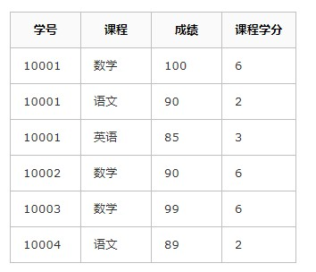

### 1. 聚簇索引和非聚簇索引

​		聚簇索引就是对磁盘上的实际数据重新组织以按照特定的一个或者多个列的值排序的算法。

​		特点是存储数据的顺序和索引顺序一致，一般情况下主键会默认生成聚簇索引，且一张表有且只有一个聚蔟索引。

​	1.聚蔟索引和非聚蔟索引的区别是：

​		聚簇索引(innobe)的叶子节点就是数据结点，而非聚蔟索引(myisam)的叶子节点仍然是索引文件，只是这个索引文件中包含指向对应数据块的指针。

​		MySQL中不同的数据存储引擎对聚蔟索引有不同的支持。

		* MyISAM使用的是非聚簇索引，按照列值和行号来组织索引的，叶子节点中保存的实际上是指向存放数据块的指针。

​       从物理文件中也可以看出MyISAM的索引文件.MYI和数据文件.MYD是分开存储的 是相对独立的（叶子节点只存放指针）。

		* 对于InnoDB引擎来说，是按照聚簇索引的形式存储数据。它的每个聚簇索引的叶子节点都包含主键值，事务ID，回滚指针以及余下的列。

​       从物理文件也可以看出InnoDB的数据文件只有数据结构文件.frm和数据文件.idb，其中.idb中存放的是数据和索引信息，存放在一起。

​	2.二级索引的区别

​	InnoDB的二级索引和主键索引也有很大的不同，二级索引叶子节点存放的是主键值而不是行指针，减少了移动数据或者分裂时维护二级索引的开销，因为不需要更新索引的行指针。因此首先通过二级索引查找到的是主键值，再根据主键值在主键索引中查找到相应的数据文件。

​	InnoDB会以聚蔟索引的形式来存储实际的数据，它是其他二级索引的基础。假设对一张InnoDB引擎表上的name字段加索引，那么name索引的叶子节点则只会存储主键id。检索时，会先通过name索引数找到主索引id，再通过id在主索引树的聚簇索引叶子节点中取出数据。

​	而MyISAM的二级索引存放的还是列值和行号的组合，叶子节点中保存的是指向物理数据的指针，因此它的主键索引和二级索引结构并没有任何区别，只是说主键索引的索引值是唯一却非空格的，而且MyISAM引擎可以不设置主键。

​	InnoDB引擎时必须设置主键的，需要依赖主键生成聚蔟索引，因此当没有指定主键的时候，InnoDB引擎会默认寻找一个可以唯一标识每行数据的列作为主键，当这种列不存在时，会默认生成一个6字节整型的隐藏列作为主键。

​	3.聚簇索引

​	对于非聚簇索引来说，每次通过索引检索到所需行号后，还需要通过叶子节点上的磁盘地址去磁盘内取数据（回行）。为了优化这部分回行取数据的时间，InnoDB引擎采用了聚蔟索引。

​	聚簇索引，即将数据存入索引叶子结点上。对于InnoDB引擎来说，叶子页面不在存该行对应的地址，而是直接存储数据。这样便避免了回行操作所带来的的时间消耗，使得InnoDB在某些查询上比MyISAM还要快。

​	4.为什么说多数情况下MyISAM比InnoDB查的快：

​	因为InnoDB查询变慢的原因是因为支持事务，回滚等，使得InnoDB的叶子结点实际上还包含有事务id以及回滚指针。


### 2.相较于叶子节点中存储行指针，二级索引存储主键值会占用更多空间，那为什么要这样设计呢？

​	InnoDB在移动行时，无需维护二级索引，因为叶子节点中存储的是主键值，而不是指针。减少了移动数据或分裂时维护二级索引的开销。

### 3.InnoDB有了聚蔟索引后，为什么还要有二级索引呢？

​	聚蔟索引的叶子节点存储了一行完整的数据，而二级索引只存储了主键值，相比于聚蔟索引，占用的空间要少。当我们需要为表建立多个索引时，如果都是聚蔟索引，那将占用大量内存空间，索引引入了二级索引。InnoDB中主键所建立的是聚蔟索引，而唯一索引，普通索引，前缀索引等都是二级索引。


### 4.为什么一般情况下，我们建表的时候 都会使用一个自增的id来作为我们的主键。

​	InnoDB中表的数据是直接存储在主键聚蔟索引的叶子节点中的，每插入一条记录，其实都是增加一个叶子节点，如果主键是顺序的，只需要把新增的一条记录存储在上一条记录的后面，当页达到最大填充因子的时候，下一条记录就会写入新的页中，这种情况下，主键页就会近似于被顺序的记录填满。

​	若表的主键不是顺序的id，而是无规律数据，比如字符串，InnoDB无法简单的把一行记录插入到索引的最后，而是需要找一个合适的位置，甚至可能产生大量的页分裂并且移动大量数据来寻找一个合适位置进行插入。如果找到了具体位置不在内存中，还会导致大量随机IO操作，影响插入效率。除此之外，大量的也分裂会导致大量的内存碎片。

​	

### 5.	存储过程和存储函数

​		存储过程和存储函数是事先**经过编译并存储在数据库中的一段SQL语句集合**，调用存储过程和存储函数可以简化应用开发人员的很多工作，减少数据在数据库和应用服务器之间的传输，对于提高数据处理的效率是有好处的。

​		我们调用存储过程其实就是再次执行这个SQL语句集合。

​		使用存储过程可以减少应用程序和数据库的交互。

​		存储过程和存储函数的区别在于存储函数必须有返回值，而存储过程没有返回值。

​		存储函数能做的事，存储过程也能做。

​	1.调用存储过程：

```SQL
call procedure_name() ;	
```

​	2.存储过程是可以编程的，意味着可以使用变量，表达式，控制结构来完成比较复杂的功能。

​	3.虽然存储过程没有返回值，但是可以传入一个OUT类型的参数来接收返回值，IN类型是传入的参数

```sql
CREATE PROCEDURE pro_test6(IN height INT, OUT description VARCHAR(50))
```

​	4.存储过程的优点：

​		能够将SQL代码封装起来，以后直接调用，方便复用。

​		保存在数据库之中。

​		让编程语言进行调用。

​		存储过程是一个预编译的代码块，执行效率比较高。

​	5.存储过程的缺点

​		每个数据库的存储过程语法几乎都不一样，十分难以维护（语法不通用）

​		业务逻辑放在数据库上，难以迭代。		

### 	6.数据库的三范式

​		首先要明确：满足第三范式，那么就一定第二范式，满足第二范式就一定满足第一范式。

​		1.第一范式：数据库表中的字段都是单一属性的，不可再分。

​			这个单一属性由基本类型构成，包括整型，实体，字符型，逻辑型，日期型等。

​			原子性，字段不可分，否则就不是关系数据库。

​		2.第二范式：满足第一范式，表中的非主键字段要依赖主键

​			唯一性，一个表只能说明一个事物。

​		3.第三范式：满足第二范式，非主键字段不能相互依赖。

​			每列都与主键有直接关系，不存在传递依赖。

​		

​		A：第一范式（1NF）：

​				即表的列具有原子性，不可再分解，一个字段只能存储一项信息，只要是关系型数据库就自动满足INF。		数据库表每一列都是不可分割的原子数据项，而不能是集合，数组，记录等非原子数据项。

​		B：第二范式（2NF）：表中的非主键字段要依赖主键

​				第二范式是在第一范式的基础上建立起来，满足第二范式必须先满足第一范式。第二范式要求表中的每		行必须可以被唯一地区分，为实现区分通常需要我们设计一个主键来实现。

​				当存在联合主键（多个字段构成一个主键）的时候，才会发生不符合第二范式的情况。比如当有两个主		键时，不能存在这样的属性，它职以来其中的一个主键。所有的非主键字段，都必须依赖同样的主键字段。

​		看下面的学生选课表：



​		假设表中主键为（学号，课程）这样两个字段构成的联合主键，所有的非主键列都依赖与主键（学号，课程），可以用（学号，课程）->（成绩，课程学分）表示。但是还有这样的一个依赖，课程学分，依赖于部分主键课程，（课程）->（课程学分）。所以上表是不满足第二范式的。

​		我们可以将这个表拆成两张表：

​		

​		那么学生选课表主键为（学号，课程），课程信息表主键为（课程），表中所有非主键列都完全依赖主键。不仅符合第二范式，还符合第三范式。

​		C.第三范式(3NF)：非主键字段不能有依赖，每列都与主键有直接关系，不存在传递依赖。

​		为了查询的高效，可能添加了一些冗余字段，这些冗余字段其实是可以通过多表关联查询得到的。此时这个冗余字段就可能和其他非主键字段产生依赖。

​		比如商品表中为了查询方便，加了一个冗余字段分类名，非主键字段分类名和分类id就有依赖关系，而且分类id还和商品表的主键id有依赖关系，这样分类名和主键id有了传递依赖关系。这就违反了三范式，非主键字段不能相互依赖，每列都与主键有直接关系，不存在传递依赖。但是查询效率高。

​		满足第三范式（3NF）必须先满足第二范式（2NF）。简而言之，第三范式（3NF）要求一个数据表中不包含已在其他表中存在的非主键字段。也就是说，某个字段如果能被推导出（关联查询），就不应该单独再设计一个字段来存放。

​		4.反三范式

​			没有冗余的数据库未必是最好的数据库，有时为了提高查询效率，就必须降低范式标准。适当保留冗余数据。具体的做法就是：在概念数据模型设计时遵守三范式，**降低范式标准的工作放到物理数据模型设计时考虑。降低范式就是增加冗余字段，减少关联查询，提高查询效率。**

​			数据库的操作中查询的比例要远大于DML的比例。

​			但是反三范式化一定要适度，并且在原本已满足三范式的基础上再做调整。


### 7. 什么是视图？以及视图的使用场景。

​		视图（View）是一种虚拟存在的表，是一种基于数据表的虚表，是为了简化查询操作的。

​		a.视图是一种虚表

​		b.视图建立在已有表呃基础上，视图赖以建立的这些表称为基表。

​		c.视图就是一条SELECT语句执行后返回的结果集

​		d.视图并不在数据库中实际存在，行和列数据来自定义视图的查询中使用的表（基表），并且是在使用视图时动态生成的。

​		c.虽然表面上是操作视图，但实际上还是操作的基表

​		场景：

​			每个人想看不同的字段，那么我们就用视图封装相应的查询结果集，然后将视图提供给响应的人。

​		好处：

​			a.简单：使用视图的用户完全不需要关心对应的基表的结构，关联条件和筛选条件，对用户来说这已经是过滤好了的符合条件的查询结果集。

​			b.安全：使用视图的用户只能访问他们看到的结果集，将用户的权限限制在某几行某几列。

​			c.数据独立：一旦视图的结构确定了，可以屏蔽基表结构变化对用户的影响，源表增加列对视图没有影响；源表修改列名，则可以通过修改视图来解决，不会造成对访问着的影响。

### 8. 触发器

​		触发器是与表有关的数据库对象，指在insert/update/delete之前或之后，触发并执行触发器中定义的SQL语句集合。

​		OLD和NEW行记录变量：

​		使用别名OLD和NEW来引用触发器中发生变化的记录内容，这与其他的数据库是相似的。

​		触发器类型：							NEW和OLD的使用

​		INSERT触发器							NEW表示将要或者已经新增的数据

​		UPDATE型触发器					  OLD表示修改之前的数据，NEW表示将要或已经修改的数据

​		DELETE型触发器						OLD表示将要或者已经删除的数据。

### 9. drop、delete与truncate分别在什么场景下使用

​	对比一下他们的区别：

​	1.drop table/drop database

​		a.属于DDL：操作/定义数据库，表的语句

​		b.不可回滚

​		c.不可带where

​		d.表内容和结构删除

​		e.删除速度快

​	2.truncate table：**当你仍要保留该表，但要删除所有记录时， 用 truncate**

​		a.属于DDL

​		b.不可回滚

​		c.不可带where

​		d.表内容删除

​		e.删除速度快

​	3.delete from

​		a.属于DML：操作具体数据记录的语句

​		b.可回滚

​		c.可带where

​		d.表结构还在，删除记录

​		e.删除速度慢，需要逐行删除

### 10. 索引是什么？有什么优缺点

1.索引的概念

​		索引(index)是帮助MySQL高效获取数据的数据结构。在数据之外，数据库系统还维护着满足特定查找算法的数据结构，这些数据结构以某种方式引用（指向）数据，这样就可以在这些数据结构上实现高级查找算法，这种数据结构就是索引。

​		一般来说索引本身也很大，不可能全部存储在内存中，因此索引往往以索引文件的形式存储在磁盘上。索引是数据库中用来提高性能的最常用的工具。

2.索引优势劣势

​	优势：

​	a.类似于数据的目录索引，提高数据检索的效率，降低数据库的IO成本。

​	b.通过索引列对数据进行排序，可以将数据变成有序的，降低数据排序的成本，降低CPU的消耗。

​	劣势：

​	a.实际上索引也是一张表，该表中保存了主键与索引字段，并且指向实体类的记录，所以索引列也是要占用空间的。

​	b.虽然索引大大提高了查询效率，同时却也降低了更新表的速度，如对表进行INSERT, UPDATE, DELETE。因为更新表时，MySQL不仅要更新表的数据信息，还要维护一下索引文件。


### 11 说说事务的四种特性（ACID）

什么是事务：

​	事务简单来说，几个会话Session中所进行的所有操作，要么同时成功，要么同时失败。

1.原子性(Atomicity)

​	原子性是指事务是一个不可分割的工作单位，事务中的操作要么都发生，要么都不发生。

2.一致性(Consistency)

​	事务前后数据的完整性必须保持一致。

3.隔离性(Isolation)

​	事务的隔离性是指多个用户并发访问数据库时，一个用户的事务不能被其他用户的事务所干扰，多个并发事务之间数据要相互隔离。

4.持久性(Durability)

​	持久性是指一个事务一旦被提交，它对数据库中数据的改变就是永久性的，接下来即使数据库发生故障也不应该对其有任何影响。

### 12 数据库隔离级别是什么？有什么作用？

1.隔离级别说明：

​	MySQL定义了四种隔离级别，包括一些具体规则，用于限定事务内外哪些改变是可见的，哪些改变是不可见的。低级别的隔离一般支持更高的并发处理，并且拥有更低的系统开销。

2.Isolation Read Uncommitted：读取未提交内容

​	这是事务最低的隔离级别，它允许另外一个事务可以看到这个事务未提交的数据。这种隔离级别还会产生很多问题，比如脏读，不可重复读和幻读。实际上很少使用，读取未提交数据，也被称为“脏读”。

3.Isolation Read Committed：读取提交的内容

​	是很多数据库系统默认的隔离级别，但不是MySQL的默认隔离级别。

​	保证一个事务修改的数据提交后才能被另外的事务读取，另外一个事务不能读取该事物未提交的数据。这种事务隔离级别可以避免脏读出现，但是可能会出现不可重复度和幻读。

4.Isolation Repeatable Read：可重复读

​	这是MySQL数据库默认的隔离级别，这种事务隔离级别可以防止脏读，不可重复度，但是可能出现幻读。它除了保证一个事务不能读取另一个事务未提交的数据外，还避免了不可重复度。

5.Isolation Serializable：可串行化

​	这是话费最高代价但是最可靠的事务隔离级别，是级别最高的隔离级别。它通过强制事务排序，使事务被处理为顺序执行，不会出现相互冲突，从而解决了脏读，不可重复度，幻读问题。

​	简而言之，Serializable是完全串行化的读，每次读都需要获得表级共享锁，读写都会阻塞。

​	在这个级别可能导致大量的超时Timeout和锁竞争Lock Connection现象，所以实际应用中恩少使用这个级别。


### 13. 脏读，不可重复读，幻读

​	1.脏读 ---- 读的时候可能就出错了，读到未提交的数据，未提交的数据就可能会回滚

​		一个事务读到另一个事务尚未提交的修改，UPDATE,INSERT,DELETE。当事务A对数据进行了修改，而这种修改还没有提交到数据库中，这时，另外一个事物B也访问这个数据。访问到的是一个还没提交的数据，是一个“临时数据”，最终的结果还没确定，可能回滚到原来的值。

​		脏读的后果：如果事务A回滚，那么它之前所做的修改统统撤销，事务B读到的数据，就是垃圾数据。

​	2.不可重复读 ---- 重复读的时候，数据可能被另外的事务修改

​		在事务A中，读取同一个数据时(SELECT)，两次读取的结果可能不同。原因就是在事务A两次读取一个数据，事务A还没有结束事务的过程中，允许事务B在事务A的过程中去修改这个数据。


例子：

​		客户端A开启了提交读的事务隔离级别，该级别可以解决脏读，但是允许不可重复读。

​		所以客户端A连续两次读取同一个数据的结果不同：不可重复读。

​		但是如果客户端A在客户端commit之前去读取id=2的数据，会发现结果还是0，说明该隔离级别避免了脏读。


3.幻读<-----可重复读

​	

​	可重复读：

​		当我们将当前会话设置为可重复读的时候，当前会话每次读取的结果都相同，不管其他事务有没有修改提交这个数据。

​	但是在可重复读的隔离级别上，会产生幻读的问题。

​	幻读：

​		所谓幻读，指的是当某个事务在读取某个范围内的记录时，另外一个事务又在该范围内插入了新的记录，当之前的事务再次读取该范围的记录时，会产生幻行。**InnoDB存储引擎通过多版本并发控制MVCC解决了幻读的问题。**

​		大白话解释一下，就是事务A查询id<10的记录时，返回2条数据。接着事务B插入一个id=3的记录并提交。事务A再次查询id<10的记录时，返回了3条记录。这就破坏了可重复读。

​	例子：MySQLInnoDB存储引擎已经解决了幻读


4.不可重复读和幻读的区别：

​	两者有相似的地方，两次SELECT可能得到不同的结果。

​	不可重复读一般是查询的单个记录被修改或者被删除了，但是原来的结果改变或者没有了。也就是第二次读到了已经提交的事务的更改数据（修改或删除）。  ---- UPDATE/DELETE

​	幻读是指在范围SELECT时，读到了新增的数据 ---- INSERT

​	

​	对于这两种问题往往采取不同的办法：

​		防止读到更改数据（脏读），只需要对要操作的数据加上行级锁，防止操作中的数据发生变化；

​		防止得到新增数据（幻读），往往需要添加表级锁，将整张表锁定，防止新增数据。

​	当隔离级别设置为可串行化，强制事务串行执行，避免了前面说的幻读问题。


### 14. SQL语句的执行顺序

​		selelct * from table t where size > 10 group by size order by size的语句执行顺序？

​		where -> group by -> having -> select  -> order by


### 15 MySQL的优化思路

一.查看各种SQL语句的执行频次：先确定当前数据库是以插入为主还是以查询为主

​	1.MySQL服务器的操作统计：对于所有操作引擎的表操作都会进行累计

```sql
# 显示数据库上次启动至今的统计结果
show global status like 'Com______';
# 显示当前连接（会话）的统计结果
show session status like 'Com______';
```

​	得到的统计结果：

​	Com_select		执行select操作的次数

​	Com_insert		执行INSERT操作的次数，对于批量插入的INSERT操作，只累加一次。

​	Com_update		执行UPDATE操作的次数

​	Com_delete		执行DELETE操作的次数。

​	2.InnoDB引擎操作的频次：只累计InnoDB操作引擎的表

```	sql
show status like 'Innodb_row_%';
```

​	Innodb_rows_read			select查询返回的行数

​	Innodb_rows_inserted		执行INSERT操作插入的行数	

​	Innodb_rows_deleted			执行DELETE操作删除的行数

​	Innodb_rows_updated		执行UPDATE操作更新的行数

二.定位到执行效率较低的SQL语句

​	可以通过一下两种方式定位执行效率底下的SQL语句。

​	1.慢查询日志：开启慢查询日志来定位那些执行效率较低的SQL语句。

​		开启时，MySQL会将所有执行时间超过long_query_time秒的SQL语句写到日志文件中。可以将					  long_query_time参数设置的小一点，默认的是10s，可以改成1s或者更小。

​	2.show processlist

​		因为慢查询日志是在查询结束以后才记录，所以不能实时的反应SQL的执行情况。可以用show processlist命令查看当前MySQL在进行的线程，包括线程状态，执行的语句信息等。

​		show processlist查询结果信息：


​		每一行记录都代表一个连接，可以是SQLyog图形化工具连接，com界面的连接。

​		所以可以用show processlist来查询当前系统当中每一个数据库连接正在执行的慢SQL语句和状态。

​		一些重要的列信息：

​			a.id列：用户登录mysql时，系统分配的“connection_id”

​			b.user列：显示当前用户

​			c.db列：显示这个进程目前连接的是哪个数据库

​			d.command列：显示当前连接执行的命令，一般是休眠sleep，查询query，连接connect等

​			e.time列：显示这个状态持续的时间，单位s。执行这个语句已经消耗的时间。

​			f.state列：显示当前连接的正在执行的SQL语句的状态，很重要的一个列。state描述的是语句执行中的某一个状态，一个sql语句，以查询为例，可能需要经过copying to tmp table、sorting result、sending data等状态才可以完成。

​			g.info列：显示这个具体的sql语句。

三.explain分析执行计划

​	通过以上步骤查询到效率低的SQL语句后，可以通过explain命令获取MySQL如何执行SELECT语句的信息，包括在SELECT语句执行过程中表如何连接和连接的顺序。

```sql
explain select * from tb_item where id = i;
```


```sql
explain select * from tb_item where title = '阿尔卡特 (OT-979) 冰川白 联通3G手机3';
```


​	各字段含义：

​	id：	select查询的序列号，是一组数字，表示的是查询中执行select子句或者是操作表的顺序

​	select_type：表示SELECT的类型，常见的取值有SIMPLE（简单表，即不使用表连接或者子查询），PRIMARY（主查询，即外层的查询），UNION（UNION中的第二个或者后面的查询语句），SUBQUERY（子查询中的第一个SELECT）等。

​	table：输出结果集的表

​	type：表示表的连接类型，性能由好到差的连接类型为（system->const->eq_ref->ref->ref_or_null->index_merge->index_subquery->range->index->all）

​	possible_keys：表示查询时，可能使用的索引

​	key：表示实际使用的索引

​	key_len：表示索引字段的长度

​	rows：扫描行的数量

​	extra：执行情况的说明和描述。

四.show profiles分析SQL

​	show profiles能够在做SQL优化时帮我们了解时间都耗费到哪里去了

​	分析出SQL语句在执行过程中时间到底耗费在哪个阶段，各个阶段耗时多少。

​	1.先查看是否支持

```sql
SELECT @@have_profiling;
```

​	2.查看是否开启

```sql
SELECT @@profiling;
```

​	3.开启profiling

```sql
set profiling=1;
```

​	4.演示：先执行一系列SQL操作

```sql
show databases;

use db01;

show tables;

select * from tb_item where id < 5;

select count(*) from tb_item;
```

​	5.show profiles 指令， 来查看SQL语句执行的耗时：

```sql
show profiles;
```


​	6.通过show profile for query query_id语句查看该SQL语句执行过程中每个阶段的状态和消耗时间

```sql
show  profile for  query  6;
```


​		tip:

​		Sending data状态表示MYSQL线程开始访问数据并把结果返回给客户端。Sending data状态下，MySQL线程往往需要做大量的磁盘读取操作，所以经常是整个查询中耗时最长的状态。

​		7.MySQL支持进一步选择all、cpu、block io 、context switch、page faults等明细类型类查看MySQL在使用什么资源上耗费了过高的时间。

​		例如，选择查看CPU的耗费时间  

```sql
show profile cpu for query 6;
```


### 16 MySQL的执行过程

​	当我们开启慢查询记录或者show processlist定位到低效率的SQL时，可以再用explain这个命令来查看这个查询SQL语句的执行过程/执行计划。比如查看这个SQL语句有没有使用索引，有没有做全表扫描。获取MySQL如何执行SELECT语句的信息，包括SELECT语句执行过程中表如何连接和连接的顺序。

​	一.id：id字段是select查询的序列号，是一组数字，表示的是查询中执行select子句或者是操作表的书信

​	1.id相同表示加载表的熟悉是从上到下

```sql
# 多表联查
explain select * from t_role r, t_user u, user_role ur where r.id = ur.role_id and u.id = ur.user_id ;
```

​	多表联查：id相同，从上到下加载表


​	2.id不同，id值越大，优先级越高，优先被执行。

```sql
# 子查询语句
EXPLAIN SELECT * FROM t_role WHERE id = (SELECT role_id FROM user_role WHERE user_id = (SELECT id FROM t_user WHERE username = 'stu1'))
```


​	3.id有相同，也有不同。id相同可以认为是异族，从上往下顺序执行。id越大，越先执行费。

​	联查，联查的是一个子查询

```sql
EXPLAIN SELECT * FROM t_role r , (SELECT * FROM user_role ur WHERE ur.`user_id` = '2') a WHERE r.id = a.role_id ; 
```


​	二.explain之select_type

​	表示SELECT的类型，常见的取值，如下表所示：从上到下效率越来越低

​	select		含义

​	SIMPLE		简单的select查询，查询中不包含子查询或者UNION

​	PRIMARY	查询中若包含任何复杂的子查询，最外层查询标记为PRIMARY

​	SUBQUERY	在SELECT或WHERE列表中包含子查询

​	DERIVED	在FROM列表中包含的子查询，被标记为DERIVED（衍生），临时表。MYSQL会递归执行这些子查询，把结果放在临时表中。

​	UNION		若第二个SELECT出现在UNION之后，则标记为UNION；若UNION包含在FROM子句的子查询中，外层SELECT将被标记为DERIVED	

​	UNION RESULT	从UNION表获取结果的SELECT

​	1.SUBQUERY：在SELECT或WHERE列表中包含子查询

```sql
# 在SELECT或者WHERE中包含子查询
EXPLAIN SELECT * FROM t_user WHERE id = (SELECT id FROM user_role WHERE role_id = 5);
```


​	2.derived：在from列表中包含的子查询，会被标记derived衍生表，临时表

```sql
# 在from列表中包含的子查询，会被标记为DERIVED
EXPLAIN SELECT a.* FROM (SELECT * FROM t_user WHERE id IN ('1', '2')) a;
```


​	3.UNION：查询id=1的用户，再查询id=2的用户，求其并集

```sql
## 查询id=1的用户，在查询id=2的用户，求其并集
EXPLAIN SELECT * FROM t_user WHERE id = '1' UNION SELECT * FROM t_user WHERE id = '2'; 
```


​	三.explain之table

​	展示这一行的数据是关于哪一张表的

​	四.explain之type

​	通过type这个指标，就可以大致知道这个SQL的大致执行效率

​	type显示的是访问类型，是较为重要的一个指标，可取值为：

​	type			含义：

​	NULL			MySQL不访问任何表，索引，直接返回结果

​	system			查询的表中只有一行记录，等于系统表，是const类型的特例，一般不会出现

​	const			表示通过索引一次就找到了，const只比较primary key和unique索引。因为只匹配一行数据，所以很快。**如将主键置于where列表，MYSQL就能将该查询转换为一个常量。**const于将“主键”或“唯一”索引的所有部分与常量值进行比较。

​	eq_ref			类似于ref，区别在于使用的是唯一索引，主键的关联查询，关联查询出的记录只有一条。常见于主键或唯一索引扫描。

​	ref				非唯一性索引扫描，返回匹配某个单独值的所有行。本质上也是一种索引访问，返回所有匹配某个单独值的所有行。

​	range			范围查询，只检索给定返回的行，使用一个索引来选择行。where之后出现between，<，>，in等操作。

​	index			index与ALL的区别为Index类型只是遍历了索引树，通常比ALL快，ALL是遍历数据文件。

​	all				遍历全表来找到匹配的行

​	1.eq_ref：多表关联查询，相互关联的是唯一索引，主键，查询出来的数据只有一条。

```sql
EXPLAIN SELECT * FROM t_user u, t_role r WHERE u.id = r.id;
```


​	2.ref：根据非唯一性索引查询，所以不能用PRIMARY和UNIQUE索引扫描，我们为name列建一个非唯一性索引

```sql
# 为name列建一个非唯一索引
CREATE INDEX idx_user_name ON t_user(NAME);
EXPLAIN SELECT * FROM t_user WHERE NAME = '系统管理员';
```


​	3.ALL：ALL是遍历全表以找到匹配的行

```sql
EXPLAIN SELECT * FROM t_user;
```


​	4.index：id是主键，主键有索引，所以通过索引查出所有id

```sql
EXPLAIN SELECT id FROM t_user;
```

​	

​	type结果从好到坏：system > const > eq_ref > ref > range > index > ALL

​	一般来说，我们需要保证查询至少达到range级别，最好达到ref。不能是index或ALL，每次都要检索所有索引或数据记录。

​	五.explain之key相关字段

​	1.possible_keys：显示可能应用在这张表的索引，一个或多个。

​	2.key：实际使用的索引，如果为NULL，则没有使用索引。

​	3.key_len：表示索引中使用的字节数，该值为索引字段最大可能长度，并非实际使用长度，长度越短越好。

​	六.explain之rows

​	扫描了几行得到结果：整个SQL执行过程扫描了几行。

​	七.explain之extra

​	其他的额外的执行信息，在该列展示

​	extra				含义

​	using filesort			**通过对返回的数据再进行排序，得到结果，也就是通常说的filesort排序。所有不是通过索引直接返回排序结果的排序都叫filesort排序，效率较低。**

​	using temporary		使用了临时表保存中间结果，MySQL在对查询结果排序时使用临时表。常见于order by和group by；效率低

​	using index			表示相应的select操作使用了覆盖索引，避免访问表的数据行，效率不错。

​	需要优化的是：using filesort, using temporary，保持using index

​	1.using filesort：

```sql
# password没有索引：mysql会对数据使用一个外部的索引排序using filesort
EXPLAIN SELECT * FROM t_user ORDER BY PASSWORD;
```


```sql
# name有索引
EXPLAIN SELECT NAME FROM t_user ORDER BY NAME;
```


​	2.using temporary：MYSQL在对查询结果分组或排序使用临时表

```sql
# PASSWORD列没有索引
EXPLAIN SELECT * FROM t_user GROUP BY PASSWORD;
```


### 17 避免索引失效

​	1.全值匹配，对索引中所有列都指定具体值：**对创建了索引的列都进行匹配**，这样索引肯定不会失效。

​	该情况下，索引生效，执行效率高：

```sql
explain select * from tb_seller where name='小米科技' and status='1' and address='北京市';
```


​	type=ref：说明用了非唯一性索引进行扫描

​	ref=const：说明用的是常量进行查询。

​	2.最左前缀法则

​	查询条件要包含复合索引的最左列

​	如果索引了多列（复合索引），要遵守最左前缀法则。指的是查询从索引的最左前列开始，若果用到后面的列，跳过后面索引中的列时，只会走最左列索引。可以不走后面所有的列，也相当于没有跳过。

​	索引长度：810时，代表复合索引的三个索引来都起作用了

​	索引长度：410时，代表符合索引的前两个索引起作用了。

​	索引长度：403时，代表只有最左索引列起作用了。

​	2.1.匹配最左前缀法则，走索引：


​	2.2.不匹配最左前缀法则，索引失效：有没有保函最左列


​	2.3.如果符合最左法则，但是出现跳跃某一列，只有最左列索引生效：索引的长度是403，name的长度

​	

​	2.4.只要有最左列，就会走索引：NAME = '小米科技';和WHERE的相对顺序无关，但是必须要有。

```sql
EXPLAIN SELECT * FROM tb_seller WHERE address='西安市' AND NAME = '小米科技';
```

​	

​	3.范围查询右边的列，不会使用索引。

​	精确匹配会走索引，范围匹配之后的字段索引失效。

```sql
# 精确匹配会走索引
explain select * from tb_seller where name = '小米科技' and status = '1' and address = '北京市';
# 范围匹配之后的字段索引失效
explain select * from tb_seller where name = '小米科技' and 'status' > 1 and address = '北京市';
```

​	根据前面的两个字段name，status查询是走索引的，但是最后一个条件address没有用到索引


​	4.不要在索引列上进行运算操作，否则索引将失效。

​	本来name是符合最左前缀法则的

```sql
explain select * from tb_seller where substring(name, 3, 2) = '科技'; 
```

​	由于在索引列name上进行了运算操作，所以导致name索引列失效


​	5.字符串不加单引号，导致索引失败

​	主要是数字类型，不写单引号也能查询出来（MYSQL会进行隐式的类型转换，导致字符类型的列索引失效）

```sql
explain select * from tb_seller where name='科技' and status = '0';
```

```sql
# status是char类型，0没有加引号，导致索引失效
explain select * from tb_seller where name = '科技' and status = 0
```


​	由于在查询时，没有对字符加单引号，MYSQL的查询优化器会自动的进行类型转换，导致索引失效。

​	6.尽量使用索引覆盖，避免select *

​	尽量使用索引覆盖，减少select * ，只访问有索引的列或者索引列完全包含查询列。

​	不是访问所有字段，而是访问有索引的字段。要查询的字段在索引列中都包含了。

```sql
# select * ---> Extra：Using index condition
explain select * from tb_seller where name = '科技' and status = '0' and address = '西安市';

# select name, status, address ---> Extra：Using where;Using index
explain select name, status, address from tb_seller where name = '科技' and status = '0' and address = '西安市';
```


​	Tips：Explain的Extra列

​		6.1. using index：查询的列被索引覆盖，查询列被索引覆盖，并且满足最左前缀，意味着直接通过索引就可以找到数据，无需回表操作。

​		6.2. using index condition：用到了索引的。查询的列没有全部被索引覆盖，查询的条件可以被索引覆盖。SELECT * 

```sql
explain select * from tb_seller where name = '小米科技';	
```

​			

​			因为不是所有的列都有索引，只如果查询有索引的列，那么通过二级索引查到主键索引，在主键		

​		索引中可以直接拿到数据。那么查询所有的列SELECT *，有的列有索引，有的列没有索引。此时也会用

​		到索引，找到符合where索引条件的数据行，再到表中拿到这个数据对应的一张行数据。

​		6.3.using where;using index：查询的列都是索引列，查询条件也都被索引列覆盖，满足最左前缀原

​		则。所以不会进行会表操作，直接查询出来。

```sql
EXPLAIN SELECT NAME, STATUS, address FROM tb_seller WHERE NAME = '小米科技';
```


​		6.4.using where ：需要回表去查询所需要的数据。


​	7.用or分割开的条件，如果or前的条件中的列有索引，而后面的列中没有索引。那么涉及到的所有索引都失效

​	实例：name字段是索引列，而createtime不是索引列，中间用or进行连接时这样不会走索引

```sql
explain select * from tb_seller where name='黑马程序员' or createtime = '2088-01-01 12:00:00'\G;	
```


​	8.SELECT * 时，而且还是以%开头的LIKE模糊查询，索引失效。

​	如果仅仅是尾部模糊查询，索引不会失效。如果是头部模糊匹配，所以失效。

```sql	
explain select * from tb_seller where name like '黑马程序员%';
explain select * from tb_seller where name like '%黑马程序员';
explain select * from tb_seller where name like '%黑马程序员%';
```


​	通过覆盖索引来解决：select 索引列1, 索引列2

​	

​	9.如果MySQL评估使用索引比全表扫描更慢，则不适用索引：MySQL评估走全表扫描比走索引更快

​	比如address列有索引， 表中有12条数据，其中11条address是北京市，Mysql会认为全表扫描更快


```sql
explain select * from tb_seller where address = '北京市';
explain select * from tb_seller where address = '西安市';
```


10.is null , is not null 有些情况下会失效

is NOT NULL : 加入当前字段都是非空的，就不会走索引。MYSQL认为还不如走全表扫描。

is NULL：该字段绝大部分都是NULL，就不走索引。

```sql
explain select * from tb_seller where name is null;
explain select * from tb_seller where name is not null;
```


9和10的情况类似：就是大部分行的该列数据都满足where条件。

11.in走索引，not in索引失效：尽量避免使用not in


### 18.SQL优化

一.大批量插入数据

​	使用load命令导入大批量数据：

```sql
load data local infile '/root/sql1.log' into table 'tb_user' fields terminated by ',' lines terminated by '\n'; 
```


​	对于InnoDB类型的表，有以下几种方式可以提高导入的效率。

​	1.因为InnoDB类型的表示是按照主键的顺序保存的，所以将导入的数据按照主键的顺序排列，可以有效的提	

高导入数据的效率。如果InnoDB表没有主键，那么系统会自动默认创建一个内部列作为主键。

​	a.插入ID顺序排列的数据


​	b.插入ID无序排列的数据


​	2.关闭唯一性校验

​	在导入数据前执行 SET UNIQUE_CHECKS=0，关闭唯一性校验，在导入结束后执行SET UNIQUE_CHECKS=1，再恢复唯一性校验，可以提交导入的效率。


​	3.手动提交事务

​	如果应用使用自动提交的方式，建议在导入前执行SET AUTOCOMMIT=0，关闭自动提交，导入结束后再执行SET AUTOCOMMIT=1，打开自动提交，也可以提高导入的效率。

​	

二.优化INSERT语句

当采用INSERT语句时，可以考虑采用以下几种优化方案。

​	1.如果需要同时对一张表插入很多行数据时，应该尽量使用values后面跟多个值insert语句，这种方式将大大的缩短客户端与数据库之间的连接，关闭等消耗。使得效率比分开执行的单个insert语句快。

示例a，多个单独的INSERT语句：效率慢，多次客户端与数据库之间的连接，关闭。

```sql
insert into tb_test values(1,'Tom');
insert into tb_test values(2,'Cat');
insert into tb_test values(3,'Jerry');
```

示例b，优化后的方案：

```sql
insert into tb_test values(1,'Tom'),(2,'Cat')，(3,'Jerry');
```

​	2.进行数据插入：手动操作事务

```sql
start transaction;
insert into tb_test values(1,'Tom');
insert into tb_test values(2,'Cat');
insert into tb_test values(3,'Jerry');
commit;
```

​	3.数据有序插入

​		a.无序示例：影响效率

```sql
insert into tb_test values(4,'Tim');
insert into tb_test values(1,'Tom');
insert into tb_test values(3,'Jerry');
insert into tb_test values(5,'Rose');
insert into tb_test values(2,'Cat');
```

​		b.优化后，有序插入

```sql
insert into tb_test values(1,'Tom');
insert into tb_test values(2,'Cat');
insert into tb_test values(3,'Jerry');
insert into tb_test values(4,'Tim');
insert into tb_test values(5,'Rose');
```

三.优化order by语句

```sq
# 为age，salary建立索引
create index idx_emp_age_salary on emp(age,salary);
```

1.没有优化的情况：通过对返回的数据再进行排序，得到结果，也就是通常说的filesort排序。所有不是通过索引直接返回排序结果的排序都叫filesort排序，效率较低。

SELECT *

```sql
select * from emp order by age desc;
select * from emp order by age asc;
```


2.第二种：使用索引覆盖

通过索引顺序扫描直接返回有序数据，不需要额外的排序。SELECT使用覆盖索引，查询的列被索引覆盖。


3.第三种：多字段排序，既按照age排序，又按照salary排序

如果按照age升序，salary降序，就会出现Using filesort，也就是对返回的数据进行了再排序，而不是直接通过索引就拿到了排序后的结果。

```sql
explain select id, age from emp order by age, salary desc;
```


a.多字段排序时：要么都是升序要么都是降序，而且order by后面的字段顺序要和索引顺序一致。

​	索引顺序：age，salary

```sql
CREATE INDEX idx_emp_age_salary ON emp(age,salary);
```

​	排序顺序：salary，age

```sql
explain select id, age from emp order by salary desc, age desc;
```

​	此时就会出现：using filesort


优化排序SQL小结：

​	1.尽量减少额外的排序，使用覆盖索引，SELECT查询的列都有所引，直接返回有序数据。

​	2.order by 中的条件索引顺序，要和索引顺序一致。

​	3.order by中的条件要么是正序，要么都是倒序

四.优化Group by语句

1.GROUP BY操作实际上底层也会进行排序操作，如果我们仅仅想要分组的结果，可以禁止掉排序操作。

```sql
# 删掉前面建的索引
drop index idx_emp_age_salary on emp;
# 优化前：
explain select age,count(*) from emp group by age;
```


优化：优化掉了filesort的消耗 order by null

```sql
# 优化，禁掉默认的排序
explain select age,count(*) from emp group by age order by null;
```


从上面的例子可以看出，第一个SQL语句需要进行filesort，而第二个语句由于order by null 不需要进行filesort。

2.为group by条件中的列创建索引，再结合order by null

```sql
create index idx_emp_age_salary on emp(age,salary)；
```


五.优化嵌套查询：子查询

连接查询要比子查询更高效，因为MYSQL不需要在内存中创建临时表。

优化前：

```sql
explain select * from t_user where id in (select user_id from user_role );
```


优化后：

```sql
explain select * from t_user u , user_role ur where u.id = ur.user_id;
```


六.优化OR条件

对于包含OR的查询字句，如果要利用索引，则OR之间的每个条件列都必须用到索引，而且不能使用复合索引。如果没有索引，则应该考虑增加索引。

```sql
explain select * from emp where id = 1 or age = 30; 
```

而且建议使用UNION替换OR

```sql
explain select * from emp where id = 1 union select * from emp where id = 10;
```

UNION语句的type值为ref，OR语句的type值为range，可以看到这是一个很明显的差距

UNION语句的ref值为const，OR语句的type值为null，const表示是常量值引用，非常快。

这两项的差距就说明了UNION要优于OR。

七.优化分页查询

一般分页查询时，通过SELECT查询索引覆盖的列就能比较好的提升性能。

一个常见的问题就是：limit 2000000,10;过程时，需要MYSQL进行一个默认的排序操作，排序2000010个数据，但是只返回了2000000--2000010十个记录 ，其他记录丢失，分页查询时代价很高。

```sql
# 是一个全表扫描  type=ALL
select * from tb_user_1 limit 2000000, 10;
```


1.优化思路

在有索引的索引列上完成排序分页操作，最后根据主键关联回原表查询其他所需要的其他列的内容

```sql
explain select * from tb_item t, (select id from tb_item order by id limit 2000000, 10) a where t.id = a.id;
```


2.优化思路：适用于有自增主键的表

可以把limit查询条件，转换成某个位置的查询

不仅仅要自增，而且主键还不能有断层

```sql
select * from tb_user_1 where id > 2000000 limit 10;
```

八.使用SQL提示

在SQL语句中加入一些人为的提示来达到优化操作的目的

1.USER INDEX：建议数据库使用这个索引，只是建议。数据库可能还是会走他认为的最优流程。

```sql
create index idx_seller_name on tb_seller(name);
```

比如：name有一个单值索引，name还有一个复合索引：而且查询也符合最左前缀规则。

发现数据库默认走的是单值索引：


指定索引：use index(idx_seller_name_sta_addr)

```sql
 explain select * from tb_seller use index(idx_seller_name_sta_addr) where name = '小米科技';
```


2.让数据库忽略某个索引：ignore index

```sql
 explain select * from tb_seller ignore index(idx_seller_name) where name = '小米科技';
```

3.强制MYSQL使用一个特定的索引： force index 

```sql
explain select * from tb_seller force index(idx_seller_address) where address = '北京市';
```

### 19.工作中使用索引的例子

#### 1.前缀匹配


#### 2.为列的一部分建立索引

我们工作中涉及到姓名，电话号码这些隐私的数据都会进行加密，存在表中的是加密后的字段。还会根据这些隐私的内容得到一个hash值存到表中，这个hash值主要是用来做查询的，查表的时候是根据这个hash值来进行条件筛选。所以我们为这些hash值做了索引，但是这个hash值又非常的长，直接对整个列建索引的话非常浪费，我们建索引的时候只对该列的前面一部分做索引。

### 20.case then语法

```sql
# 如果sex列的值是m换成f，如果不是换成m
update salary
set 
    sex = case sex
        when 'm' then 'f'
        else 'm'
    end;

```

### 21.MySQL中的字符集

#### 1.MySQL中的UTF8mb3和UTF8mb4：

​	utf8mb3就是阉割过的utf8。考虑到大部分常用的字符用1~3个字节就可以表示，所以utf8mb3只使用1~3个字节表示字符。

​	utf8mb4是正宗的utf8字符集，使用1~4个字节表示一个字符。

​	如果有使用4个字节存储一个字符的需要，比如一些emoji表情，就需要使用utf8mb4字符集。

​	utf8是一种变长的编码方式；utf8、utf16、utf32都是Unicode字符集的一种编码方案。

#### 2.客户端发送请求到服务器返回响应的过程：

​	1.客户端发送的请求字符串是采用哪种字符集进行编码的：主要取决于当前操作系统的字符集、启动客户端时指定启动项指定字符集、my.ini配置文件中进行的配置。

​	2.服务器接收到请求字节序列时，会认为它是按照character_set_client进行编码的，所以会按照character_set_client进行解码。

​	3.解码后得到的字符串还会再按照character_set_connection对应的字符集进行编码（转码）。

​	4.服务器处理好请求，将结果返回时，结果字符串是按照character_set_result进行编码得到的字节序列。

​	5.客户端得到响应的字节序列后，会按照客户端的字符集进行解码，写到命令行中。


### 22.InnoDB存储引擎

MySQL服务器中对表中数据进行读取和写入工作的部分是存储引擎负责的。MySQL支持多种存储引擎，真实数据在不同的存储引擎中的存放格式一般是不同的。	

InnoDB是将表中的数据存储到磁盘上的存储引擎，所以在关闭服务器再重启后，数据还是存在的。

#### 1.数据页：

​	因为处理数据是在内存中进行的：将数据读到内存，在将处理好的数据写到内存。由于磁盘I/O非常慢，所谓为了提高效率，InnoDB以页为单位作为磁盘和内存交互的基本单位，InnoDB中页的大小一般是16kb。即一般情况下，InnoDB一次最少从磁盘中读取16KB的内存，以最少把16Kb的数据刷新到内存。

#### 2.InnoDB行格式：

​	我们一般以记录为单位向表中插入数据，这些记录在磁盘上的存放形式也被称为行格式或者记录格式。

​	一条完整的记录主要分为两部分：记录的真实数据+记录的额外信息。

​	其中记录的额外信息主要是一些记录的描述信息比如：变长字段长度列表，null值列表，记录头信息。

​	其中记录的真实数据除了我们定义的列数据外，MySQL还会为每个记录默认添加一些隐藏列：行id，事务id，回滚id。

​	出去记录头信息和隐藏列：一行记录中所有列占用的字节长度最长是65535字节。

#### 3.InnoDB表对主键的生成策略：

​	优先使用用户自定义的主键作为主键；

​	如果用户没有定义主键，则取一个Unique列作为主键；

​	如果Unique列也没有，InnoDB会为表默认添加一个行id作为主键；

​	所以InnoDB存储引擎会为每条记录都添加事务id和回滚id，但是行id只有在没有自定义主键且没有Unique列时才会添加到行格式的真实数据部分。

#### 4.索引页：

​	页是InnoDB存储引擎管理存储空间的基本单位，一般是16kb。InnoDB为了不同的目的设计了许多种不同类型的页：如存放表中记录的页，存放日志信息的也...其中存放表中记录的页称为索引页。


### 23.记录在页中的组织形式

#### 1.组织形式

​	每条记录都是由特定的格式的，这种格式我们称之为行格式。行格式包括两部分：记录地额外信息+记录的真实信息。在记录的额外信息中有一个next_record字段：表示当前记录的真实数据部分都下一条记录的真实数据的地址偏移量。类似一个指针，我们能通过这个字段找到下一个记录。

​	而且InnoDB管理存储空间的基本单位是页，所以这些行格式形式的记录都是存放在页中，页的大小是16kb。这种存放记录的页称为索引页。

​	在索引页中有一部分存放了两条伪记录：Infimum记录和Supremum记录。规定这两条记录分别是最小记录和最大记录。对于记录的大小比较的标准就是它们的主键值。规定Infimum记录的下一条记录就是本页记录中的主键值最小的记录，主键值最大的记录的下一条记录就是Supremum记录。这些记录这件按照主键值排序，并且通过next_record字段链接起来，组成一个单向链表。

​	所以我们的记录按照主键从小到大的顺序形成了一个单链表，最大记录supremum的next_record的值为0，表示它是最后一条记录了。

#### 2.页目录

​	了解到记录在页中按照主键值由小到大的顺序串联成一个单链表，那么想要根据主键值查找某条记录怎么才能更高效呢？依次遍历显然是个笨方法，所以还要在组织这些记录，为了方便根据主键id来进行查找。

​	InnoDB设计了一个页目录的结构，作为索引页的一部分。将正常的记录，包括最大最小记录划分成若干组，一般的分组是4~8条记录一组；每组中的最后一条记录的地址偏移量单独提出来按照顺序存放到索引页中的页目录处；页目录中的这些每组中最大记录的地址偏移量被称为槽，所以页目录是由一个个槽组成的。

​	那么怎么利用这个页目录来高效的根据主键查找记录呢？因为页目录中各个槽也是按照主键值从小到达顺序排列的，根据二分法找到中间槽，看看中间槽对应的记录的主键值和要找的记录的主键值关系。然后缩小查找范围，最后当high-low=1时，就可以定位到要找的记录所在的槽对应的组。找到这个组，在依次遍历几条记录就可以找到我们要查的记录了。

### 24.B+树索引

​	如果所有的记录都放在一个页中，并且每次都是按照主键id来进行查找的，那么页目录配合记录的单向链表是可以满足快速查找的。

​	但是显然所有记录不可能都存放在一个页中，每次查找不可能都是按照主键id来查询的。所以怎么确定要查找的记录所在的页和怎么根据其他列进行快速查找就是我们要解决的问题。

​	引出索引：解决定位记录所在的页的办法。

​	InnoDB设计了一种结构：为每个页对应一个目录项记录，这些目录项也存放在索引页中。每个目录项记录着一个页的最小记录的主键值和该页的页号。所以这个存放目录项记录的页，就会对应着若干个索引页。那么通过这种结构就可以快速定位到记录所在的页：二分法从页目录中定位到目录项记录所在的组，找到目录项纪录；那么就找到了目录项纪录对应的页，在进行二分查找找到记录所在的组，再遍历找到记录。

​	如果存放目录项纪录的页有多个，那么怎么定位一个存放目录项记录的页呢？再分配一个页，作为这些存储目录项纪录的页的索引。所以这样一层一层的就构成了一个树形结构。

​	随着表中记录的增加，这个目录的层级会继续增加，我们将这种结构称为B+树。

#### 1.聚蔟索引

​	上面介绍的这种索引结构称为聚蔟索引：存放用户记录的页按照主键的大小排成一个双向链表。存放目录项纪录的页有不同的层次，在B+树同一层的页也是根据目录项记录的主键值排成一个双向链表。页内的记录按照主键值的大小排成一个单向链表。那么在最下层的节点，即叶子节点（索引页）就存放着完整的用户记录。

​	所有完整的用户记录都存放在这个聚蔟索引的叶子节点处，InnoDB存储引擎会自动为我们根据主键创建聚蔟索引。在聚蔟索引中聚蔟索引就是数据的存储方式，也就是索引即数据，数据即索引。

#### 2.二级索引

​	为其他列建立的索引或者联合索引统称为二级索引。二级索引就是用索引列的大小进行记录和页的排序，二级索引的B+树存储的并不是完整的用户记录，而是索引列+主键值，非叶子节点对应的页中的目录项记录存储的是c2列+主键值+页号。

​	所以根据二级索引来查找记录时，要先根据二级索引定位到该条记录的主键值，在根据中间值到聚蔟索引中查找完整的记录，这一步称为回表。用到2颗B+树。

​	由于二级索引列不一定是Unique唯一列，那么在按照索引列大小进行排序是可能出现相同的情况。那么此时为了保证二级索引列的大小比较，就规定在二级索引列比较值相同时，在比较主键值，这样就能保证二级索引列大小唯一。所以二级索引中的非叶子节点中的目录项纪录存储的是二级索引列值+主键值+页号。二级索引排序规则就是先比较索引列，相同时在比较主键。

​	所以二级索引都可以看成是索引列+主键的连接索引。

#### 3.B+树索引适用的条件

​	全值匹配或者最左匹配原则：比如联合索引idx_c1_c2_c3。那么要想用的这个索引，查询条件要满足全值匹配或者最左匹配原则。主要就是你的查找条件和二级索引的记录排序规则一致或者部分一致。

​	前缀匹配：对于字符串类型的二级索引列来说，它们的排序规则是先按照第一个字符排序，相等的话再按照第二个字符排序，所以字符串类型的二级索引列类似一个联合索引。那么如果想要用到这种二级索引，你的查询条件也得满足二级索引的排序规则：那么只能是前缀模糊匹配查询=like 'As%';如果有匹配字符串后缀的需要，那么可以考虑将字符倒置存储，然后就可以编程匹配前缀了。

​	排序：因为索引本质上就是对记录进行排序，那么如果我们的排序和索引的排序规则一致，那么就可以直接用索引省去了在内存或者磁盘的排序过程，直接返回查询的记录。当然order by字句中的列的顺序要和索引列的顺序相同，还是为了满足排序规则。当然也可以只满足一部分：order by子句中的列只包含索引列的前半部分，且顺序一致。

​	分组：联合索引会对记录进行排序；先按照c1进行排序，相同的在按照c2进行排序。分组group by c1,c2：先按照c1列进行分组，同一个c1组再按照进行c2分组，所以和索引的排序规则一致。所以分组语句也要和索引列顺序一致。

#### 4.B+树索引不适用的条件

​	混用ASC和DESC太复杂，不会用到索引。

​	排序列不属于同一个索引：那也就以为着没有这种排序规则。

​	查询条件用到了索引列和排序字句用的索引列不同：那么排序条件不会用到索引。

​	回表的代价很高：所以如果有许多二级索引要进行回表，那么此时可能就会走全表扫描不走索引。

#### 5.更好的使用索引

​	索引列的数据类型尽可能小。主键的类型也尽可能小，聚簇索引和二级索引都会存储主键值。

​	只为为经常需要查询，排序，分组的列建立索引。

​	查询时尽量覆盖索引：也就是避免回表操作，直接从二级索引中拿数据。只查询二级索引的列。