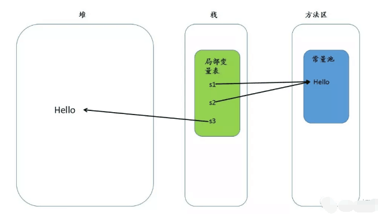

### 1.	String是基本数据类型吗？

#### 1.1	基本数据类型包括：

​		byte, shot, char , int, long, float, double, boolean

​		java.lang.String类不是基本数据类型，是final类型，不能修改这个类，也不能被继承。

#### 1.2	String类是final类型：

​		 String是不可变类型，也就是说类的实例是不可以被修改的。实例的信息是在创建的时候提供，并且在整个生命周期中都不可改变。

​		所以如果需要经常操作字符串，对字符串进行修改，或者有不可预见的修改，那么使用String来操作字符串就会引起很大的内存开销。

​		因为String对象创建后就不能改变，所以每次经过操作得到的不同的字符串都是一个新的对象。

​		因此可以使用StringBuffer类，它允许字符串修改，而不是不同的字符串都要生成新的对象。并且这两种类的对象转换十分容易。


### 2.	String s="Hello"; s=s+“world"

​	这两行代码执行后，原始的String对象中的内容到底变了没有。

​	没有。因为String是不可变类，原来的字符串对象没有改变，s=s+“world"会生成一个新的String对象，s引用会指向这个新的对象。原来的那个String对象还在内存中，只是s这个引用变量不再指向它了。	

​			

### 3.	String s=new String("xyz");

​	创建了几个String Object？二者之前的区别是什么？

​	创建了两个String Object。第一个对象是字符串常量"xyz"；第二个对象是new String("xyz")的时候产生的，在堆中分配内存给这个对象，只不过这个对象的内容是指向字符串常量"xyz"。

​	此外还有一个引用s，指向第二个对象。这是一个变量，在栈中分配内存。


### 4.	String与StringBuffer的区别

​			简单来说，就是类似一个变量和常量的关系。

​			StringBuffer对象的内容可以修改，而String对象一旦产生后就不可以被修改，重新赋值其实是两个对象。

​			StringBuffer内部实现方式和String不同，StringBuffer在进行字符串处理时，不生成新的对象，在内存使用上要优于String类。所以在实际使用时，如果经常需要对一个字符串进行修改，例如插入，删除等操作，使用StringBuffer要更加适合一些。

​			String：在String类中没有用来改变已有字符串中的某个字符的方法，由于不能改变一个Java字符串中的某单独字符，所以在JDK文档中称String类的对象是不可改变的。然而不可改变的字符串也具有一个很大的有点：编译器可以将字符串设为共享的。

​			StringBuffer：属于一种辅助类，可预先分配指定长度的内存块建立一个字符串缓冲区。这样使用StringBuffer类的append方法追加字符比String使用"+"操作符添加字符到一个已经存在的字符串后面要有效的多。因为使用“+”操作符每一次将字符添加到一个字符串中去时，字符串对象都需要寻找一个新的内存空间来容纳更大的字符串，这无疑是一个非常消耗时间的操作。添加多个字符也就意味着要一次次的对字符串重新开辟新的内存空间。使用StringBuffer类就可以避免这个问题。

​			StringBuffer是线程安全的，在多线程程序中也可以很方便的进行使用，但是程序的执行效率相对来说要慢一些。

​			StringBuffer常用方法：

   1. append：追加内容到当前StringBuffer对象的末尾。

   2. deleteCharAt：删除指定位置的字符。

   3. insert(4, "666")：在对象的索引值为4的位置插入字符串

   4. reverse：翻转形成新的字符村

   5. setChart(1, 'D')：设置索引值1的位置的字符为'D'

   6. trimToSize：将StringBuffer对象中的存储空间缩小到和字符串长度一样的长度，减少空间浪费。

   7. length()：长度

   8. replace(0, 1, "qqq")：0~1位置替换为"qqq"

      

### 5. 	字符串常量池

```java	
        String s1="Hello";
        String s2="Hello";
        String s3=new String("Hello");
```

​		Java为了避免产生大量的String对象，设计了一个字符串常量。工作原理是这样的：创建一个字符串时String s1="Hello";，JVM首先会检查字符串常量池中是否有相等的字符串，如果有则不创建，直接返回字符串的引用地址。若没有，则创建一个新的字符串对象，然后放到字符创常量池中，并返回新创建的字符串的引用地址。所以s1和s2的引用地址相同。

​		String s3=new String("Hello"); JVM检查常量池，发现存在"Hello"。但是由于有new关键字，还会在内存（不是在字符串常量池，而是在堆里面）创建一个新的String对象，存储"Hello"，并将该对象的引用地址返回。所以s3和s1,s2的引用地址不同。



​		所以单独看String s3=new String("Hello"); 这句活，是创建了两个String对象。首先查找字符创常量池发现没有"Hello"，在字符传常量池中创建一个对象；然后再在堆内存中创建一个String对象。

​		所以说会创建两个对象。

​      


