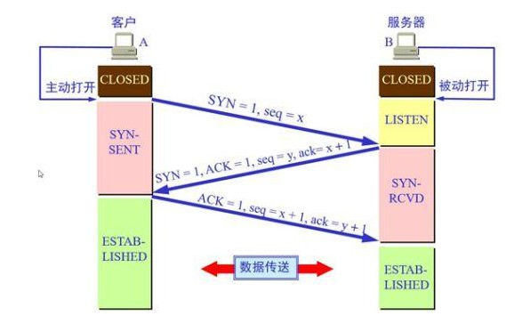
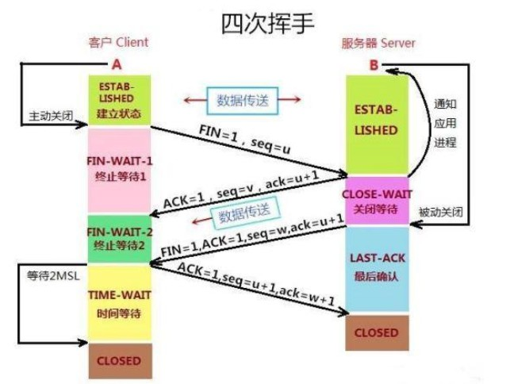

#### 1.IP，MAC，子网掩码

1. IP地址的组成：网络标识ID+主机标识ID

2. 子网掩码：网络标识ID都是1，主机标识ID都是0。

3. IP地址和子网掩码进行按位`&`运算，得到这个IP地址的网段。

4. ARP广播：当不知道目的主机的MAC地址时，源主机会发送一个ARP广播给整个网段中的主机，来询问目的IP地址的MAC地址是什么？网段中的该IP地址的主机会将自身的MAC地址返回给源主机。

   源主机会将IP地址和MAC的映射关系缓存下来，这是一种动态缓存，到期自动清空。

   源主机发送的ARP数据包的MAC地址是：FFFF.FFFF.FFFF。

5. 一个网段所能分配的IP数量

   主机ID部分不能全为1：否则这是一个ARP广播。

   主机ID部分不能全为0：否则这是一个网段。

   所以一个网段能分配的IP数量：这个网段包含的IP数量 - 2 

#### 2.路由：

​	不同网段之间转发数据，需要路由器的支持。

​	网关：默认情况下路由器只知道和它直连的网段。通过多个路由间接连在一起的网段想要实现通信，那么就要配置路由网关。

​	NAT转换：私网ip给因特网中的一个公网ip发送请求时，源私网ip地址会被因特网中的路由器转换成一个公网ip地址。

#### 3.网络互连模型

​	OSI七层模型：OSI参考模型，偏理论。

​		应用层，会话层，表示层，传输层，网络层，数据链路层，物理层

​	TCP/IP协议模型：4层，实际应用最多，偏实际。

​		应用层，传输层，网络层，网络接口层。

​	更利于学习的5层模型：

​		应用层，		传输层，			网络层，	数据链路层，	物理层。

​		数据报文；	数据段；		数据包；	数据帧；			比特流；

​		HTTP、FTP；TCP，UDP；	IP、ARP；	

#### 4. 网络中TCP出现大量time_wait状态是什么原因导致的？如何排查解决？

​	1.可能是操作系统设置的**MSL（Maximum Segment Lifetime，最大分段生存期）**过大了，一般是MSL2分钟。而TIME-WAIT是2倍的MSL。

​	2.可能在第4次挥手时，对方端每次都没有收到我方端发送的ACK=1的报文段，每次都会在TIME-WAIT发送FIN=1的报文段。我方又会在TIME-WAIT阶段收到FIN=1报文段后，再次发送ACK=1的报文段，再次进入TIME-WAIT阶段

#### 5.UDP和TCP的区别

1.相同之处：

​	UDP和TCP都是传输层的协议，都对来自应用层数据报文进行包装，作为传输层段的数据部分。

​	之后会将数据段传输给网络层再次被包装加工成为数据包。

2.不同之处

​	TCP一般封装的是来自应用层的HTTP/HTTPS等协议数据；UDP协议一般封装的是来自应用层的DNS协议数据。

​	TCP是面向连接的，基于TCP协议进行通信之前要先建立一个可靠的连接；UDP是无连接的，即发送数据之前不需要建立连接。

3.基于是否先建立连接这一点这两个协议就有不同的特点：

​	TCP协议更可靠稳定，而且为了维持这个可靠的连接，TCP还有可靠连接，拥塞控制，流量控制，连接管理制等功能机制。在数据传输完毕后，两端都会断开连接节约资源。所以TCP协议是面向连接的，通过TCP传输数据无差错，不丢失，且按需到达。一般用在文件传输，邮件传输中。

​	而UDP因为是无连接的，发送数据线不需要建立连接，也不关心接收方能不能准确收到数据。所以UDP只会尽最大可能实时交付传输的数据，但是不保证数据的完整性，可靠性。所以在网络质量不好的情况下就会很容易发生丢包，UDP一般应用在实时音视频通讯中。

​	TCP也有其缺点，正是因为其要建立可靠连接，维护可靠连接，所以它的开销较高。每次传输都要一个最少20字节的首部，而且像拥塞控制，重传机制，确认机制都会耗费时间，耗费资源。

​	UDP的优点就是速度快，开销少，传输数据保证实时性。即使网络出现拥塞，源主机的发送速率不会收到影响。UDP的首部很小，只有固定的8字节。

#### 6.TCP的三次握手

​	一般在发送一个HTTP请求前，需要先建立一个稳定的连接。在TCP协议中，通信双方将通过发送三次TCP报文来确认一些双方的信息，并在此基础上建立一个稳定的TCP连接。通信双方的三次TCP报文段的交换过程，就是我们常说的建立连接的三次握手过程。一般三次握手都是客户端主动发起建立连接的请求。

​	在这三次TCP报文段中，双方会交换如下的一些信息：序号Seq我当前发的数据的起始字节编号，我当前这个包的数据从哪个字节开发发的；确认号Ack，表示我收到了哪些数据，期望对方下一次传过来的TCP数据从这个位置发给我；双方的缓冲区大小；能接收的报文段的数据部分的最大长度MSS；标志位；还有TCP首部的选项部分，比如是否支持SACK，窗口缩放系数。

​	大致的过程如下：

​	1.首先客户端处于关闭状态CLOSED，服务器处于监听状态LISTEN监听某一端口。

​	2.客户端想要和服务器建立连接，主动发起一个建立连接的请求：客户端先结束CLOSED状态，并发送一个建立连接的请求。发送的TCP报文没有数据部分，且标志位SYN=1，ACK=0，同时告诉服务器我的序号seq=x。之后客户端进入同步已发送状态SYN-SENT表示客户端已发送SYN同步报文，发送了第一次握手，等待服务器的第二次握手。------第一次握手

​	3.服务器监听到客户端发送的这个建立连接的请求，如果没有问题的话，服务器就会返回给客户端一个响应，发送一个TCP报文段给客户端，标志位SYN=1，ACK=1;并且也返回给客户端一个服务器的序号seq=y，因为是对第一次握手的响应收到了数据，还要返回一个确认号ack=x+1作为对上一次报文的回应；同时结束LISTEN状态，进入同步已接收SYN-RCVD状态，表示服务器接收到SYN报文，服务器同意建立连接，并且我也想建立连接。------------------------这是第二次握手

​	4.客户端收到了服务器发过来的同意建立连接的响应，如果没有问题的话，客户端会再次给服务器一个响应，发送一个TCP报文段给服务器。其中标志位SYN=0，ACK=1。同时作为对第二次握手的响应，发送序号seq=x+1，确认号ack=y+1。同时结束同步已发送状态，进入ESTABLISHED连接已建立状态。---------------------------------------------------------这是第三次握手。

​	5.服务器接收到第三次握手后，会结束同步已接收状态，进入ESTABLISHED连接已建立状态，此时连接就正式建立起来了。

#### 7.为什么要进行三次握手，2次不行吗？

如果只进行2次握手就建立连接，可能会出现一种服务器端认为连接已建立，客户端认为没有建立连接，从而服务器一直等待客户端发送数据的情况：

​	1.客户端发送一个建立连接的请求（第一次握手），但是可能由于网络延迟等原因，迟迟没有到达服务器端。

​	2.那么服务此时也不会给客户端响应，客户端迟迟没有收到服务器端的响应，就会再次发送一个连接请求，此时会将上次发送的连接请求作为。

​	3.这次连接请求很顺畅，双方建立了连接，并且在数据传输完毕后，连接又释放了。

​	4.但是在连接释放之后，服务器收到了客户端发送的第一次连接请求，服务器端认为没有问题返回第二次握手给客户端，假如2次握手就建立连接，那么服务器端就会认为此时连接已建立，等待客户端发送数据。但是客户端不认这个响应，不认为已经建立了连接。

​	最后服务器就会一直等待客户端发送数据，直到超时。

迟迟收不到第三次握手：

​	如果是三次握手，就可以避免这种情况。客户端没有响应服务器发来的第二次握手，服务器由于没有收到第三次握手，就知道客户端没有建立连接，就不会傻傻的等着了。

​	服务器此时处于同步已接收状态SYN-RCVD状态，迟迟等不到第三次握手标志位ACK=1的报文。服务器就会多次重发SYN=1，ACK=1的第二次握手报文，如果还是没有响应，服务器就会发送一个标志位RST=1的报文强制关闭连接。

#### 8.TCP的释放连接

由于TCP连接是全双工的，意味着客户端可以给服务器发东西，同时服务器也可以给客户端响应东西，因此每个方向都必须单独进行关闭。大致就是当一方完成它的数据发送任务后，就会发送标志位FIN=1的报文，表明我的数据已经发完了，我要终止这个方向的连接。但是此时仅仅是从这个方向上没有数据流动了，另一端仍能发送数据，所以另一端也要主动关闭连接。

大致过程：假设是客户端方向先主动关闭连接。

​	1.一开始客户端，服务器都处于ESTABISHED连接已建立状态。

​	2.客户端发现自己的数据已经发送完了，客户端会结束ESTABISHED连接已建立状态，进入FIN-WAIT-1终止等待1状态。发起一个释放连接的请求报文，其中标志位FIN=1，ACK=1。表明我的数据已经发完了，我这边要断开连接了。-----第一次挥手

​	3.服务器端收到这个FIN=1的报文，即客户端发送的释放连接的请求。然后会先回应一个ACK=1的报文给对方，告诉对方我知道你要关闭连接了，我同意了。然后结束ESTABISHED连接已建立状态，进入CLOSED-WAIT关闭等待状态。-----第二次挥手

​	4.客户端收到第二次挥手不会响应，但是会结束FIN-WAIT-1终止等待1状态，进入FIN-WAIT-2终止等待2状态。

​	5.处于CLOSED-WAIT关闭等待状态的服务器，此时还要考虑自己是否还有数据要发送给对方。如果没有，那么也向对方发送一个释放连接的请求报文FIN=1，ACK=1并且结束CLOSED-WAIT关闭等待状态，进入LAST-ACK最后确认状态。-------第三次挥手。

​	6.客户端收到这个FIN=1，ACK=1的报文后，就知道服务器端也没东西要发了，也要断开连接了。就会在相应一下这个请求，标志位ACK=1，告诉服务器我知道了。然后结束FIN-WAIT-2终止等待2状态。进入TIME_WAIT时间等待状态。

​	7.服务器端收到最后这个响应后，就会结束LAST-ACK最后确认状态，进入CLOSED关闭状态。

释放连接时的状态解读：

​	TIME-WAIT：表示释放连接的主动方也收到了对方释放连接的请求，并且响应了这个请求。那么主动方进入TIME-WAIT状态，在等待2MSL后即可进入CLOSDE状态。其中MSL是TCP报文的最大生存时间。

#### 9.为什么要有TIME-WAIT状态

主要是为了预防这种情况：如果主动方在第四次挥手发送ACK=1的报文后，立马关闭连接进入CLOSED状态，那么就可能出现以下情况。

​	第四次挥手发送的报文，对方没有收到。那么对放就会重发FIN=1报文，但是此时客户端已经关闭了，客户端没有任何反应，服务器就会等待，重发FIN报文，浪费资源。

​	客户端在进入CLOSED阶段后，在同一个端口启动了一个新的连接，然后又收到了服务器端重发的FIN=1报文。那么客户端就会马上开始执行断开连接的操作。

​	所以TIME-WAIT主要预防对方么有收到第四次挥手的ACK=1的报文，看看会不会收到对方重发的FIN=1的报文。如果在TIME-WAIT又收到FIN=1的报文，说明上一次发的ACK=1第四次挥手报文对方没有收到，那么客户端就会在发送一个ACK=1的报文，帮助对方顺利关闭连接。如果在2MSL，2倍TCP报文的最大生存时间都没有收到重发的FIN=1的报文，说明服务器没有重发报文，即服务器成功关闭了。

#### 10.TCP实现可靠传输

​	1.ARQ：自动重传请求。

​	假设A要给B发送3个包，如果发送第一个包M1时，B没有接收到，B就不会给A响应收到M1包这个消息。那么A端就回一直等待这个响应直到超时，然后重新发送M1包。

​	也就是发送单必须收到接收端的响应后，才会发送下一个信息。必须等待上一个数据传输结束，下一个信息才能传输，所以虽然保证了可靠传输但是效率较低。

​	2.连续ARQ协议+滑动窗口协议+SACK选择性确认

​	滑动窗口：接收端有一个缓存窗口，用来暂时存放每次从发送端发送来的数据。这个窗口的大小会在建立连接的时候告诉发送单。窗口的大小，代表每次最多能接受多少分组，发送方的窗口大小一般由接受放决定。

​	发送窗口有多个数据分组的话，会一口气发送完在等待确认信息。而且接收端的确认信息只会发送最后一个分组的确认信息，等价于确认收到所有的分组信息。

​	SACK选择性确认：如果发送分组中的中间某个数据包丢失，那么TCP会通过重传最后确认的分组的后续分组，不会每次重传整个分组。有了SACK后，会告诉对方哪些丢失了，哪些收到了，就可以只重传丢失的部分。

#### 11.TCP的流量控制

1.如果接收方的缓存区满了，发送方还是疯狂的发送数据，接收方只能把收到的数据包丢掉，大量的丢包会极大的浪费网络资源，所以要进行流量控制。

2.什么是流量控制：让发送方的发送速录不要太快，让接收方来得及接收处理。

3.原理：

​	通过确认报文中的窗口字段来控制发送方的发送速录。

​	发送方的发送窗口大小不能超过接收方给出的窗口大小。

​	当发送方接收到接收窗口大小为0时，发送方就会停止发送数据。

#### 12.TCP的拥塞控制

1.拥塞：比如某个路由器1允许通过的最大带块1000M，但是和其连接的路由器2允许通过的最大带宽只有500M。那么此时路由器2就极有可能发生来不及处理数据的情况，发送拥塞。通信子网中某一部分的分组数量过多，网络来不及处理，引起这个部分的网络性呢过下降，进而影响到整个网络的通信。

​	而且虽说某个链路的理想情况下最大吞吐量是1000M，但是实际情况下由于数据可能在传输过程中会想干扰，所以往往实际负载不到1000M时，该链路的实际处理能力就达到最大了，之后再加大负载就会造成拥塞。

2.拥塞控制：

​	防止过多的数据注入的网络，网络来不及处理，避免网络中的链路过载。

​	拥塞控制是一个全局性的过程，要整个链路来协同控制，是大家共同努力的结果。

3.涉及到的参数

​	MSS：每个数据段的数据部分的最大长度

​	CWND：拥塞窗口，进行拥塞控制，最终能发多少数据由拥塞窗口和接收窗口共同决定。

​	RWND：接收窗口，接收方告诉放送放，你最多一次能发送多少的TCP报文段。

​	SWND：发送窗口，发送发一次发送的数据量，取决于拥塞窗口和接收窗口的最小值。

4.拥塞控制的方法

* 慢开始：加入接收方的接受能力接收窗口RWND=3000比较大，但是考虑到拥塞控制的话，拥塞窗口CWND一开始会设置的比较小比如100。那么发送窗口SWND会取两者的最小值100，第一次发送100的数据量。发送完第一次数据后，发现网络良好，拥塞窗口会成指数级增大。之后网络状况仍然良好的话，拥塞窗口继续呈指数级增大。发送窗口也随着拥塞窗口从很小，慢慢增长，试探接收方的接收程度。直到出现丢包拥塞，从头开始执行慢开始算法
* 加上阈值：避免拥塞更快的到来。在慢开始的基础上，为拥塞窗口cwnd加上一个慢开始阈值，拥塞窗口在到达阈值前呈指数级增长，到达阈值后成乘法级增长。当出现拥塞时，就会把慢开始的阈值减半，同时重新开始慢开始算法。
* 快速恢复：当出现拥塞时，慢开始阈值减半，但是不会重新开始慢开始算法。而是将拥塞窗口从减半的慢开始阈值开始。
* 快重传：之前的TCP是超时之后，发送方一直没有收到确认信息发送方才会重传；加上滑动窗口后，接收方也之后要等到一组数据都发送完，或者最后一个数据超时时，才会返回给发送端确认信息，哪些收到了哪些没收到。快重传，就是改变了这种被动的反馈形式。接收端会及时主动地提醒发送端，数据发送了丢包，需要立即重传。即当接收端收到一个失序的分组后，会立即发出重复的确认。比如没有收到分组3，直接收到分组4，就会立即返回确认收到了分组2，后续在收到分组5，分组6都只会返回确认收到分组2。如果发送端连续的收到3个重复的确认，就会立即重传尚未收到的报文，不必等待重时重传。

5.拥塞控制是上述4个方法综合来治理的：

​	慢开始算法开始增大拥塞窗口，当拥塞窗口以指数增大，知道达到慢开始阈值后。执行拥塞避免，拥塞窗口放缓增长速度，呈乘法增长。当收到3个重复的确认后，意识到开始丢包了，产生拥塞了，慢开始阈值减半，慢开始算法从减半的阈值处开始。

#### 13.HTTP协议

​	超文本传输协议，最初的目的是发布和接收HTML页面的，由URI来表示具体的资源。

​	报文格式主要是：请求行+请求头+请求体。GET请求是没有请求体的。

#### 14.常见状态码：

​	200 OK：请求成功

​	302 Found：重定向到Location响应头指定的URL。

​	304 Not Modified：请求的资源没有变化，直接从缓存中取。

​	404：资源不存在。

​	403 Forbidden：拒绝授权访问

#### 15.常见请求头和响应头

1.请求头：

​	Content-Type：告诉服务器我的请求体的类型，GET请求没有请求请求体，POST请求有请求体。

​		application/x-www-form-urlencoded：	

​		multipart/form-data：

​	Cookie

​	Origin：这是一个跨域访问资源的请求。

​	Host：主机

​	Referer：可以防盗链，通过这个连接来到了这个页面。

2.响应头：

​	Content-Type：告诉服务器我的响应体体的类型

​	Content-Disposition ：下载文件时用到，定义下载的文件名。

​	Location：重定向。

​	Set-Cookie

​	Access-Control-Allow-Origin：设计跨域，指定哪些网站可以跨域访问资源。