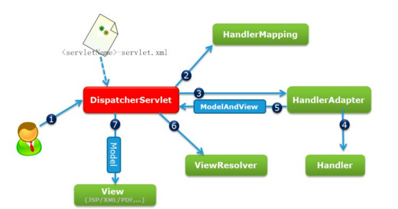

## 1.Java基础

### 1.说一下接口和抽象类的区别

1. 抽象类里面可以有抽象方法也可以定义具体的方法，接口里面的方法只能是抽象方法，继承了接口的类必须实现这些方法。

   不过在java 8之后引入了关键字default，在接口中可以使用default关键字修饰方法，default修饰的方法可以有具体实现。default修饰方法只能在接口中使用，不能在抽象类中使用，且不能喝abstract关键字一起使用。

2. 抽象类不能实例化，**抽象类实现接口时可以不实现其中的方法。**

3. Java中接口可以多实现，但是类只能单继承，包括抽象类也只能单继承。

4. 对抽象父类和接口的一些理解：接口和抽象父类在类的继承关系的设计中有着不同的作用

   - 比如有若干个子类，那么他们肯定既有公共的部分，也有非公共的部分（各自有各自的实现）。
   - 那么设计继承关系的时候，子类公共的部分我们可以抽取到抽象父类中实现，用final和protected修饰，意思是只暴露给子类且只能使用不能重写。
   - 而且因为抽象父类在这个继承关系中只起到一个抽取公共部分的作用，我们不想其被外部可见，那么抽象父类正好是不能实例化的，**所以这里不用普通父类。**
   - 那么子类中需要各自实现的部分我们可以将其放到一个接口中，然后让抽象类实现这个接口。正好抽象类可以不用实现接口中的方法，因为这些方法要让子类各自去实现。
   - 而且子类在继承抽象类的时候，接口也会强制子类分别去实现各自的逻辑。


### 2.Java中的数据类型类型

Java有8中基本数据类型：

- byte 字节 ：1个字节，范围：[-2^(8-1)^, 2^(8-1)-1]，-128 ~ -1, 0 ~ 127
- short 短整型 ：2个字节，范围：[-2^(16-1), 2^(16-1)-1]， -32768 ~ 32767
- int 整型 ：4个字节，范围：[-2^(32-1), 2^(32-1)-1]
- long 长整型 ：8个字节，使用时加上L，否则会被解析成整数。
- float 单精度： 4个字节
- double 双精度：8字节
- char 字符：2字节
- boolean 布尔值：逻辑上理解占用1位即可，但是依赖JVM厂商的具体实现，实际中会考虑计算机高效存储的因素。

**Java的引用类型**：

- 局部引用类型一般存放在线程栈的局部变量表中，记录的是对象在堆内存中的地址，Java堆内存是依赖于当前操作系统的运行内存的，Java引用必须能记录到堆内存的最大地址值。
- 所以Java引用的大小取决于当前系统的寻址位数，如果是32位操作系统那么就是4字节，如果是64位操作系统，那么就是8字节。

8种包装类型：Byte，Short，Integer，Long，Float，Double，Character，Boolean

- 编译期可知的基本类型是直接放到虚拟机栈的局部变量表中的，而包装类型数据对象放在堆中。相比对象基本数据类型占用的空间非常小。

### 3.equals() 和 ==

1. ==
   - 对于基本数据类型，== 比较的是值，基本数据类型是没有equals方法
   - 对于引用数据类型来说，== 本质上比较的是也是引用值，只是引用类型变量存储的是是对象在堆内存中的地址，所以也可以说引用数据类型 == 比较的是对象的内存地址。
2. equals()是Object类中的方法，意味着每个类都继承了这个方法。
   - equals在Object类中的默认实现就是比较两个对象的引用值，即地址值。作用和用 == 比较两个对象一致。
   -  一般会类中重写equals方法，因为我们想要比较两个对象时，是根据其属性内容做比较，一样的话就认为两个对象相同，而不是比较内存地址。
   - **String默认重写了equals方法，比较的是String底层的字符数组char[] 内容。** 

### 4.equals() 和 hashCode()

1. hashCode是Object类中的一个native方法，作用是将对象的内存地址转化为整数之后返回，**可以根据hashCode快读定位到对象在哈希表中的索引位置（索引位置处可能是一个链表，再遍历这些链表即可，相比遍历整个数组要快很多）。**

   ```java
   public native int hashCode();
   ```

2. 为什么重写equals方法时，建议同时重写hashCode()方法

   一般hashCode不同时两个对象就是两个不同的对象，但是如果重写equals后没有重写hashCode()方法，那么可能出现**两个对象的hashCode()不一样，但是equals()是相同的。**

   而且在将这些对象存往HashTable，HashSet，HashMap等散列存储结构时可能会出现bug。**如果两个对象的HashCode不同，但是equals相同，那么他们是可以都存入HashSet，或者说都可以作为HashMap的key。这样就导致了散列容器存储数据的不唯一性。**

   比如当把对象加入HashSet时，HashSet底层是依靠HashMap实现的，最终会调用HashMap的put方法，将对象作为Key和一个Object对象作为Value存入HashMap中。

   ```java
   private static final Object PRESENT = new Object();
   
   public boolean add(E e) {
       return map.put(e, PRESENT)==null;
   }
   ```

   **所以为了预防对象以后可能会存储到散列容器中，最后重写equals时也重写hashCode()方法，让equals相同的对象其hashCode也相同。**

   补充：hashCode相同的对象，可能是因为散列冲突导致两个不同对象的hashCode相同。所以hashCode相同的对象，并不一定是同一个对象。

###   5.包装类型

1. Java的8种包装类型：Byte，Short，Integer，Long，Float，Double，Character，Boolean

2. 自动装箱与拆箱

   - 自动装箱：如果将一个基本类型赋值给一个包装类型的变量，会发生自动装箱。底层会调用valueOf(x)方法将基本类型用转换成包装类型。

   - 自动拆箱：如果将一个包装类型赋值给一个基本类型的变量，会发生自动拆箱。比如Integer，底层会调用intValue将包装类型转换为基本类型。

     ```java
     Integer i = 10;  //装箱
     int n = i;   //拆箱
     
     Integer i = 10 等价于 Integer i = Integer.valueOf(10)
     int n = i 等价于 int n = i.intValue();
     ```

   - 频繁拆装箱的话，会浪费系统性能，尽量避免不必要的拆装箱操作

     ```java
     private static long sum() {
         // 应该使用 long 而不是 Long
         Long sum = 0L;
         for (long i = 0; i <= Integer.MAX_VALUE; i++)
             // 一直在拆装箱
             // sum = Long.valueOf(sum.longValue() + 1)
             sum += i; 
         return sum;
     }
     ```

3. 包装类型的缓存池技术

   - Byte，Short，Integer，Long这四种包装类型默认创建了数值范围在[-128, 127]的缓存数据，Character创建了数值在[0, 127]范围的缓存数据，Boolean直接返回True Or False。

   - 两个浮点数类型的包装类Float和Double没有实现缓存池技术。

   - 在缓存池范围内，且不是用new关键字创建的包装类型的对象，会直接在缓存池中产生，会复用已有的对象。如果是new关键字创建的对象，那么一定是一个新的对象。
   - 建议用equals来比较两个包装类型：因为equlas在包装类中重写了，比较的是value值。而用==比较的话，因为new创建的是新对象，那么即使两个包装类型的对象即使数值相等，==也会判断出是两个不同的对象，所以==判断是不等的。


### 6.深度克隆和浅度克隆

1. 浅度克隆：直接通过Object类中的clone()方法实现的克隆是浅度克隆，会根据一个对象创建新的对象，新对象中的属性会和原来对象的属性值一样。**但是引用属性会和原对象一样，指向同一个内存地址，效果看上去对象属性没有克隆。**

2. 多克隆一层：我们可以重写clone方法，新对象的引用属性也通过clone方法得到新的对象。

3. 深度克隆：

   - 将对象序列化成JSON，然后再将JSON反序列化成指定对象，那么就会得到一个从内到外完全克隆的新的对象。

     ```java
     //实现深度拷贝1：借助fastJson序列化
     String s = JSON.toJSONString(father);
     Father jFather = (Father)JSON.parseObject(s, Father.class);
     ```

   - java的对象输入输出流也可以实现深度拷贝，前提是被克隆的对象及其对象属性都要实现Serializable接口

     ```java
     public static <T extends Serializable> T deepCopy(T obj) throws Exception {
     
         ByteArrayOutputStream byteOut = new ByteArrayOutputStream();
         ObjectOutputStream objOut = new ObjectOutputStream(byteOut);
         objOut.writeObject(obj);
     
         ByteArrayInputStream byteIn = new ByteArrayInputStream(byteOut.toByteArray());
         ObjectInputStream objIn = new ObjectInputStream(byteIn);
     
         T copyObj = (T) objIn.readObject();
         return copyObj;
     }
     ```

     ByteArrayOutputStream和ByteArrayInputStream不需要close，因为这两个是基于内存的流只要垃圾回收器清理对象就能释放资源，这一点不同于对外的资源流需要手动释放，比如文件流。

4. 注意：调用clone方法时要实现Cloneable这个标记接口，否则会报错。

   

### 7.Serializable序列化和反序列化

1. 序列化：把对象转化成可存储或可传输的形式的过程，一般通过序列化将对象转化为字节序列。

   序列化的作用一般是两处：

   - 将Java运行时对象持久化到保存起来
   - 将Java对象通过序列化能在网络上传输

2. 反序列化：序列化的逆过程，把字节序列恢复为对象的过程。

3. serialVersionUID的作用

   Java的序列化机制是通过判断类的serialVersionUID序列号来验证版本一致性的。在进行反序列化时，JVM会把传来的字节流中的serialVersionUID和当前类的serialVersionUID进行比较，如果一致就认为可以进行反序列化，否则就会发生序列化冲突报错。

   如果一个类实现了Serializable接口，但是没有为其显示指定一个serialVersionUID。这个类被加载时，JVM会自动为其分配一个唯一的serialVersionUID。当对其进行序列化时，得到的内容也包含着这个serialVersionUID。如果我们后续修改了源代码，那么会造成这个类的serialVersionUID也会发生变化。然后我们将之前序列化的内容在反序列成对象时，JVM会发现此时两者的serialVersionUID不一致，那么就会反序列失败。

   所以我们最后为实现了Serializable接口的类指定一个serialVersionUID，这样即使这个类发生了修改，serialVersionUID也不会变化，并且我们也不需要serialVersionUID是唯一的。

### 8.final关键字

- 修饰类：表示该类不能被继承
- 修饰方法：表示该方法不能被重写
- 修饰变量：表示变量不能修改，是一个常量。

### 9.String类

1. String介绍

   String是final修饰的，该类不能被继承。java8及之前底层都是字符数组final char[] value。java9之后为了节省空间改成字节数组final  byte[] value，因为大部分的时候用的拉丁字符其实都是一个字符占据字节的。

2. String的不可变性的理解

   String的不可变性，我们在修改一个字符串对象时，不是在原内存地址上修改数据，而是创建一个新的对象，将引用指向这个新的对象。

   String的底层是private final修饰的字符数组char[] value，final修饰的仅意味着这个字符数组的引用不能改变，不能再指向其他对象。但是数组内部的数据其实是可以改变，这不就破坏了String的不可变性了吗。但是别忘了还有一个private，String类没有提供/暴露修改字符数组的方法，所以不可变性主要体现在此处。

3. String的intern()方法

   ```java
   String str1 = new String("a") + new String("b");
   
   //虽然StringBuilder.toString()没有向字符串常量池中创建"ab"对象，但是调用了intern方法后，发现字符串常量池中没有"ab"
   //会把"ab"字符串对象的引用放进字符串常量池，并返回该引用
   str1.intern();
   
   //发现字符串常量池有了指向"ab"对象的引用，直接将其引用返回给str2
   String str2 = "ab";
   
   //所以str1和str2都指向堆中的String对象
   System.out.println(str1 == str2); // true
   ```

   当intern()被调用时，会去字符串常量池中判断是否有这个字符串常量，有的话直接返回该字符串常量的引用，如果字符串常量池没有的话，说明这个String对象是new出来的，仅在堆中有个String对象。

   - JDK6会复制一份新的对象到字符串常量池中，最后intern()方法返回在常量池中的引用
   - JDK7之后，会把这个堆中的String对象的引用复制一份，放到字符串常量池，然后返回该引用。本着节省空间的想法，避免在字符串常量池中再创建一个新的对象。

4. String的拼接操作

   1. 常量与常量（final修饰的也是常量，"abc"也是常量）的拼接结果在常量池中，原理是编译期优化。
   2. 拼接操作时只要其中有一个时是变量，结果会在（常量池之外的）堆中创建一个String对象。变量+号拼接到原理，底层走的是StringBuilder的apend和toString，最后相当于new String("")。

5. StringBuilder的优化

   在实际开发中，如果能确定最后的字符串长度的大致范围，最好指定StringBuilder的capacity，尽量避免对String底层的char[]进行扩容和复制等操作。

   使用StringBuilder默认构造器的话，初始的char[]数组大小是16。如果在进行大量拼接操作时，会导致频繁的进行数组扩容。而数组的长度是不可变的，每次扩容操作都是开辟一个新的数组，然后进行数组件的copy，即耗费性能也会产生很多垃圾。

6. StringBuffer：它的线程安全的，因为它的apend方法是synchronized修饰，是个同步方法。但是效率低。

7. intern()的应用场景：保证sync锁住的是同一个值。

   ```java
   synchronized (userId.toString().intern()) {
       // 拿到当前对象的代理对象：为了事务生效
       IVoucherOrderService proxy = (IVoucherOrderService)AopContext.currentProxy();
       return proxy.createVoucherOrder(voucherId);
   }
   ```

   toString()：每次返回的是一个新的new String()，所以锁不住

   intern()：一定返回的是字符串常量池中的常量/引用，只要字符串的字面量是一样的，那么一定返回是相同的。这样能保证每次锁的都是同一个值。

### 10.说一下反射

1. 个人理解反射就是让我们在运行时，可以很灵活很暴力地获取一个类的所有信息，执行这个类中定义的方法。通过反射可以获取任意一个类的所有方法和属性还有注解，可以调用这些方法访问它的属性。
2. 反射也有一些缺点：因为它可以绕过一些安全的规则直接，会带来一些风险，增加了安全问题。而且反射的性能也比较差。
3. Spring等框架中大量使用了反射：
   - 比如动态代理，就是通过反射创建一个代理对象。
   - 比如我们在框架中经常在类中加上一个简单的注解，就能赋予该类一个复杂的功能，其实背后也有反射来实现。通过反射能在运行时分析每个类，获取该类加了哪些注解。如果发现有这个注解，那么就会做进一步处理，让其执行你想要的功能。

### 11.代理模式

1. 代理模式

   代理模式就是用代理对象来代替对真实对象的访问，可以在不修改原对象的前提下，为原目标对象提供额外的功能和操作。比如在某个对象的方法前后加上一些自定义的操作。代理模式一般分为两种：静态代理和动态代理。

2. 静态代理：如果我们想要为一个目标对象添加一些额外的功能的话，我们可以手动创建一个代理对象让其实现了元目标对象相同的接口，并且在里面维护一个属性，这个属性就是原目标对象。然后我们就可以通过这个目标对象属性来访问原目标对象的方法，并且在其前后加上要扩展的功能。这就是静态代理。

   通过静态代理获得代理对象时，要自己手动为目标类单独创建一个代理类。而且这个代理类只能代理这个目标类，关系绑定死了。后续如果我们还要其他类的代理对象，还要重生写一个代理类，比较麻烦。而且静态代理是基于接口的，目标类必须有实现的接口。

3. 动态代理

   利用动态代理获取代理对象时，不需要我们单独为目标类创建一个代理类。动态代理可以在运行时动态的生产类字节码。并加载到JVM中。动态代理的实现分为两种，一种是基于接口的JDK实现的动态代理，一种是不基于接口的CGLib实现的动态代理。

   - JDK动态代理：主要是Proxy类中的getProxyClass方法，通过传入一个类加载器和要实现的接口数组，我们能够获得一个动态生成的代理类的Class对象。然后通过这个代理类的Class对象，调用其中的构造方法，传入一个InvocationHandler的实现类就获得了一个和目标对象实现了相同接口的代理对象。其中InvacationHandler实现类作为构造方法的参数，而且复写其中的invoke方法，在invoke方法中我们可以在调用原生方法的前后加上一些需要扩展的逻辑。后续代理对象再调用原生方法时，会被invoke拦截到，执行invoke方法来增强我们的目标对象，实现我们的扩展逻辑。

   - CGlib动态代理：JDK的动态代理有个缺陷就是只能代理实现了接口的类，而CGlib可以代理为实现任何接口的类。GClib主要是通过生成一个目标类的子类来拦截被代理类的方法调用，因此目标类不能声明为final类型的类和方法。

     CGlib不是Jdk提供的，需要我们自己引入第三方库。

###    12.解释一下什么是Servlet，说一下Servlet的生命周期

1. Servlet是一种服务端的Java应用程序，具有独立于平台和协议的特性，它担当客户端请求与服务端响应的中间层。

   Tomcat容器监听端口，请求过来后，Tomcat通过解析把请求中的报文封装到一个Request对象中，然后根据url等信息会将请求分发给对应的Servlet。

   然后我们可以在Servlet中的service()方法中实现业务逻辑，然后口岸和处理后的结果写到response返回。Tomcat收到Response后，在将其组装成HTTP响应发给客户端。

2. Servlet生命周期可以分成四个阶段：加载和实例化，初始化，服务，销毁

   当客户第一次请求时，首先判断是否存在Servlet对象，若不存在，则由Web容器创建对象。

   而后调用init方法对其初始化，此初始化方法在整个Servlet生命周期中只调用一次。

   完成Servlet对象的创建和实例化后，可以调用Servlet对象的service()方法来处理请求。

   当Web容器关闭或者Servlet对象要从容器中删除时，会自动调用destory()方法销毁。

## 2.Spring等框架

### 2.1.Spring的事务

1. Spring事务管理用的是AOP，AOP底层用的是动态代理。如果我们在类或者方法上标注注解@Thransactional，那么会为当前类生成一个代理对象。这个代理对象中为添加了@Thransactional注解的方法加上了事务开启，事务提交，事务回滚这些动作。
2. 而且我们知道事务是得保证一组操作同时成功或同时失败的。这也意味着我们一次事务的所有操作需要在同一个数据库连接即Connection对象上。Spring用ThreadLocal为当前线程存储了一个独立的Connection对象，不受其他线程影响。从而保证当前线程中的一次事务的所有操作都在同一个数据库连接上。

### 2.2.Spring IOC 和 AOP

1. IOC也就是控制反转：以前创建对象，注入属性都是我们自己来在代码中实现。Spring IOC主要解决的就是对象管理和对象依赖的问题。本来需要我们自己手动new的对象，现在将对象的创建，销毁，初始化等一系列生命周期的过程都交给Sring的IOC容器来管理。当我们将一个类通过注解/配置文件注册到ICO容器中后，Spring会在需要它的地方自动实例化，然后属性注入，这也称为依赖注入。

   这样对象就无需自行创建或者管理它的依赖关系，Spring IOC会将依赖关系自动注入到需要的对象中。

   IOC的好处是能够统一管理对象，并且降低各个代码层之间的耦合。比如业务层和持久层的依赖关系，在使用了Spring之后，就由Spring来维护了，不需要我们再单独的new对象。

2. AOP：Spring AOP主要解决的是公共代码抽取的问题，当我们需要在方法上注入一些重复性的功能代码时，就可以利用Spring AOP技术。底层用到的是动态代理技术，能在不修改源码的基础上，对我们已有的方法前后进行增强。

   就是将那些与业务无关，却是业务模块所共有的部分封装起来，减少系统的重复代码，降低模块间的耦合度，有利于可操作性和可维护性。
   
   所谓的面向切面编程，大概就是在方法的前后增加非业务代码。
   
   实现：采用动态代理的技术，拦截原对象方法，对其增强装饰。

### 2.3.几个常用注解

1. @PostConstruct：

   之前系统中有个功能，要在项目启动后就开始监听消息队列中的消息，有的话就消费，没有的话就循环监听。

2. @Transactinal

   如果我们在类或者方法上加上这个注解，那么会为当前类生产一个代理对象。这个代理对象中为添加了该注解的方法加上事务开启，事务提交，事务回滚等动作。就是让这个方法有事务控制。

3. @Component

   一般不属于三层的类会用这个注解将其注入到Spring IOC容器，扫描到类上有这个注解后会通过反射创建一个当前类对象放到Spring IOC容器中。bean的id默认是当前类名的首字母小写，可以用value属性指定bean的id

   类似的有@Controller，@Configuration，@Service，@Repository

4. @Autowired

   进行属性注入的，默认是按照对象类型注入，主要容器中有唯一的一个bean对象类型与其匹配，那么就可以注入成功。如果Spring IOC容器中有多个bean的类型都匹配，会根据变量名去匹配bean的id。

5. @Qualifier

   在用@Autowired注入时，如果类型匹配了多个，但是变量名没有匹配上。此时就可用用@Qualifire结合@Autowired使用。@Aualifier中可以指定具体的bean的id。只能结合@Autowired使用

6. @Resource

   直接按照bean的id注入，使用时指定name属性即可。而且它是J2EE的注解，不是Spring的注解。

7. @Value

   如果要注入基本类型或者String类型，那么就要通过@Value。一般要事先在配置文件中配好之后才能用@Value注入。

8. @Bean

   放在方法上，会将方法的返回值放到IOC容器中。

### 2.4.Spring是怎么解决循环依赖的

1. 什么是循环依赖

   多个Bean对象互相持有对方，比如A对象持有B属性，B对象又持有一个A属性，这就构成了循环引用。（如果垃圾回收算法不好的话，循环引用可能造成内存泄漏）

   按照我们的想法，循环依赖可能会导致这样一个问题。A对象初始化时发现需要对象B，B对象创建时又发现需要A，可能造成A,B对象在创建时相互等待的情况。那么Spring是怎么解决循环依赖的呢？有点类似死锁中循环等待条件...

2. Spring解决循环依赖

   解决循环，让有循环依赖关系的两个对象能成功创建，关键是能暴露未完全创建的Bean。Spring解决循环依赖主要是用到了3级缓存。

   比如A对象创建过程中发现了需要注入B属性，发现B也没有初始化，于是A会先将自己暂时放到三级缓存里面，然后去实例化B。

   B实例化的时候发现需要注入A，于是B会先去查Spring的一级缓存，没有的话再查二级缓存，还是没有回去查三级缓存。在三级缓存中找到了对象A，将其注入到B的属性中。然后把A放到二级缓存，并删除三级缓存中的A。

   B初始化完成后，会把自己直接放到一级缓存里面。然后回来继续初始化A，此时B已经创建完毕，直接从一级缓存中拿到B注入到A中。此时就完成了A和B的初始化。

### 2.5.SpringBoot

1. 谈一下Spring Boot的优点

   简化配置：搭建Spring环境来开发项目的话，我们要做很多的配置。每当我们要集成一个组件框架时，都需要写一份配置文件。无论是Spring本身还是继承其他组件都需要大量的配置文件需要我们编写，这个非常繁琐。而SpringBoot就不需要我们写那么多配置文件，

   starter：SpringBoot把各个功能场景都抽成了一个个的starter，需要什么功能我们就引入相关的starter即可，然后Spring Boot底层会根据我们引入的starter为我们做好相应的配置。比如我们只需要引入一个starter-web模块，就能用Spring Boot非常快速的创建一个Web服务。相比Spring非常快速。

   源自Spring：因为Spring Boot也是基于Spring的一个框架，它与Spring生态的其他组件框架集成起来非常的适合。

   自身集成了Tomcat，无需我们手动部署项目，可以很容器的启动项目。

   版本仲裁中心：Spring Boot每个starter我们称之为场景启动器，pom文件中有一个parent父项目，在那里面为我们实现了依赖版本的统一管理。也避免了我们的依赖冲突，自己管理依赖版本。

2. 谈一下SpringBoot的自动配置原理

   我大致说一下吧，从SpringBoot的启动来来说。每一个SpringBoot项目都有一个启动类，项目的启动入口就是这个启动类里面的main方法。

   标注了@SpringBootApplication注解的类就是启动类，也可以说主配置类。这个注解是一个组合注解，其中有很多的子注解，程序启动时会扫描到这个注解，然后会执行各种操作来完成项目的启动，比如自动装配，扫描包实现bean的创建，注入等等。

   首先@SpringBootApplication注解下有一个子注解是@SpringBootConfiguration，这个注解表示当前类是一个SpringBoot配置类，并且会把当前类创建放到IOC容器中，因为这个@SpringBootConfiguration注解也是个组合注解，它的子注解有@Configuration和@Component。正好起到表明这是个配置类，并且加到IOC容器中。

   然后说下@SpringBootApplication注解的另一个子注解：@EnableAutoConfiguration。这个注解其中也有两个比较重要的子注解，一个是@AutoConfigurationPackage，这个注解会扫描启动类所在包及其子包下面所有的类，然后将加了@Component，@Controller，@Service等类似注解的Bean都创建添加到IOC容器中。@EnableAutoConfiguration的另一个子注解是@Import，他会给为Spring Boot导入一些组建，并且根据我们选中的starter启动器导入很多的自动配置类，各种XxxAutoConfiguration。这些配置类结合一些其他的配置类能实现SpringBoot的自动配置功能。

   


### 2.6.SpringMVC处理请求的流程



1. 请求解析和匹配DispatcherServlet路径：客户端发起一个Http请求给Web服务器后，Web服务器对http请求进行解析，如果匹配DispatcherServlet的请求映射路径（在web.xml中指定），web容器将请求转交给DispatcherServlet。
2. 匹配处理器Handler：DiapatcherServlet接收到这个请求之后将根据请求的信息，包括URL，Http方法，请求报文头，请求参数等，以及HandlerMapping处理器映射器的配置找到请求的处理器Handler
3. 处理器进行处理：DispatcherServlet根据HandlerMapping找到对应的Handler处理器后，通过HandlerAdapter来对Handler进行具体的调用。
4. Handler处理器返回一个逻辑视图ModelAndView对象给DispatcherServlet
5. DispatcherServlet通过ViewResolver将逻辑视图转化成正式视图View：Handler返回的ModelAndView()只是一个逻辑视图，并不是一个正式视图。DispatcherServlet通过ViewResolver将逻辑视图转化为真正的视图View。
6. Dispatcher通过Model解析出ModelAndView中的参数，进行解析最终展示完整的View并返回给客户端。

### 2.7.谈一下Mybatis

1. Mybatis是一个半ORM对象关系映射框架，主要就是两个作用：封装JDBC，对象和表的映射。

   - 它内部封装了JDBC，开发时只需要关注SQL语句本身，不需要花费精力去处理加载数据库驱动，创建连接，创建statement等繁杂的过程。

   - 它有一套默认的匹配规则，能把从数据库得到的数据封装成一个对象直接返回给我们，我们也可以自己指定映射关系。

### 2.8.#{}和${}

- #{}是预编译处理，${}是字符串替换
- Mybatis在处理#{}时，会把SQL中的#{}替换为?号，调用PreparedStatement的set方法来赋值
- Mybatis在处理${}时，会把${}替换成变量的值。
- 使用#{}可以有效的防止SQL注入，提高系统安全性。

### 2.9.Mybatis的一级缓存和二级缓存

1. Mybatis在开启一个数据库会话时，会创建一个新的SqlSession对象，SqlSession对象中会有一个新的Executor对象。Executor对象中持有一个新的PerpetualCache对象。当会话结束时，SqlSession对象及其内部的Executor对象还有PerpetualCache对象也并释放调用。

   一级缓存是会话级的缓存，跟当前的SqlSession对象绑定。当我们执行查询时，查询的结果会存入SqlSesson的缓存中一份，这是一个哈希结构。后续我们执行Sql查询时，回先去这个一级Map中查看是否有缓存，有的话就直接返回，没有的话再去查询数据库，然后再刷新缓存。当SqlSession对象销毁时，该对象的一级缓存也就销毁了。或者调用SqlSession的修改，commit，close等方法也会清空缓存。

   Mybatis的以及缓存是默认开启的。

2. Mybatis的二级缓存：指的是SqlSessionFactory对象的缓存。由Sql会话工厂创建的SqlSession对象共享这个缓存。二级缓存的作用域是mapper文件的同一个namespace，但是缓存在其中的是数据而不是对象，所以从二级缓存中查询出来的结果要反序列化成一个新的对象。

   SqlSessionFactory层面的二级缓存是默认不开启的，二级缓存的开启需要额外配置。

   ```xml
   <?xml version="1.0" encoding="UTF-8" ?>
   <!DOCTYPE mapper PUBLIC "-//mybatis.org//DTD Mapper 3.0//EN"
           "http://mybatis.org/dtd/mybatis-3-mapper.dtd">
   <mapper namespace="com.yihaomen.mybatis.dao.StudentMapper">
       <!--开启本mapper的namespace下的二级缓存-->
        <cache eviction="LRU" flushInterval="100000" readOnly="true" size="1024"/>
        
       <!--可以通过设置useCache来规定这个sql是否开启缓存，ture是开启，false是关闭-->
       <select id="selectAllStudents" resultMap="studentMap" useCache="true">
           SELECT id, name, age FROM student
       </select>
     
       <!--刷新二级缓存
       <select id="selectAllStudents" resultMap="studentMap" flushCache="true">
           SELECT id, name, age FROM student
       </select>
       -->
   </mapper>
   ```

3. 二级缓存的问题

   因为二级缓存的作用域是指定的namespace，如果两个sql不在同一个namespace，那么当MapperA执行了查询后会把结果缓存到二级缓存。MapperB更新了这个表，之后MapperA在查询时，会从二级缓存直接返回结果，但是这个结果不是最新的。

   开启二级缓存后：二级缓存-->一级缓存-->数据库

4. 注意

   我们一般用Spring整合Mybatis，是通过Spring来注入Mapper对象的。如果若干操作不在同一个事物中，那么每次数据库的操作都对应一个新的SqlSession实例，这个时候就不会有一级缓存命中。

### 2.10.Mybatis都有哪些Executor执行器

1. MyBatis有三种基本的Executor执行器，SimpleExecutor，ReuseExecutor，BatchExecutor
2. SimpleExecutor简单执行器：每执行一次update或select，就开启一个Statement第项，用完立刻关闭Statement对象
3. ReuseExecutor重用执行器：执行update或select时，第一次也会创建Statement，然后以sql作为key缓存到一个map中。后续再执行相同的sql时会先到缓存中复用之前的Statement。相同的sql会复用之前的Statement。
4. BatchExecutor批量执行器：批量执行器, 对相同sql进行一次预编译, 然后设置参数, 最后统一执行操作。
5. CachingExecutor缓存执行器

## 3.Java并发

### 3.1.谈谈ThreadLocal

1. 多线程直接访问共享变量时可能会出现线程安全的问题，ThreadLocal主要就是解决这个情况的。ThreadLocal可以让每个线程有一份私有的局部变量，这样线程在访问这个变量时在线程间是隔离的，不会受到其他线程的影响，访问是线程安全的。

2. 原理：

   - 每个线程对象Thread里面维护了一个ThreadLocalMap属性，可以认为这是ThreadLocal定制化的一个Hashmap。

   - 每当我们调用threadlocal.set时，底层源码会先拿到当前线程对象的threadLocalMap属性，然后**调用threadLocalMap.set方法，其中key是当前ThreadLocal对象，value是我们要set的变量。**

     ```java
     public void set(T value) {
         Thread t = Thread.currentThread();
         ThreadLocalMap map = getMap(t);
         if (map != null)
             map.set(this, value);
         else
             createMap(t, value);
     }
     ```

   - ThreadLocal其实就是通过把要隔离的变量放到当前线程对象的ThreadLocalMap属性中，其中key是ThreadLocal对象，value就是要隔离的变量。这里其实就已经实现了变量在线程间的隔离了。

   - 当两个线程都调用同一个ThreadLocal对象的get方法时，会分别调用到各个线程对象的threadLocalMap的get方法，分别拿到各自的变量副本。

   - 所以一个ThreadLocal对象应该定义成static线程共享的，因为它只是作为当前线程对象的ThreadLocalMap属性的key。

   - 如果一个线程想有2个线程局部变量，那么要用两个ThreadLocal对象分别set一下。

3. 使用场景

   之前在上上一家的项目中，用户登录过之后登录信息会放到Redis中，key是一串token。有一个拦截器拦截所有的请求，然后从请求头中拿到token，根据token从Redis中查出用户信息，然后把用户信息存到ThreadLocal中。之后每次获取当前登录用户时直接从ThreadLocal中拿就可以了。

4. Spring的事务也用到了threadLocal

   Spring事务管理用的是AOP，AOP底层用的是动态代理。如果我们在类或者方法上标注注解@Thransactional，那么会为当前类生成一个代理对象。这个代理对象中为添加了@Thransactional注解的方法加上了事务开启，事务提交，事务回滚这些动作。

   而且我们知道事务是得保证一组操作同时成功或同时失败的。这也意味着我们一次事务的所有操作需要在同一个数据库连接即Connection对象上。Spring用ThreadLocal为当前线程存储了一个独立的Connection对象，不受其他线程影响。从而保证当前线程中的一次事务的所有操作都在同一个数据库连接上。

5. ThreadLocal的内存泄漏问题

   我们知道ThreadLocal在set时，threadlocal对象的引用作为threadLocalMap中Entry的key，而且这个key被置为了一个弱引用。那么线程ThreadLocal在堆中的对象有两个引用指向它，一个是外部的强引用，一个是弱引用key。

   当我们将外部的强引用置为null时，此时ThreadLocal对象没有强引用，只有一个弱引用了。那么在下次进行垃圾回收时，弱引用key会被回收掉。此时key被回收，value还在，就出现了key为null的Entry。

   但是此时Entry一直还有一个引用链路指向它，当前线程对象引用-->线程对象-->线程对象中的threadLocalMap属性-->Entry。如果我们不做任何措施的话，这个Entry不会被GC回收，产生了内存泄漏。

   

###    3.2.谈谈ConcurrentHashMap

1. ConcurrentHashMap的key和value都不允许存null

2. 因为HashMap是线程不安全的，比如多线程在进行put或触发扩容操作时，可能会发生数据丢失，甚至可能发生链表死循环的情况。所有需要类似功能但是线程安全的散列容器，比如HashTable和ConcurrentHashMap。

   - 但是HashTable保证线程安全的方式是为整个数组都加上了synchronized互斥锁，导致多线程并发访问变成了线程间串行访问，性能很低。
   - 而ConcurrentHashMap的保证并发安全性的同时也兼顾了性能

3. Jdk1.7之前

   Jdk1.7之前，ConcurrentHashMap的底层数据结构主要是分段的数组+链表实现。它将数组分成一段一段的Segment，每次上锁只锁其中的一段数据，这样在多线程访问不同段的数据时就不会发生竞争的情况，保证了并发安全也兼顾了并发访问效率。

4. jdk1.8

   ConcurrentHashMap底层的数据结构和HashMap一致，采用数组+链表+红黑树的方式。并发控制主要是通过sycnhronized和CAS自旋来实现。

   - CAS：1.8的ConcurrentHashMap在进行put时，如果通过hash计算出当前桶位置上没有元素，那么会通过CAS将元素放到这个桶位置上，cas时指定的期待值是null，更新值是要put的元素，意味着把这个桶位置上的元素从null改为新的元素值。CAS能保证如果多个线程都在这个桶位置put元素时，只有一个能CASput成功。后续cas失败的线程，会走别的else逻辑，将元素挂到这个桶位置的链表上。
- synchronized：当出现要将元素挂到某个桶位置的链表上时，ConcurrentHashMap会用synchronized只锁这一个桶，锁的粒度很精细，不会影响其他线程去其他桶位置的访问。


### 3.3.说一说死锁

1. 死锁的产生条件

   互斥：指的是共享资源的互斥，比如多个线程同时来访问这个变量，但是同一时刻只能有一个线程成功访问。

   持有并等待：某个线程持有一些资源，但是又正在等待另一些资源。线程在这种等待的过程中不会主动释放持有资源

   不可剥夺：某线程持有的资源在用完之前不能不其他线程获取，只能自己用完后再主动释放

   循环等待：两个或多个线程各自持有一些资源，同时又希望获得对象持有的某些资源，线程间希望获取的资源构成了一个环形链。

   同时满足上述四个条件的话就会造成死锁，导致线程/进程一直在等待无法正确的执行下去。

2. 死锁的预防：防止是指在程序运行前就采取措施，死锁的防止策略主要是破坏死锁产生的四个必要条件之一。

   破坏互斥条件：如果是只读资源的话，那么可以同时访问。一般互斥条件不能破坏。

   破坏持有和等待条件：让程序在申请到所有资源后再执行，申请不全不执行。但是这种方式会严重浪费资源的利用率，程序的整个运行过程中并不是所有的资源时时刻刻都会用到，其他线程可能也需要这些资源。

   破坏不可剥夺条件：

   - 占用资源的进程若要申请新资源，必须先主动释放已占用的资源
   - 资源分配管理程序为进程分配新资源时，若有则分配；没有的话剥夺次进程已占用的全部资源，并让进程进入等待资源状态，资源充足后再唤醒它重新申请所有的所需资源

   破坏循环等待条件：给系统所有的资源编号，规定进程在请求资源时按资源编号顺序进行。这样各个线程在进行资源请求时，顺序的请求资源，之间的资源需求不会形成环链。

   

###   3.4.进程和线程的区别

1. 进程Process

   程序是由指令和数据构成的，我们在运行一个程序是，会从磁盘把这个程序的数据加载至内存，程序中的代码会被编译解析成一条条指令被CPU加载执行，此时就相当与开启了一个进程。进程是程序的运行时体现，一个程序可以开启多个进程，各个进程是相互独立的，每个进程都有自己的虚拟地址空间。

   进程是操作系统进行资源分配和调度的基本单位。

2. 线程Thread

      线程可以认为是进程中，用来帮助进程执行任务的执行活动，独立运行的子任务。这些线程并发或并行的执行这些任务，实现了其所属进程功能的完整运行。
      
      线程依托于进程存在，线程必须有一个父进程，线程就是从属于当前进程的一个执行活动。线程可以共享进程的内存空间，也有属于自己的内存空间即线程栈。
      
      线程是CPU调度的基本单位
      
3. 两者的区别

      进程的创建，销毁开销大，线程的创建，销毁开销小。

      进程是操作系统调度和资源分配的基本单位，进程是CPU调度的基本单位。


### 3.5.Java线程的生命周期

1. 操作系统层面的线程有5个生命周期

   New新建太，Ready就绪态，Running运行态，Waiting阻塞等待，Terminated终止结束

2. Java线程对应的Thread类，它在内部的State枚举中也定义了6种状态

   - New：表示刚创建好的Thread对象，还没有调用start()方法

   - Runnable：表示线程已经调用start()方法了，线程在JVM中处于运行状态。但是到底有没有被操作系统调度执行还不一定，所以Java的Runnable状态对应到操作系统中，可能是就绪态，也可能是运行态。
   - BLOCKED：因为synchronized无法获取锁，线程会进入BLOCKED状态。
   - WAITING：处于无限等待状态，比如wait，join方法会导致线程进入wait状态。可以被interrupt方法打断，重新变成Runnable状态。
   - TIMED_WAITING：一般是调用sleep方法指定休眠一段时间后，线程会自动唤醒从TIMED_WAITING变成RUNNABEL状态。当然也可以在休眠过程中用interrupt打断。
   - TERMINATED：线程执行完毕，终止状态.、。


### 3.6.sleep，wait，join，yield方法

1. sleep：是静态方法，指定当前线程休眠一段时间，进入TIMED_WAITING状态，到时自动唤醒，重新进入Runnable状态。期间可以被interrupt打断休眠状态回到就绪队列，catch到打断后，可以再执行具体逻辑。
2. yield：调用yield的当前线程会释放占有的CPU执行权，并提示调度器去执行优先级更高的线程。没有的话当前线程可能会在一次抢占到CPU。
3. join：当前线程阻塞，进入WAITING状态，直到指定的线程执行完后才被唤醒就如就绪队列。也可以被interrupt打断
4. wait：当前线程让渡出CPU，并且会释放持有的锁，进入WAITING状态。一般是结合同步代码块使用的，如果没有指定休眠时间的话需要用notify/notifyAll唤醒。


### 3.7.interrupt相关方法

1. interrupt()：是Thread的一个成员方法，当Thread实例对象调用interrupt()方法后，会将线程对象的中断标志位置为true。如果线程处于WAITING阻塞状态的话，interrupt()方法会中断阻塞状态，是线程变成Runnable状态，同时清除中断标志位，置为false。如果一个线程已经死亡了，尝试调用interrupt()方法时会被忽略。
2. isInterrupted()：是Thread的一个成员方法，仅仅是判断当前线程是否被打上了中断标志位。
3. interrupted()：是一个静态方法，也用于返回当前线程的中断标志位，但是还会清除中断标志位，置为false。


### 3.8.管程

1. Monitor直译为监视器，而操作系统领域一般翻译为管程。管程是指管理共享变量以及对共享变量的操作过程，让他们支持并发。Java中的每个对象都实现了管程，synchronized，wait，notify，notifyAll这几个方法都是管程的组成部分。

2. 管程的MESA模型：

   - 在管程模型里，共享变量和对共享变量的操作是被封装起来的。封装后对外提供一个入口，在入口出有一个等待队列。当多个线程同时试图进入管程内部访问共享变量时，此时只允许有一个线程进入，其他线程在等待队列中等待。这个主要解决线程互斥的问题。
   - 管程里还引入了条件变量的概念，而且每个条件变量都对应有一个条件等待队列。条件变量和条件变量等待队列主要解决线程同步的问题。
   - synchronized，wait，notify，notifyAll就是相当于只有一个条件变量和条件等待队列的管程。

3. 管程解决同步互斥问题：在并发编程领域，有两大核心问题

   - 一个是互斥：即统一是时刻只允许一个线程访问共享资源
   - 一个是同步：即控制线程执行的先后顺序，解决线程之间如何通信，协作的。

   这两大问题管程都是可以解决的，我们来看看管程是如何解决这两大问题。

4. 管程如何解决互斥问题

   管程解决互斥问题的思路很简单，就是将共享变量以及对共享变量的操作统一封装起来。暴露一个入口，入口处有一个等待队列，多个线程视图访问共享变量时会先排队，同一时刻只能有一个线程进入管程，其他等待。对应的就是synchronized关键字了。

5. 管程解决线程同步问题

   在管程模型里，条件变量和条件变量等待对象是用来解决线程同步问题的。比如一个线程要执行出队操作，首先要满足队列不空这个条件。那么就会调用队列不空这个条件变量的wait方法，让线程去队列不空这个条件变量的的等待队列中去排队，同时允许等待队列中的其他线程进入管程。如果后面的线程成功执行了入队操作，此时队列不空这个条件满足了，然后会调用队列不空的notify方法唤醒队列不空条件变量等待队列中的线程，让线程到入口的等待队列重新排队。

6. Java内部量两种管程的实现

   - synchronized+wait，notify，notifyAll：这种等价于只支持一个条件变量，synchronized支持非公平锁（等有个后进先出的栈，后进的线程可能会被先唤醒，非公平锁）
   - lock+内部的condition：lock支持公平锁也支持非公平锁，支持多个条件变量。lock需要自己加锁解锁，更加灵活。


### 3.9.synchronized

1. synchronized是JVM内置锁，基于Monitor管程机制实现，底层依赖于操作系统的互斥原语Mutex，涉及到操作系统内核的切换，是一个重量级锁，性能较低。JDK1.6对synchronized做了优化，偏向锁，轻量级锁，自适应自旋等来减少sync的开销，性能得到了很大的改善。对应的字节码有monitorenter montorexit。

   

   

​    


##   4.JVM

### 4.1.Java中的几种引用

1. 强引用

   强引用是平常最常见的引用，也是Java默认的引用类型。通过new关键字创建的对象，然后将其赋值给一个变量后，这个变量就成为指向该对象的一个强引用。GC永远不会回收有强引用指向的对象，除非这个引用变量被置为null，在下次GC时这个该对象就会被当作垃圾进行回收。而且强引用是可触及的，可以通过引用变量访问到对象。

   OOM和内存泄漏一般都是强引用导致的。

2. 软引用

   软引用在ref包下，软引用一般用来指向那些还有用，但是非必要的对象。只有软引用指向的对象，如果一次GC后发现内存还是紧张不够用，会触发第二次GC，此时才会把软引用也列入GC的范围将其回收。

   可以用在缓存中，比如Mybatis的缓存就用到了软引用。当内存空间还足够时，软引用指向的这些缓存能够起到加速系统的效果，当内存空间不足时可以将这些缓存回收掉。

   软引用是不会导致OOM或者内存泄漏的，因为他们在GC时一定会被回收掉。

   可以通过软引用获得其指向的对象。

3. 弱引用

   弱引用一般描述那些不必要的对象，只被弱引用指向的对象，在被GC扫描时一定会被回收掉。不过垃圾回收线程并不会马上发现只被弱引用指向的对象，所以弱引用指向的对象可能会存活较长一段时间。

   弱引用和软引用最大的区别就是：弱引用只要发生了GC一定会被回收，软引用在GC时发现内存还是紧张不够用的话，会触发第二次GC此时才会回收软引用。弱引用更容易被回收。

   可以通过弱引用访问到其指向的对象。

4. 虚引用

   虚引用是所有引用类型中最弱的一种，一个对象是否被虚引用指向，完全不会影响到对象的生命周期。如果一个对象仅被虚引用指向，那么就和没有引用指向一样，GC时会直接回收掉。

   为一个对象设置虚引用关联的目的是在于跟踪其垃圾回收过程，虚引用可以记录跟踪对象的回收情况，比如能在这个对象被GC时收到一个系统通知。

   无法通过虚引用去访问对象。

### 4.2.谈一下类加载机制

1. 首先是类加载阶段

   JVM根据全限定类名将这个类对应的字节码文件以二进制流的方式加载进内存，一般是class文件从本地文件系统，网络，或者运行时生成得到的。加载进内存后，会把字节码文件转换成对应的类元数据信息，方法信息，常量池等放到方法区，并且生成一个Class对象，这个Class对象后续就作为访问这个类的入口。

2. 然后是链接阶段，它又分为3个小阶段

   - 验证：主要是验证Class文件字节流是否符合当前虚拟机的规范，避免一些安全隐患。例如文件头校验，文件格式验证，字节码验证等。
   - 准备：这个阶段主要是为static类变量分配内存，并设置默认初始值，类变量默认初始化后会放到方法区。如果是final定义的常量，会在编译阶段就赋好初始值。
   - 解析：解析阶段主要是将常量池中的符号引用解析为直接引用，就是将原来描述目标的符号解析为直接指向目标的指针，或者偏移量，通过直接引用能直接访问到目标资源。

3. 初始化阶段

   类或者接口在被Java程序首次主动使用时才会执行类初始化阶段，比如new 对象实例，访问static类变量，访问静态方法等都会触发类的初始化阶段。

   初始化阶段就是执行类构造器方法clinit的过程，编译器会自动收集类中的所有静态变量的赋值动作和静态代码块中的语句合并而来。所以主要就是为类变量赋初始值并执行静态代码块。

   因为要保证每个类只需往内存加载一次，在多线程情况下，JVM会使用同步加锁的方式保证初始化阶段只执行一次。

4.    到这里类加载阶段就差不多结束了，类被加载放到了方法区，后续再访问该类时就直接从方法区中获取即可。


### 4.3.JVM有哪些类加载器

Java提供了3种最常见的类加载器：

1. BootStrap ClassLoader：引导类加载器，这个是嵌入在JVM内部的，主要是加载Java核心库，是最顶级的类加载器。没有对应的Java类，所以如果打印某个类的类加载器是null的话，就说明这个类是引导类加载器加载的。

2. Extension ClassLoader：扩展类加载器，派生于ClassLoader类，有对应的Java类，在sun.misc.Launcher$ExtClassLoader。

3. App ClassLoader：应用程序类加载器，也是派生于ClassLoader类，父类是扩展类加载器，有对应的Java类sun.miscs.Launcher$AppClassLoader。应用程序类加载器是程序中默认的类加载，它负责加载环境变量classpath路径下的类库，一般我们自己写的类默认都是应用程序类加载器加载的。

4. 自 ssLoader类实现自定义类加载器。

5. JVM中怎么确定两个class对象是否为同一个类：

   - 类的完整类名必须一致，全限定类名，包括包名，说明来自同一个字节码文件
   - 加载这个类的ClassLoader 实例对象也必须相同。

   所以即使两个类对象来源于同一个Class文件，被同一个虚拟机加载，但是只要加载他们的Class Loader实例对象不同，那么这两个对象也不相等。


### 4.4.说一下双亲委派

1. 当一个类加载器收到类加载请求，它并不会直接自己去加载这个类，而是先把这个请求向上委托给自己的父类加载器。
2. 如果父类加载器还存在父类，那么会向上进一步委托，直到请求最终到达最顶层的引导类加载器Bootstrap ClassLoader。
3. 此时引导类加载其会根据全限定类名判断，这个类是否是我负责加载的，如果是就加载，不是就把这个类加载请求返回给子类加载器。
4. 优点：
   - 双亲委派机制能避免重复加载同一个字节码文件，出现类加载请求是会先向上委派给父类加载器，会从父类加载器向下每个类加载器挨个判断判断这个类是否已经被加载过了。
   - 能保证核心.class文件不被篡改，会营造一种沙箱安全的机制：核心包下的类都是引导类加载器加载的，如果我们自己有定义了核心包，比如我们自己创建了java.lang包在其中自定义了类，这会被引导类加载器检查出，会直接报错。避免影响到原来的java.lang包，对核心包下的类的保护。

  

### 4.5.说一下JVM的运行时数据区

1. JVM规定了一些Java程序在运行时内存的划分和管理，我一般将所有的内存区域分成两部分，一部分内存区域的生命周期是和JVM进程的生命周期保持一致，比如方法区和堆空间。一部分内存区域的生命周期是和单个线程保持一致的，比如程序计数器，虚拟机栈，本地方法栈，他们是每个线程私有的，随着线程的销毁而销毁。方法区和堆是线程间共享的。

2. 方法区：JDK1.7及之前的实现是永久代，JDK1.8的实现是元数据区Metaspace。两者的区别主要是永久代使用的是虚拟机内存，元数据区使用的是本地内存，显然元数据区的空间要大很多，更不易触发OOM。方法区主要存储类的元数据信息，运行时常量池，字符串常量池，JIT即时编译器编译的热点代码缓存。

   注意：字符串常量池在1.7到1.8后，从方法区移到了堆中。

3. 堆：几乎所有的对象实例和数组都会分配到堆空间上。堆是GC回收的主要区域

   JVM的OOM主要是堆内存引起的，包括GC的回收也主要是针对OOM。堆又可以细分为这样几个区域

   - 年轻代：主要是生命周期较短的对象，这类对象的创建和消亡都非常迅速，让在新生代，GC会频繁的回收该区域内存
     - 伊甸园区
     - Survivor区

   - 老年代：主要是生命周期较长的对象，GC不会频繁的回收该区域内存。

4. java虚拟机栈

   每个线程在创建时都会创建一个对应的虚拟机栈，其内存的基本单元是栈帧，对应着一次次Java方法的调用。Java虚拟机栈是线程私有的，每个新线程都有一个独立的Java虚拟机栈，且Java虚拟机栈和线程的生命周期保持一致。栈不会触发OOM，所以也不会对其进行GC。不过可能出现StackOverFlow，出现这个异常时，一般通过出栈即可解决，不需要复杂的GC算法。

   Java虚拟机栈的基本结构是栈帧，内部又可分为如下几部分

   - 局部变量表：实例方法的局部变量表中的第一个槽会存储this引用
   - 操作数栈
   - 方法返回地址

   

### 4.6.为什么方法区从永久代改成了元空间

1. 之前1.7及其之前的方法区的实现是永久代，主要是由JVM来分配内存，内存大小肯定会受JVM进程限制。后面改成了元数据区，它的的最大可分配空间受本地内存影响，相比永久代要大很多。本身一个Java项目的启动会加载很多的类放到方法区，而且Java项目运行时可能因为业务需要也会动态加载非常多的类（AOP，动态代理这样），如果触发的方法区的OOM会非常麻烦。方法区它不像堆空间那样比较好GC，方法区存放的是类信息，对class类信息的回收和卸载非常困难。很可能发生对类的回收不彻底，又会造成内存泄漏，类的回收条件很苛刻。而且永久代的OOM一般会触发Full GC，会引起一个较长的STW工作线程停顿时间，频繁的STW导致用户体验也不好。所以用空间使用的是本地内存，容量上限取决于本地内存，一般很难尝试OOM。

2. String字符串常量池为什么从方法区移到堆中

   Java1.8时方法区由永久代变成了元空间，内存由JVM分配变成了直接使用本地内存，所以很难触发OOM，一般不回去GC这块内存区域，一般Full GC时才会触发。这一导致了方法区中的字符串常量池的回收效率很低，但是字符串常量池中的常量是需要频繁创建，频繁销毁回收的，所以基于这个考虑将字符串常量池从方法区移到堆区，堆区的回收是比较频繁的。

### 4.7.OOM的一般解决思路

1. 解决OOM异常一般是先通过内存映象分析工具，如Eclipse的内存分析工具，对dump出来的堆存储快照进行分析，重点确认内存中有哪些大对象，或者对象是否有必要存在。分清楚到底是出现了内存泄漏还是内存溢出。

2. 如果出现了超大对象，那就需要我们到具体的业务代码看看怎么改进，比如把大对象分批处理。

3. 如果堆中的对象都无法回收，那么可能是内存泄漏，找到不需要的对象无法被回收原因。我们可以通过JProfile工具查看对象到GC Root的引用链，看看是怎么和GC Roots关联上的，这样就可以定位出内存泄漏点原因。

4. 如果是内存溢出的话，就说明内存中的对象是需要存活的。那么可以检查虚拟机的堆参数 -Xms 与机器物理内存的对比是否还可以调大。再从代码上检查一些对象能否在使用完后销毁等等。

5. 虚拟机的堆参数 -Xms 与机器物理内存的对比

   


### 4.8.如何判断一个类是无用的类

1. 方法区主要回收的是无用的类，那么如何判断一个类是无用的，可以被回收呢？同时满足一下3个条件
   - 该类的所有对象实例都已被回收，也就是Java堆中不存在该类的任何势力
   - 加载该类的ClassLoader已经被回收
   - 该类对象的Class对象没有在任何地方被引用，无法在任何地方通过反射访问该类的方法。
2. Java虚拟机允许对满足上述三个条件的无用类进行回收，不一定会回收，并不是满足就会回收。


### 4.9.一些重要的虚拟机参数

-Xms10m -Xmx10m ：-Xms初始堆空间，-Xmx最大堆空间，一般两者会分配一样的值，避免堆空间的动态变化

-XX:NewRatio=2，默认值为2，老年代:新生代=2

 -XX:SurvivorRatio=8：配置伊甸园区 : Survivor0 : Survivor1

-XX:NewRatio：设置新生代与老年代在堆结构的占比。

-XX:+PrintFlagsInitial：查看所有的参数的默认初始值

-XX:+PrintFlagsFinal：查看所有的参数的最终值（可能会存在修改，不再是初始值）

-XX:MaxTenuringThreshold：设置新生代垃圾的最大年龄。设置的大话，就是让对象尽可能的留在新生代。

-XX:+PrintGCDetails：输出详细的GC处理日志

-Xss：置栈内存大小：


### 4.10.对象的内存分配过程

1. 几乎所有的java对象都是在伊甸园区new出来的
   - 当需要创建对象时，我们首先考虑将其分配到Eden区
   - 如果此时发现Eden区满了，会触发YGC进行垃圾回收。
   - 开始YGC时会停掉用户工作线程，根据当前的垃圾回收算法判断Eden区中哪些对象时垃圾，哪些还是使用，将还在使用的对象晋升到幸存者区。假设此时Survivor0和Survivor1都是空的，那么会将在刚才YGC中幸存下来的对象放到Survivor0区，并且为其年龄计数器赋为1。经过一次YGC后Eden区就空了。
   - 后续继续创建对象，Eden区又满了，再次触发YGC，GC伊甸园区。清理掉垃圾对象，然后把幸存下来的对象晋升到Survivor区。此时Survivor0区成为了from，另一个空的Survivor1区称为to区。此时YCG还会回收Survivor0区中对象，Survivor0区中存活的对象会移动到Survivor1区，并且年龄计数器+1。然后Eden区存活的对象晋升到Survivor to区，年龄计数器为1。经过YGC后Survivor 有一个区是空的，Eden也空了。
   - 后续随着对象的创建，Survivor的两个区在from和to的角色中来回切换，其中的数据也会随着每次YGC的幸存而增加年龄计数器。当年龄计数器达到15后，这类对象会直接晋升到老年代中。
   - 特例：如果创建的对象过大，可能会直接在老年代中创建


### 4.11.MinorGC/YGC，MajorGC，FullGC

1. MinorGC/YGC主要是对堆中的新生代的回收，也就是Eden，S0，S1的回收
2. MajorGC主要是对老年代的回收，但是目前只有CMS GC回收器可以单独收集老年代。
3. FullGC：收集整个Java堆和方法区


### 4.12.说一下垃圾回收算法

1. JVM运行时数据区涉及到垃圾回收的主要是堆和方法区，向虚拟机栈和本地方法栈虽然也可能出现栈溢出StackOverFlow但不需要垃圾回收，直接出栈即可。主要是针对堆和方法区，而且会频繁的收集堆中的新生代，较少收集老年代，极少收集方法区。

   垃圾回收一般分为两个阶段：标记阶段和垃圾清除阶段

2. 标记阶段有两个代表性的算法

   - 引用计算算法

     对每一个对象，只要有任何一个地方引用了这个对象，则它的引用计数器会加1，当某个引用失效时，引用计数器会-1。当这个对象的引用计数器为0时，就表示这个对象不再被使用，可以被回收。

     引用计数算法有个致命的缺陷就是对于有循环引用的多个对象无法回收，引用这种对象的引用计数器不会等于0的，会造成内存泄漏。

   - 可达性分析算法：

     可达性分析算法会把一些活跃的引用作为根引用GC Roots。比如方法参数，静态变量，常量池，持有的锁对象等等。它的思路就是通过这一些列的GC Roots作为起始点，从他们开始沿着引用链向下搜索，能搜索到的对象都是可达的对象是活跃的，不需要被收集。如果一个对象和GC Roots之间没有任何引用链相连的话，这个对象是不可达的，会为其打上垃圾标记，在之后的GC中会被回收。

   - 补充finalize机制：假如一个对象在经过可达性分析后被打上垃圾标记，但是这个对象重写了finalize()方法，并且在这个方法中为其与GC Roots又建立了练习，那么这个对象会被复活，不会被这次GC回收。但是finalize()只会被调用一次，下次这个对象经过可达性分析后发现还是垃圾话，那么还是会被回收。

3. 垃圾清除阶段的算法我感觉主要体现在内存的整理方式上

   一般清除阶段会通过维护一个空闲链表，把垃圾对象所占的内存空间添加到这个链表上，当需要分配新空间的时候直接从链表上申请，覆盖之前的垃圾对象。不过这样可能会产生很多的内存碎片，所以在清除后还有内存整理阶段。内存的整理一般分为两种

   - 复制算法：用两块内存，经过回收后的存活对象会从原来的内存复制到新的内存中。
   - 压缩算法：内存分为两部分已占用和未占用，将两部分隔开。存活对象都放在一侧，另一部分就都是空闲内存。

### 4.13.说一说你知道的垃圾收集器

1. 我感觉垃圾收集一般会基于如下几个角度考虑，GC收集时是串行还是并行的。GC时侧重于减少STW的时间，响应快，还是倾向于回收的吞吐量更大，回收的更彻底。

   垃圾回收器的选择要根据运行时数据的特点来进行合理的选择。

2. 最开始的垃圾回收器Serial：串行垃圾回收器

   它的主要特点是串行回收，也有STW机制。回收阶段用的是压缩算法，一般Serial回收新生代，Serial Old回收老年代。是单线程串行回收，意味着只有一个垃圾收集线程完成收集工作，所以收集时要停掉整个用户线程，直到Serial回收结束。

   所以它会有较大的停顿时间，但是回收的会比较彻底，高效。一般在单核CPU，单线程场景中比较合适。而且它会作为GC回收时的一个兜底方案，如果其他垃圾收集器收集后效果不理想，可以考虑在用Serial串行垃圾收集器进行回收。

3. ParNew：是针对新生代的垃圾回收器，在进行垃圾回收时它是多线程并行的。但是和工作线程之间还是串行的，所以也有STW事件，相比Serial要快一些，能有效利用多个CPU，发挥硬件优势减少STW的时间。要考虑一下线程切换的成本。

4. Parallel Old：和ParNew类似，不过是针对老年代的回收。

5. Parallel Scavenge：JDK8默认的垃圾回收器就是Parallel Scavenge + Parallel Old。Parallel Scavegen也是多线程并行回收，也有STW。但是相比于ParNew主要体现在它侧重于应用的吞吐量，他有一个自动调节的机制。我们可以预先设置一个目标，比如设置JVM参数最大停顿时间，垃圾收集占总时间的比例，最大堆等。然后Paraller Scavenge会根据这些参数自己动态的在系统吞吐量和停顿时间找到一个平衡点。在手动调优比较困难的时候，或者要求不高的话，可以通过Parallel Scanvenge垃圾回收器自己完成调优工作。

6. CMS：CMS垃圾回收器侧重于低延迟，一定程度上能做到用户线程和垃圾回收线程同时进行。但是标记阶段还是会暂停整个用户线程，只能一定程度上减少延迟时间。是要收集老年代，关注点是尽可能的缩短垃圾收集时用户的停顿时间，侧重于与用户交互，良好的响应速度。

   初始标记，并发标记，重新标记，并发清除四个阶段

   缺点：

   - 在并发阶段虽然降低了用户停顿时间，但是会因为占用一部分线程而导致应用程序变慢，总的吞吐量下降
   - CMS无法回收浮动垃圾：在并发标记阶段是工作线程和垃圾收集线程并行执行，那么在并发阶段产生的新的垃圾，CMS可能收集不了。

   在后续的Java版本中被删除了。

7. G1：

   G1也是一个并行回收器，它把堆内存分割为了很不多不相关的Region区域，以Region为单位进行垃圾回收，所以他的STW时间更可控。G1会维护一个优先列表，其中根据每块Region回收的时间和能回收空间，做了一个优先级排序，每次会优先手机优先级高的Region。

   因为G1可以不一次性回收完整个年轻代或者老年代，它是以Region为单位进行回收的，这样它的STW时间更可控，能极大概率的满足我们预先设置的GC停顿时间。

   


## 5.Java容器

### 5.1.说以下ArrayList及其扩容机制

1. ArrayList主要是为了解决数组的长度没法改变的问题，可以认为ArrayList是一个可以动态扩容的数组，底层是一个Object[]数组。因为是线程不安全的，主要适用于查找。

   因为底层采用的数组结构，所以在指定位置插入和删除元素的效率较低，因为需要移动后续元素。但是查找效率较高，因为数组是支持快速随机访问的，能直接根据数组下标访问到具体元素。

2. ArrayList的扩容机制

   - 在用默认构造方法初始化一个ArrayList时，其实只是赋值了一个长度为0的空数组，当ArrayList第一次开始添加元素时，会直接初始化一个长度为10的Object数组，进行第一次扩容。
   - 后续每次add元素时，ArrayList都会先调用ensureCapacity方法来确认当前数组长度能否满足添加元素需要的最小长度。如果不够那么会触发扩容，并且是一次性扩容到之前的1.5倍。
   - 然后初始化一个新的数组，把旧的数组中的元素，拷贝到新数组中。

3.    直接扩容为原来的1.5倍，是为了避免后续频繁的扩容，因为数组的扩容是比较消耗性能和内存的。每次都要申请一块更大的内存块，还要一次将每个元素都拷贝到新数组，比较耗费资源。当然扩容为原来的1.5肯定不能保证空间全部被利用，会用空间的浪费，相比LinkedList来说空间利用率较低。所以如果我们在创建ArrayList时能确保长度在一个范围的话，最好指定其长度，避免其后续发生扩容操作。

### 5.2.说下LinkedList和ArrayList的区别

1. ArrayList和LinkedList都无法保证线程安全。

2. 底层数据结构：ArrayList底层使用的是Object数组；LinkedList等使用的是双向链表数据结构，可以用它实现队列或者栈，因为它既可以头插尾插，也可以头出尾出。

3. 性能：

   - ArrayList的查询性能较高，因为底层是数组嘛，能元素的实现随机方法，直接通过数组下标访问到对应的元素。但是在指定位置新增或者删除元素效率较低，因为新增和删除元素后还要移动后续的元素。
   - LinkedList的查询性能较低，因为它的底层是链表结构，只能挨个遍历。不过因为它是双向链表，其实查询性能要比一般的单向链表性能要好些。查询靠近头部的元素从头指针遍历，靠近尾部的指针从尾部遍历。LinkedList的删除和添加元素的效率要比ArrayList高，因为底层是数组结构，只要定位到具体位置后，修改一下前驱和后继的指针即可实现删除或者新增。

4. 所以ArrayList适合于读多写少的场景，LinkedList适合写多的场景。

5. 内存空间利用

   ArrayList每次都要申请一大块连续内存，且不能保证充分利用整块内存，所以内存率较低。

   LinkeList底层数链表，能利用很多零碎的空间，不存在空间浪费的情况，内存利用率较高。不过因为存储了很多指针/引用，每个指针能达到8字节，其实也需要消耗不少额外的空间。

   


   


